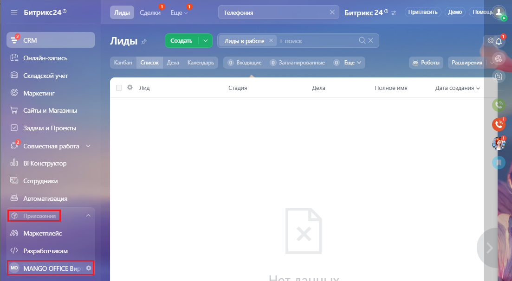
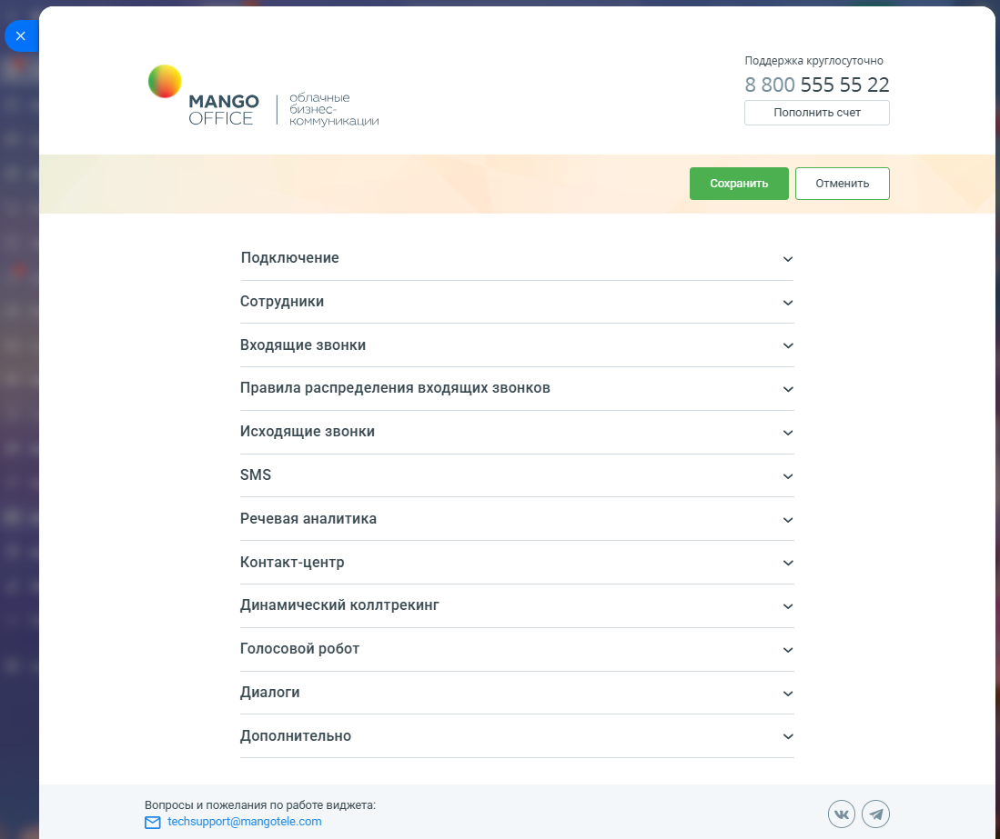

# 2.1. Как открыть форму настройки приложения

> Трассировка: PDF §2.1 · сквозные стр. 25-27 · источники: ч.1 `kb/mango-product-docs/sources/integration-bitrix24/Mango_office_integration_Bitrix24.pdf` с.25-27.

Для того чтобы открыть настройки интеграции, в вашем Битрикс24 выберите пункт "MANGO OFFICE Виртуальная АТС" (этот пункт может быть в группе "Приложения"):

Интеграция Виртуальной АТС MANGO OFFICE и Битрикс24 | Версия от 03.03.2026 В открывшемся окне "Подключение" показаны настройки интеграции. Обратите внимание, что если у вас базовый пакет, в этом окне не будет доступа ко многим настройкам интеграции (они доступны только в расширенном пакете).

Интеграция Виртуальной АТС MANGO OFFICE и Битрикс24 | Версия от 03.03.2026
