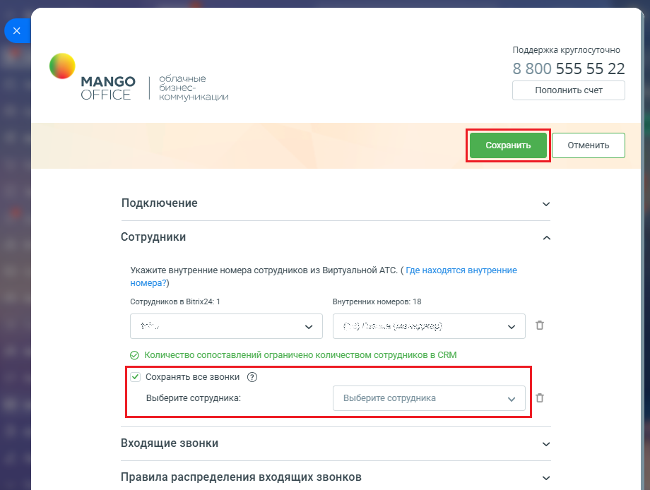

# Как включить настройку

> Трассировка: PDF §2.2 · сквозные стр. 29-30 · источники: ч.1 `kb/mango-product-docs/sources/integration-bitrix24/Mango_office_integration_Bitrix24.pdf` с.29-30.

По умолчанию данная настройка выключена. Чтобы ее включить, в форме настройки приложения следует: 1. нажмите на блок “Сотрудники”. Будут открыты дополнительные поля; 2. активируйте переключатель “Сохранять все звонки”. Будет открыто дополнительное поле; 3. укажите сотрудника Битрикс24, к которому будут привязаны все звонки несопоставленных сотрудников; 4. нажмите кнопку “Сохранить”.

Интеграция Виртуальной АТС MANGO OFFICE и Битрикс24 | Версия от 03.03.2026
