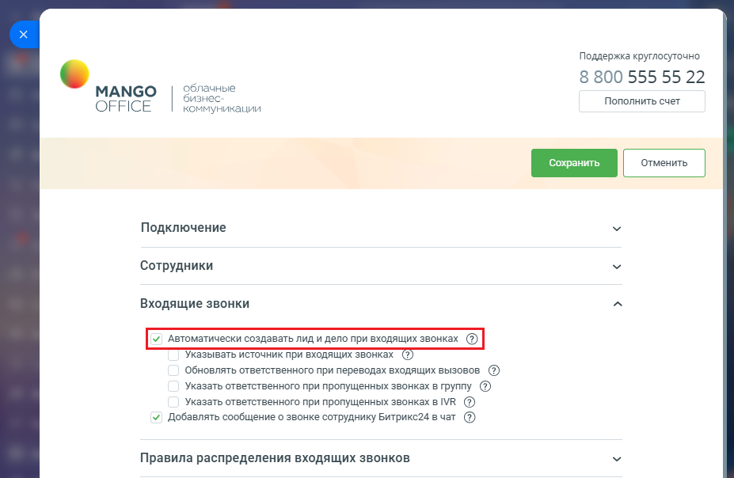
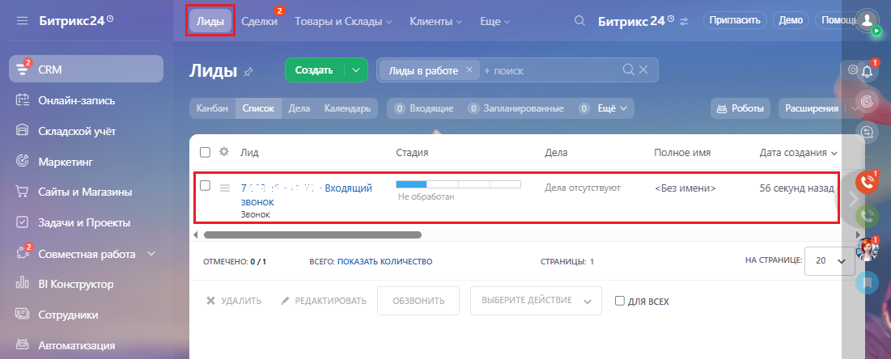
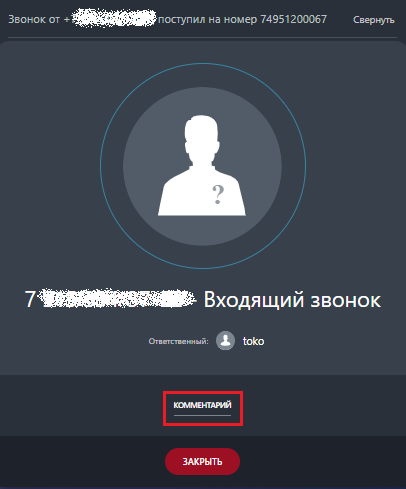
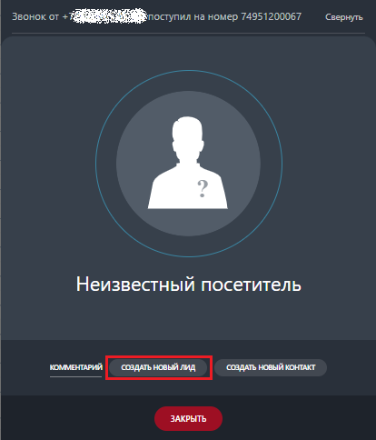

# Автоматически создавать лид и дело при входящих звонках

> Трассировка: PDF §2.3 · сквозные стр. 30-32 · источники: ч.1 `kb/mango-product-docs/sources/integration-bitrix24/Mango_office_integration_Bitrix24.pdf` с.30-32.

Откройте форму настройки приложения интеграции. В блоке "Входящие звонки" вы увидите флаг "Автоматически создавать лид и дело при входящих звонках". По умолчанию настройка включена.

Если флаг включен, при входящем звонке c номера, ранее не сохраненного в Битрикс24, будет автоматически создан новый лид:

Интеграция Виртуальной АТС MANGO OFFICE и Битрикс24 | Версия от 03.03.2026 При этом, в карточке звонка в Битрикс24 НЕ будет предложено создать лид (только добавить комментарий):

Если флаг выключен, то при входящем звонке с номера, ранее не сохраненного в Битрикс24, НЕ будет автоматически создан новый лид и в карточке звонка в Битрикс24 будет предложено создать лид:

Обратите внимание, что если номер звонящего внесен в Битрикс24 в список исключений (CRM - Настройки - Другое - Список исключений), то лид при звонке с этого номера не будет создан. Подробнее… Интеграция Виртуальной АТС MANGO OFFICE и Битрикс24 | Версия от 03.03.2026
