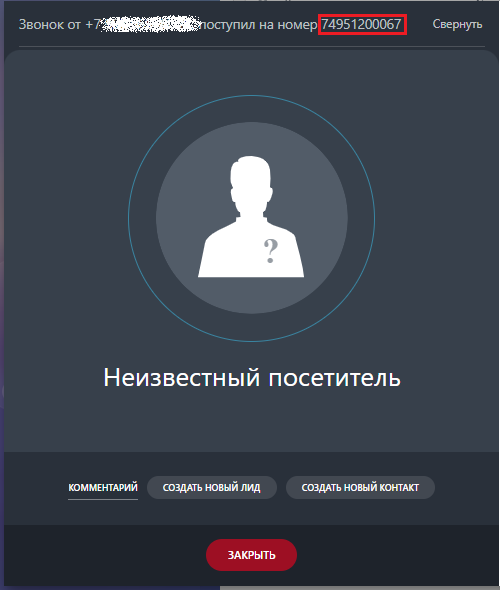
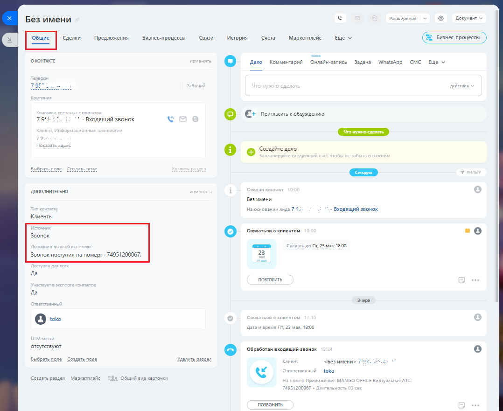
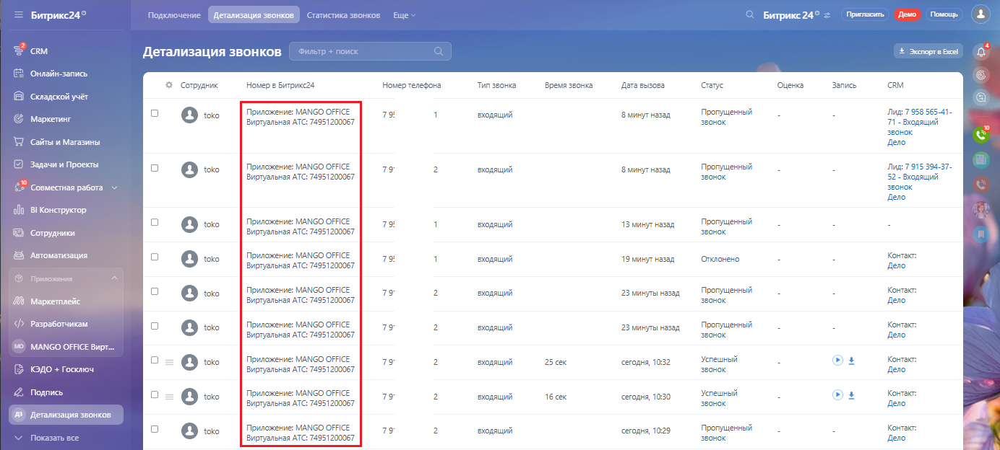

# На что влияет эта настройка

> Трассировка: PDF §2.3 · сквозные стр. 32-33 · источники: ч.1 `kb/mango-product-docs/sources/integration-bitrix24/Mango_office_integration_Bitrix24.pdf` с.32-33.

Если у вас несколько номеров подключено к Виртуальной АТС, и вы хотите разделять Клиентов, обращающихся по разным номерам, то приложение интеграции поддерживает эту возможность. При поступлении звонка от Клиента, приложение интеграции будет передавать в Битрикс24 номер, на который звонил Клиент. Этот номер будет показан: 1) в карточке звонка:

2) в карточке Клиента:

Интеграция Виртуальной АТС MANGO OFFICE и Битрикс24 | Версия от 03.03.2026 3) в детализации звонков; Примечание. Как открыть отчет "Детализация звонков" описано в приложении А.

4) в лиде (в пользовательских полях) сохранится информация о номере, на который поступил звонок (об источнике):

