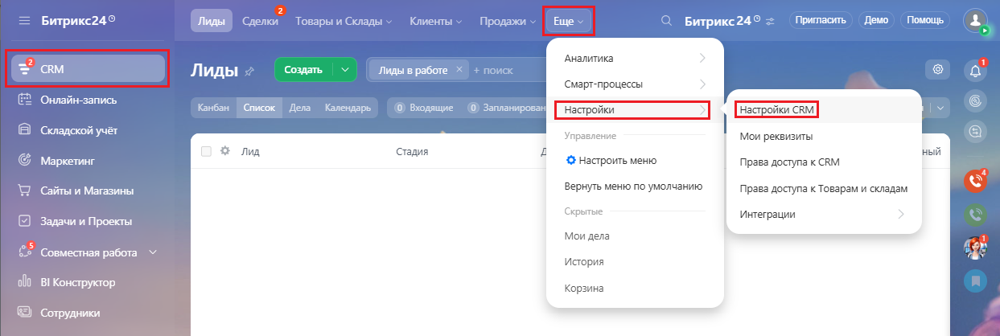
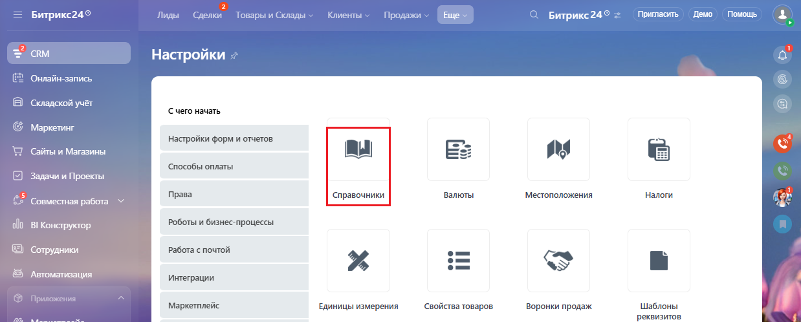
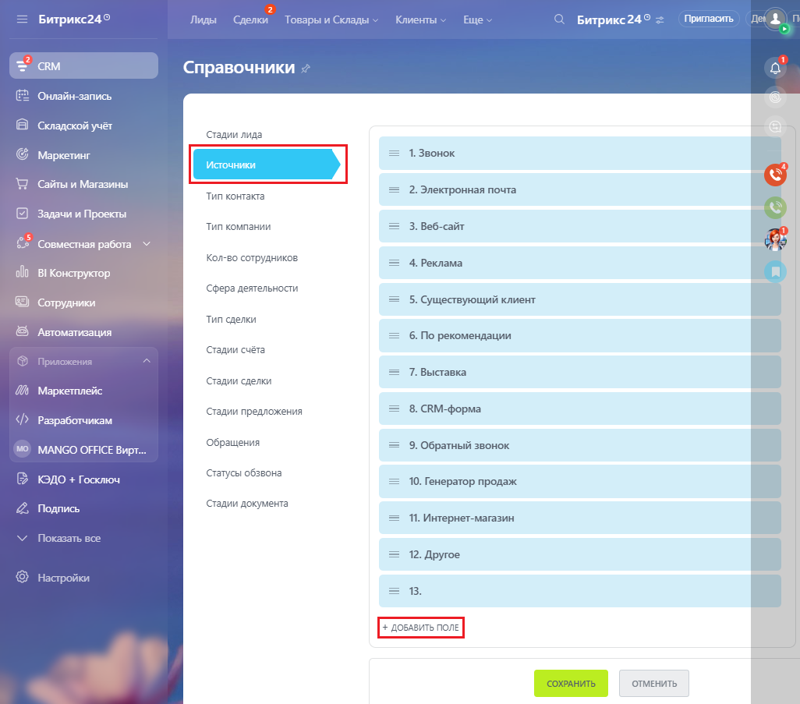
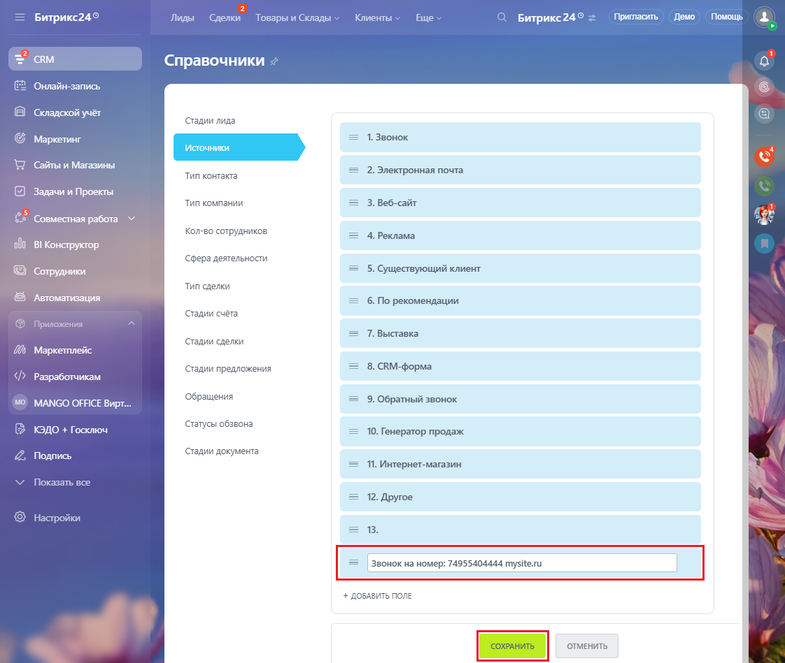
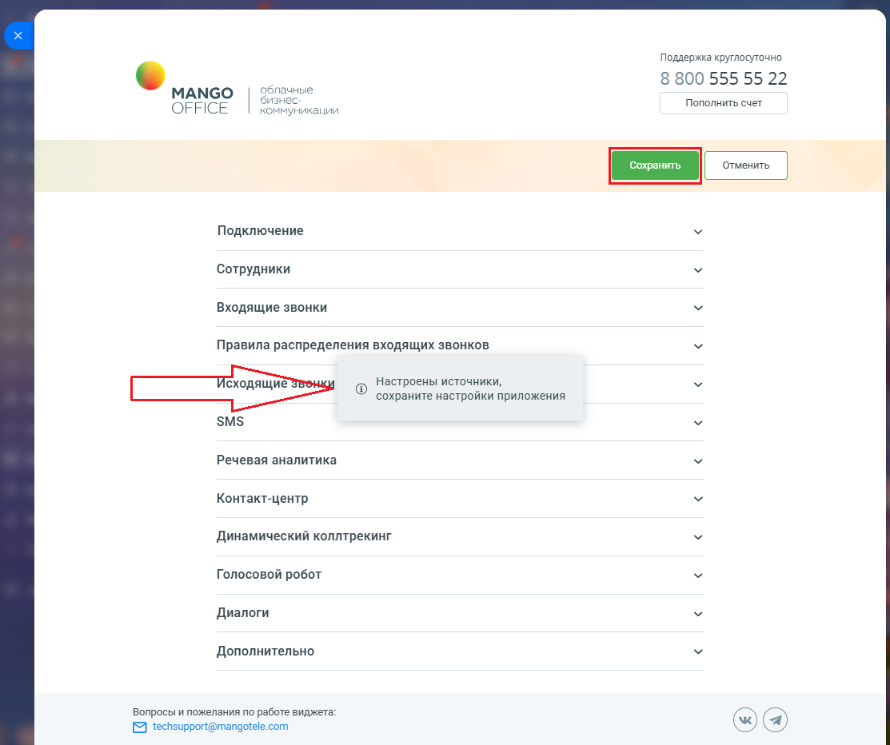

# Как настроить справочник источников

> Трассировка: PDF §2.3 · сквозные стр. 34-38 · источники: ч.1 `kb/mango-product-docs/sources/integration-bitrix24/Mango_office_integration_Bitrix24.pdf` с.34-38.

Для этого в вашем Битрикс24 следует: 1) перейдите в раздел "CRM", затем выберите пункт "Настройки CRM";

2) выберите пункт "Справочники":

Интеграция Виртуальной АТС MANGO OFFICE и Битрикс24 | Версия от 03.03.2026 3) выберите пункт "Источники"; 4) выберите пункт "+Добавить поле":

Интеграция Виртуальной АТС MANGO OFFICE и Битрикс24 | Версия от 03.03.2026 5) введите новые источники с названием и нажмите кнопку "Enter". При вводе названия источника необходимо точно соблюдать следующий формат названия: Звонок на номер: Ваш номер К примеру, "Звонок на номер: 74955404444". При вводе вашего номера укажите только значение номера, без пробелов, тире, скобок. Примечания: а) после вашего номера вы можете указать любой поясняющий текст, к примеру "Звонок на номер: 74955404444 mysite.ru"; б) если к Виртуальной АТС подключен номер другого оператора, то необходимо указывать адрес подключенной sip-линии, к примеру: "Звонок на номер: sip:user1@vpbx400012345.mangosip.ru" 6) нажмите кнопку "Сохранить":

Интеграция Виртуальной АТС MANGO OFFICE и Битрикс24 | Версия от 03.03.2026 Внимание! После настройки источников обязательно откройте форму настройки приложения интеграции. В ней вы увидите предупреждение "Настроены источники, сохраните настройки приложения". Нажмите кнопку "Сохранить", чтобы приложение интеграции "увидело" ваши настройки источников:

Интеграция Виртуальной АТС MANGO OFFICE и Битрикс24 | Версия от 03.03.2026
