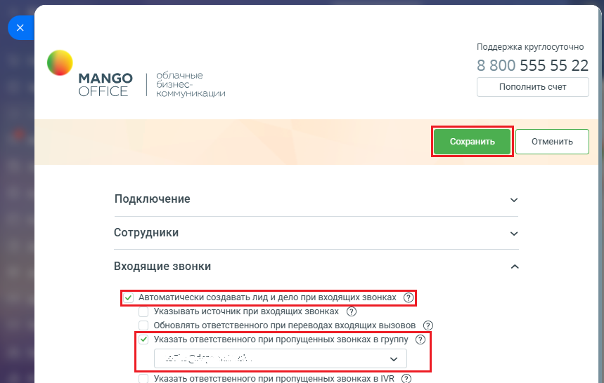

# Вот как включить настройку

> Трассировка: PDF §2.3 · сквозные стр. 40-41 · источники: ч.1 `kb/mango-product-docs/sources/integration-bitrix24/Mango_office_integration_Bitrix24.pdf` с.40-41.

1) откройте форму настройки приложения интеграции; 2) откройте блок "Входящие звонки"; 3) установите флаг "Указать ответственного при пропущенных звонках в группу". Будет открыто дополнительное поле; Примечание. Настройка доступна, если ранее был включен флаг "Автоматически создавать лид при входящих звонках". 4) выберите ответственного сотрудника; 5) нажмите кнопку "Сохранить" в верхней части формы настройки приложения интеграции:

Интеграция Виртуальной АТС MANGO OFFICE и Битрикс24 | Версия от 03.03.2026
