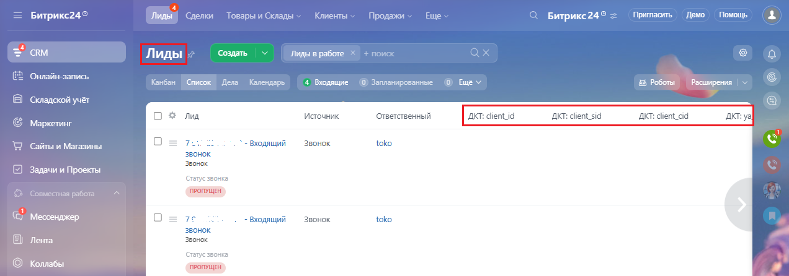
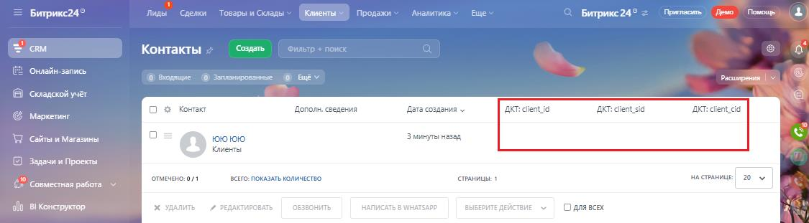

# В отчетах и списках Битрикс24

> Трассировка: PDF §2.3 · сквозные стр. 45-46 · источники: ч.1 `kb/mango-product-docs/sources/integration-bitrix24/Mango_office_integration_Bitrix24.pdf` с.45-46.

Теперь при каждом входящем звонке (даже если он и был пропущен) на номер динамического или статического коллтрекинга от нового Клиента, в Битрикс24 будет сохранена информация о посетителе сайта (если, конечно, вами ранее была включена настройка автоматического создания лида и дела при входящем звонке):

При конвертации лида в сделку и/или контакт, информация о посетителе из лида автоматически будет сохранена:

Примечание. Как настроить отображение колонок в списке Лидов \ Контактов описано в приложении Б. Интеграция Виртуальной АТС MANGO OFFICE и Битрикс24 | Версия от 03.03.2026
