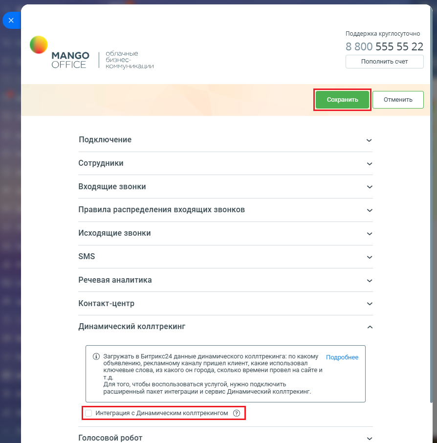

# Как включить настройку

> Трассировка: PDF §2.3 · сквозные стр. 46-47 · источники: ч.1 `kb/mango-product-docs/sources/integration-bitrix24/Mango_office_integration_Bitrix24.pdf` с.46-47.

Для этого, в вашем Битрикс24 выполните: 1) откройте форму настройки приложения интеграции; 2) нажмите на пункт "Динамический коллтрекинг"; 3) затем установите флаг "Интеграция с Динамическим коллтрекингом"; 4) нажмите кнопку "Сохранить" в верхней части формы настройки приложения интеграции:

Интеграция Виртуальной АТС MANGO OFFICE и Битрикс24 | Версия от 03.03.2026
