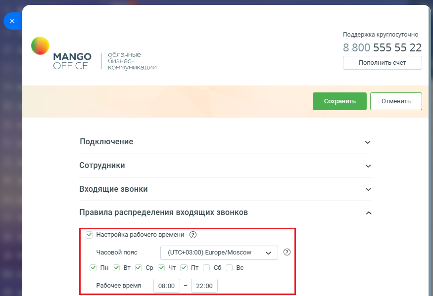

# Настройка расписания работы умных правил

> Трассировка: PDF §2.3 · сквозные стр. 61 · источники: ч.1 `kb/mango-product-docs/sources/integration-bitrix24/Mango_office_integration_Bitrix24.pdf` с.61.

Включите работу умных алгоритмов в определенные дни недели и часы. Настройка времени работы умных алгоритмов может быть полезна, если, например, ваши операторы в конце рабочего дня забывают сменить статус в Контакт-центре MANGO OFFICE или в MANGO Talker. Например, если ваша компания работает пять дней в неделю с 9 до 18, можно выбрать для работы умных алгоритмов следующие дни и часы: с 9 утра до 18 вечера с понедельника по пятницу. Обратите внимание, если выключить флаг "Настройка времени работы", то умные алгоритмы распределения звонков будут работать круглосуточно (24*7).

