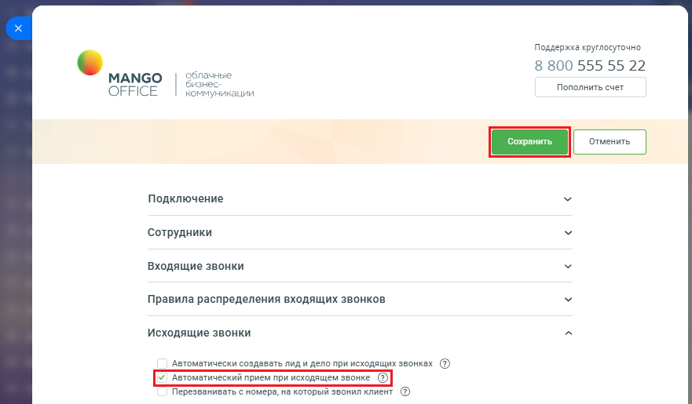

# Автоматический прием при исходящем звонке

> Трассировка: PDF §2.4 · сквозные стр. 63-64 · источники: ч.1 `kb/mango-product-docs/sources/integration-bitrix24/Mango_office_integration_Bitrix24.pdf` с.63-64.

Важно! Настройка доступна только для расширенного пакета интеграции. Эта настройка позволяет ускорить набор исходящего звонка. По умолчанию настройка выключена. Если настройка выключена, то при исходящем наборе вы должны принять входящее плечо на ваш телефон и только потом начнется дозвон внешнему абоненту. Если она включена, то при исходящем звонке по клику на номер телефона в Битрикс24 сразу начнется дозвон внешнему абоненту (как будто вы только набрали номер телефона). Поддерживается на многих моделях телефонов (к примеру, телефонах марки Yearlink) и софтфонах (временно не поддерживается в MangoTalker). Техническая справка: ваш телефон или софтфон также может поддерживать эту настройку, если он поддерживает SIP-заголовок "Alet-info: answer-after=0". Чтобы включить настройку, в Битрикс24 необходимо: 1) откройте форму настройки приложения интеграции; 2) откройте блок "Исходящие звонки"; 3) установите флаг "Автоматический прием при исходящем звонке"; 4) нажмите кнопку "Сохранить" в верхней части формы настройки приложения интеграции:

Интеграция Виртуальной АТС MANGO OFFICE и Битрикс24 | Версия от 03.03.2026
