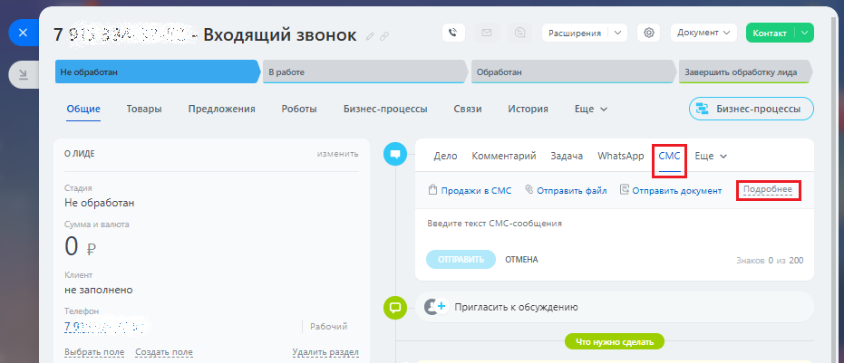
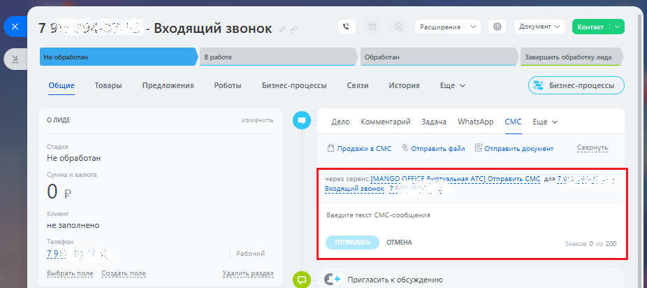

# Обзор

> Трассировка: PDF §2.5 · сквозные стр. 68-70 · источники: ч.1 `kb/mango-product-docs/sources/integration-bitrix24/Mango_office_integration_Bitrix24.pdf` с.68-70.

В приложении интеграции с Битрикс24 доступна возможность отправки SMS вручную из карточки лида/контакта/сделки. Информация об отправленной SMS и статусе доставки фиксируется в карточке. Примечание. Для обновления приложения интеграции с Битрикс24 – воспользуйтесь разделом Обновление приложения. Если настройка включена, то в карточке лида/контакта/сделки появится возможность выбирать приложение MANGO OFFICE как провайдера SMS при Интеграция Виртуальной АТС MANGO OFFICE и Битрикс24 | Версия от 03.03.2026 отправке SMS. Выберите контактный номер, на который надо отправить SMS, нажмите "Подробнее":

Появится возможность выбирать приложение MANGO OFFICE как провайдера SMS при отправке SMS. Введите текст SMS и нажмите "Отправить". Информация об отправке будет добавлена в историю контакта. После доставки SMS получателю – статус обновится на "Доставлено".

Требования 1) Настройка доступна только для расширенного пакета интеграции. Стоимость SMS - согласно вашему тарифному плану; 2) SMS НЕ будет отправляться если в настройке сопоставления сотрудников НЕ указан сотрудник, от чьего имени отправляется SMS. Интеграция Виртуальной АТС MANGO OFFICE и Битрикс24 | Версия от 03.03.2026
