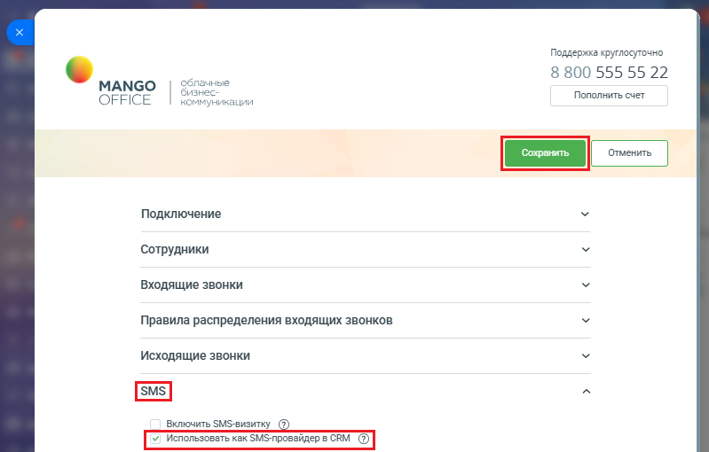

# Как включить настройку

> Трассировка: PDF §2.7 · сквозные стр. 74-75 · источники: ч.1 `kb/mango-product-docs/sources/integration-bitrix24/Mango_office_integration_Bitrix24.pdf` с.74-75.

Для этого, в форме настройки приложения следует: 1) откройте блок "SMS"; 2) включите флаг "Использовать как SMS-провайдер в CRM"; 3) нажмите кнопку "Сохранить" в верхней части этой формы.

Интеграция Виртуальной АТС MANGO OFFICE и Битрикс24 | Версия от 03.03.2026
