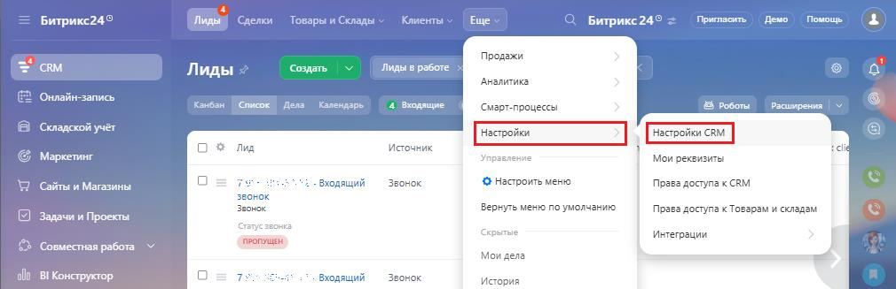
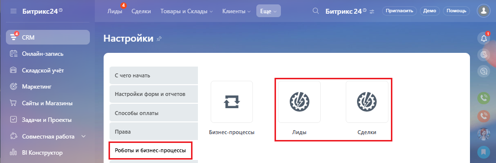
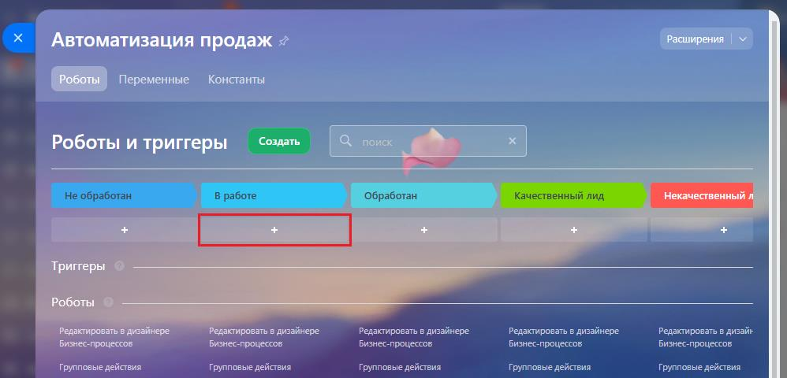
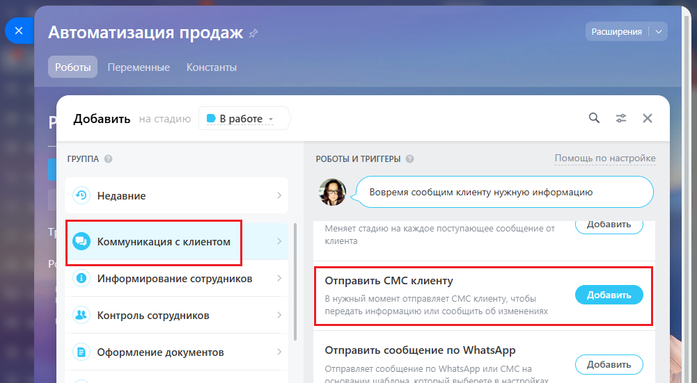
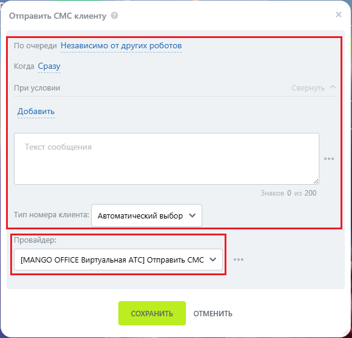
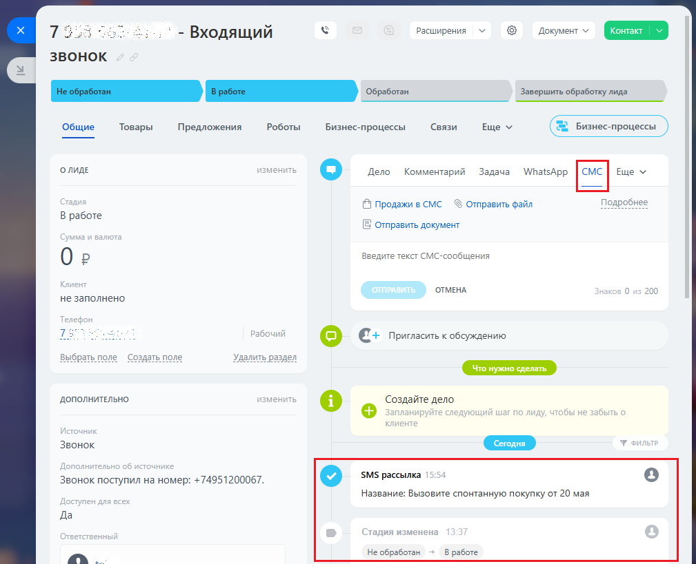

# Как настроить уведомление в роботах и бизнес-процессах

> Трассировка: PDF §2.7 · сквозные стр. 75-78 · источники: ч.1 `kb/mango-product-docs/sources/integration-bitrix24/Mango_office_integration_Bitrix24.pdf` с.75-78.

Чтобы сделать рассылку, в Битрикс24 следует: 1) выберите "CRM"; 2) нажмите кнопку "Настройка", затем выберите "Настройка CRM":

3) выберите пункт "Роботы и бизнес-процессы"; 4) выберите, для какой сущности будет использован робот: лид, сделка:

5) Начните редактировать робота. Для добавления SMS уведомления выберите "+" на нужном этапе воронки продаж:

Интеграция Виртуальной АТС MANGO OFFICE и Битрикс24 | Версия от 03.03.2026 Нажмите на пункт "Коммуникация с клиентом", затем в блоке "Роботы и Триггеры" выберите пункт "Отправить СМС клиенту":

В настройках уведомления: 1) выберите провайдера: MANGO OFFICE Виртуальная АТС; 2) настройте другие параметры уведомления; 3) нажмите кнопку "Сохранить":

Интеграция Виртуальной АТС MANGO OFFICE и Битрикс24 | Версия от 03.03.2026 При наступлении соответствующего события, автоматически отправится SMS и зафиксируется в карточке. На примере ниже, SMS была автоматически отправлена при смене статуса сделки:

Интеграция Виртуальной АТС MANGO OFFICE и Битрикс24 | Версия от 03.03.2026
