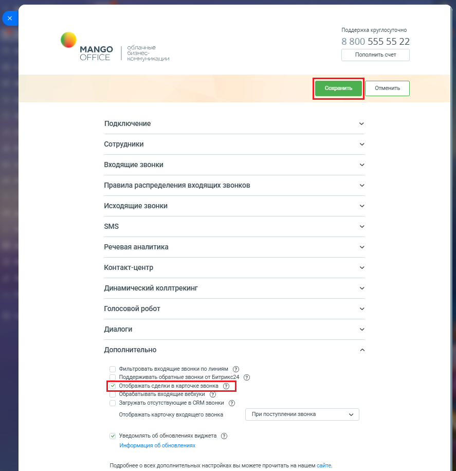

# 2.8. Отображать сделки в карточке звонка

> Трассировка: PDF §2.8 · сквозные стр. 78-79 · источники: ч.1 `kb/mango-product-docs/sources/integration-bitrix24/Mango_office_integration_Bitrix24.pdf` с.78-79.

Если данная настройка включена, то в карточке звонка будут отображаться последние 10 сделок с данным Клиентом. В результате оператор, обрабатывающий звонок, будет видеть заключал ли этот Клиент сделки ранее и на какую сумму. Чтобы включить или выключить показ информации о сделках, выполните: 1) откройте форму настройки приложения; 2) нажмите на пункт "Дополнительно"; 3) установите флаг "Отображать сделки в карточке звонка"; 4) нажмите кнопку "Сохранить" в верхней части формы настройки приложения интеграции:

Интеграция Виртуальной АТС MANGO OFFICE и Битрикс24 | Версия от 03.03.2026
