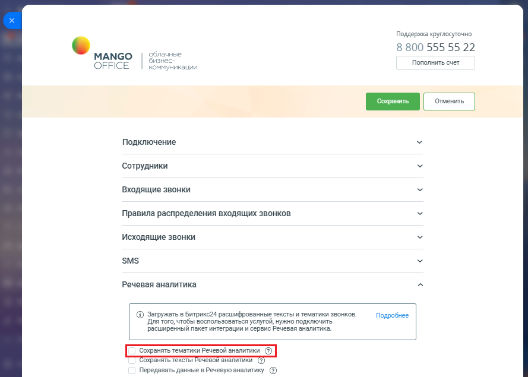
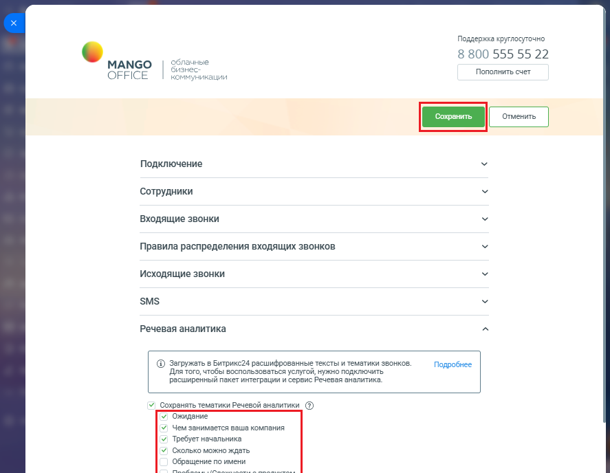

# Как включить сохранение тематик

> Трассировка: PDF §2.10 · сквозные стр. 82-84 · источники: ч.1 `kb/mango-product-docs/sources/integration-bitrix24/Mango_office_integration_Bitrix24.pdf` с.82-84.

Чтобы включить сохранение данных Речевой аналитики, в Битрикс24 необходимо: 1) откройте форму настройки приложения интеграции; 2) откройте блок "Речевая аналитика"; 3) установите флаг "Сохранять тематики Речевой аналитики"; Интеграция Виртуальной АТС MANGO OFFICE и Битрикс24 | Версия от 03.03.2026

4) выберите тематики, которые нужно сохранять; 5) нажмите кнопку "Сохранить" в верхней части формы настройки приложения интеграции:

Интеграция Виртуальной АТС MANGO OFFICE и Битрикс24 | Версия от 03.03.2026
