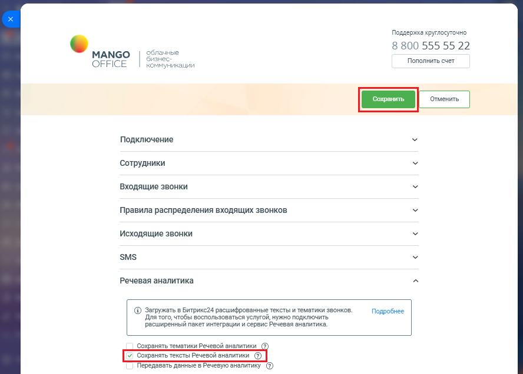

# Как настроить

> Трассировка: PDF §2.10 · сквозные стр. 85-86 · источники: ч.1 `kb/mango-product-docs/sources/integration-bitrix24/Mango_office_integration_Bitrix24.pdf` с.85-86.

Чтобы включить функцию сохранения тематик Речевой аналитики, в настройках сервиса интеграции необходимо: 1) откройте форму настройки приложения интеграции; 2) откройте блок "Речевая аналитика"; 3) установите флаг "Сохранять тексты Речевой Аналитики"; 4) нажмите кнопку "Сохранить" в верхней части формы настройки приложения интеграции:

Интеграция Виртуальной АТС MANGO OFFICE и Битрикс24 | Версия от 03.03.2026
