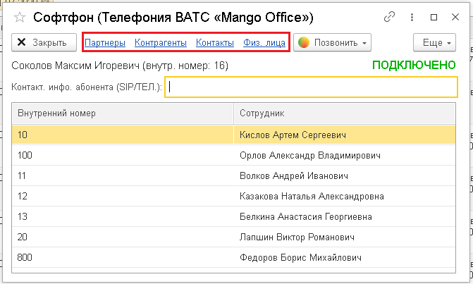

# 7. Справочник абонентов

> Трассировка: PDF §7 · сквозные стр. 40-46 · источники: ч.1 `kb/mango-product-docs/sources/integration_1c/Integratsiya_virtualnoy_ats_Pryamaya_integraciya_s_1C.pdf` с.40-46.

С помощью этого справочника вы можете в 1С собирать и упорядочивать информацию о ваших абонентах/Клиентах/партнерах.

## 7.1 Как открыть справочник

Чтобы перейти в справочник абонентов, выполните следующие действия: 1) откройте софтфон в 1С; 2) кликните на тип абонента: партнеры, контрагенты, контакты, физ.лица. Будет открыт справочник абонентов.

Рисунок 59

## 7.2 Поиск по номеру телефона

Чтобы выполнить поиск абонента по номеру телефона, выполните следующие действия: 1) откройте справочник абонентов на нужном вам типе абонентов; 2) введите номер телефона и нажмите кнопку «Enter»:

Рисунок 60 Результаты поиска будут показаны в справочнике абонентов, при этом в правой части окна отображен список найденных абонентов, а в левой части – подробные сведения об абоненте. Чтобы открыть карточку абонента, нужно дважды кликнуть на строку с данными этого абонента. 40 5Прямая интеграция с системой «1С: Управление торговлей» Редакция 11 (11.3 - 11.4, 11.5) | Версия от 22.12 .2025

Рисунок 61

## 7.3 Поиск по параметрам абонента

Поиск абонента в справочнике можно выполнять не только по номеру телефона, но и по следующим параметрам: - наименование; - бизнес-регион; - дата регистрации; - код. Чтобы выполнить поиск по любому из указанных параметров, нужно: 1) откройте справочник абонентов на нужном вам типе абонентов; 2) нажмите кнопку «Найти» в справочнике абонентов; 3) выберите параметр поиска в поле «Где искать»; 4) введите значение параметра в поле «Что искать»; 5) нажмите кнопку «Найти». Будет выполнен поиск абонента по указанным вами параметрам.

Рисунок 62

## 7.4 Фильтрация записей в справочнике

Вы можете вывести на экран все записи справочника абонентов, в которых есть определенный параметр. Например, найти всех абонентов, привязанных к одному и тому же менеджеру. Вот как это сделать: 1) откройте справочник абонентов на нужном вам типе абонентов; 41 5Прямая интеграция с системой «1С: Управление торговлей» Редакция 11 (11.3 - 11.4, 11.5) | Версия от 22.12 .2025 2) активируйте переключатель «Фильтр по»; 3) выберите параметр фильтрации. В результате вы получите список информации об абонентах, соответствующих параметрам фильтрации.

Рисунок 63 42 5Прямая интеграция с системой «1С: Управление торговлей» Редакция 11 (11.3 - 11.4, 11.5) | Версия от 22.12 .2025 Приложение. Как настроить стандартную кнопку вызова и конфигурацию модуля "УправлениеКонтактнойИнформациейКлиент" Основные сведения

Вы можете настроить кнопку стандартного функционала конфигурации так, чтобы она инициировала исходящий звонок. Тогда, нажимая эту кнопку в карточке абонента (Партнер/Контрагент/КонтактЛицоПартнера/Физлицо), пользователь 1С будет совершать звонок на номер абонента. Важно! Чтобы настроить конфигурацию модуля, вы должны уметь редактировать код 1С или обратиться за помощью к опытному разработчику 1С. Как настроить конфигурацию модуля Чтобы настроить кнопку стандартного функционала, нужно изменить конфигурацию модуля "УправлениеКонтактнойИнформациейКлиент". Вот как это сделать: 1) в меню выберите пункт «Конфигурация»; 2) выберите пункт «РасширенияКонфигурации». Будет открыт 1С-конфигуратор; 3) в расширении конфигурации "MANGO OFFICE" в общем модуле заменить у процедуры "MO_ПозвонитьПоТелефону(НомерТелефона)" директиву "&После" на директиву "&Вместо" и раскомментировать все её тело. Пример. Эти примеры содержат код до и после изменения: - пример кода модуля ДО ИЗМЕНЕНИЯ: 43 5Прямая интеграция с системой «1С: Управление торговлей» Редакция 11 (11.3 - 11.4, 11.5) | Версия от 22.12 .2025

| &После("ПозвонитьПоТелефону") |
| --- |
| Процедура MO_ПозвонитьПоТелефону(НомерТелефона) |
| //Если MO_Общий.ДоступнаРольВАТСMangoOffice() Тогда |
| // Если ЗначениеЗаполнено(СокрЛП(НомерТелефона)) Тогда |
| // Если MO_ОбщийКлиент.ИнициироватьЗвонок(СокрЛП(НомерТелефона)) |
| Тогда |
| // ПоказатьОповещениеПользователя("Исходящий |
| звонок",,"Выполнен callback-вызов"+Символы.ПС+"по номеру |
| "+СокрЛП(НомерТелефона),БиблиотекаКартинок.MO_PhoneCallback_32) ; |
| // КонецЕсли; |
| // Иначе |
| // Сообщить("Не задан телефонный номер!"); |
| // КонецЕсли; |
| //КонецЕсли; |
| КонецПроцедуры |

-пример кода модуля ПОСЛЕ ИЗМЕНЕНИЯ:

| &Вместо("ПозвонитьПоТелефону") |
| --- |
| Процедура MO_ПозвонитьПоТелефону(НомерТелефона) |
| Если MO_Общий.ДоступнаРольВАТСMangoOffice() Тогда |
| Если ЗначениеЗаполнено(СокрЛП(НомерТелефона)) Тогда |
| Если MO_ОбщийКлиент.ИнициироватьЗвонок(СокрЛП(НомерТелефона)) |
| Тогда |
| ПоказатьОповещениеПользователя("Исходящий |
| звонок",,"Выполнен callback-вызов"+Символы.ПС+"по номеру |
| "+СокрЛП(НомерТелефона),БиблиотекаКартинок.MO_PhoneCallback_32) ; |
| КонецЕсли; |
| Иначе |
| Сообщить("Не задан телефонный номер!"); |
| КонецЕсли; |
| КонецЕсли; |
| КонецПроцедуры |

44 5Прямая интеграция с системой «1С: Управление торговлей» Редакция 11 (11.3 - 11.4, 11.5) | Версия от 22.12 .2025 Список изменений в документе 17.09.2023 Изменение дизайна документа. 17.04.2023 Обновлены ссылки для скачивания расширений конфигурации, которые приведены в п. Шаг 4. Настройка интеграции в 1С. 28.03.2023 Обновлено описание настройки "Показывать наличие звонка от Клиента в меню IVR". В нем скорректировано общее описание настройки. 11.01.2023 Обновлена метаинформация файла. 08.12.2022 1) добавлено примечание о том, почему необходимо отключать безопасный режим в процессе установки расширения MANGO OFFICE; 2) добавлено уточнение, что при настройке надо указывать внутренний номер сотрудника; 3) добавлено описание, как вызвать окно "Список пользователей". 04.10.2022 1) добавлены ссылки для скачивания расширения конфигурации 11.3 – 11.4 и 11.5; 2) добавлено название. 28.06.2022 1) обновлена ссылка скачивания конфигурации; 2) обновлены иллюстрации. 31.01.2022 Добавлено описание, как начать работать с интеграцией. 08.09.2021 45 5Прямая интеграция с системой «1С: Управление торговлей» Редакция 11 (11.3 - 11.4, 11.5) | Версия от 22.12 .2025 Общее редактирование верстки, проверка работы ссылок. 08.06.2021 1) дополнено описание подключения расширения конфигурации; 2) добавлено описание способов устранения ошибки при подключении расширения конфигурации. 07.06.2021 Актуализация иллюстраций. 28.10.2020 Добавлено описание подключения расширения конфигурации в Конфигураторе 1С и первый запуск. 02.09.2020 Выпущен впервые. 46
