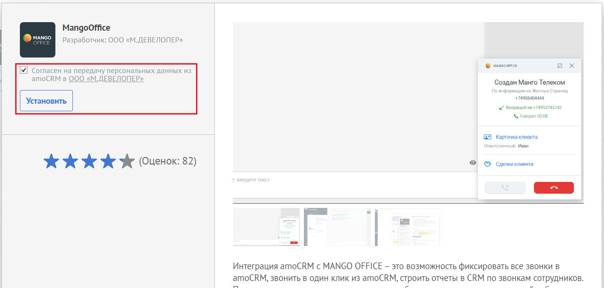
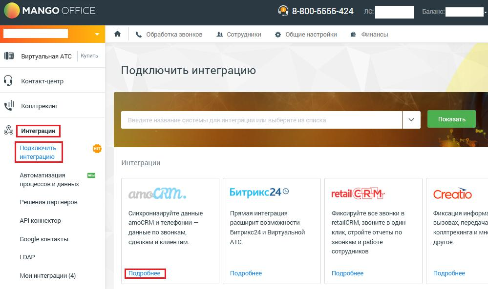
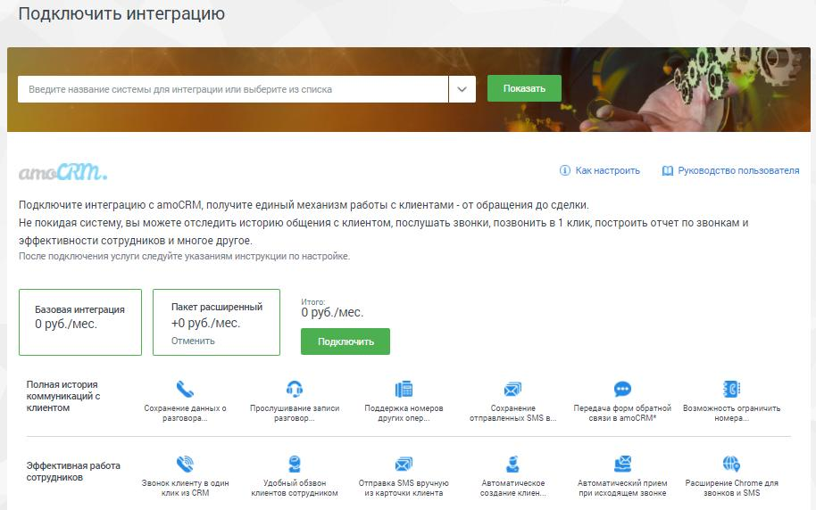
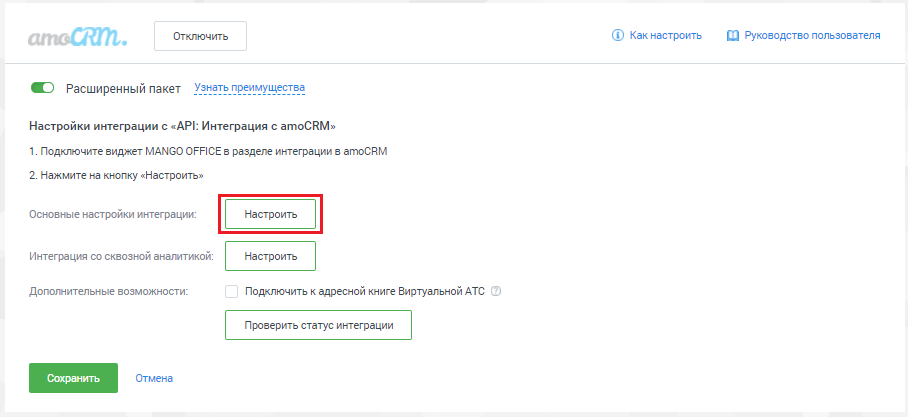
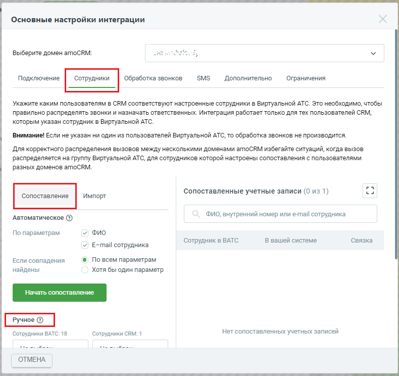
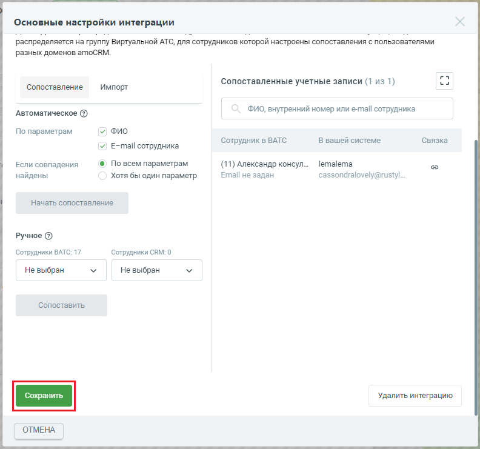
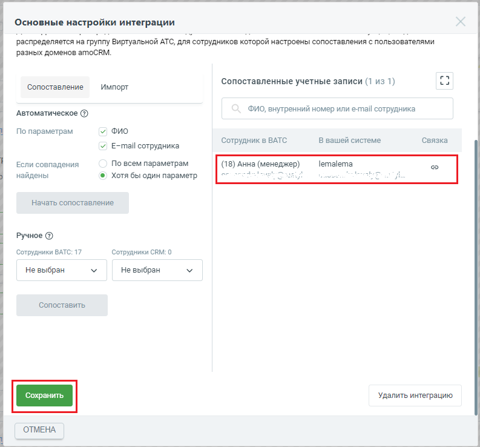
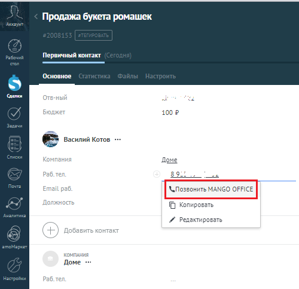

# 1. Начало работы с интеграцией

> Трассировка: PDF §1 · сквозные стр. 5-22 · источники: ч.1 `kb/mango-product-docs/sources/integration_amocrm/Mango_office_integration_amoCRM.pdf` с.5-22.

Обзор Как впервые настроить интеграцию с amoCRM. Несколько простых шагов - и можно приступать к работе. Подготовка Чтобы настроить интеграцию, вам потребуется: - Виртуальная АТС MANGO OFFICE; - ваш amoCRM, в который должны быть добавлены пользователи, которые будут совершать и принимать звонки; - расширенный или базовый пакет интеграции с amoCRM; - SIP-телефон, либо софтфон Mango Talker для совершения и приема телефонных звонков; - установив плагин MANGO CONNECT для Chrome, при подключенном расширенном пакете интеграции, вы или ваши сотрудники смогут совершать и принимать звонки прямо из браузера на компьютере. После настройки интеграции начнется передача данных о звонках в ваш amoCRM. При этом, важно учесть следующее: 1) в amoCRM будут фиксироваться звонки только тех сотрудников, которые указаны в настройках интеграции. Если вам нужно фиксировать звонки всех сотрудников, даже не указанных в настройках интеграции, включите настройку “Сохранять все звонки” (доступна только в расширенном пакете); 2) внутренние звонки между сотрудниками никак не фиксируются amoCRM; 3) в amoCRM будут фиксироваться звонки, совершенные после подключения интеграции. Данные по звонкам, совершенным ДО подключения интеграции передаваться не будут. Порядок действий Чтобы настроить интеграцию надо выполнить несколько шагов: 1) Подключить Виртуальную АТС MANGO OFFICE, если вы еще этого не сделали. В настройках Виртуальной АТС вы регистрируете ваших сотрудников, выдаете им внутренние номера телефонов и настраиваете схему распределения входящих звонков от Клиентов. 2) Установить софтфон Mango Talker, либо SIP-телефон(ы). Чтобы ваши сотрудники могли принимать и совершать звонки, необходимо чтобы каждый сотрудник использовал устройство \ программу для приема звонков по SIP-протоколу. Это может быть SIP-телефон, подключенный к вашей Виртуальной АТС, либо бесплатный софтфон Mango Talker, установленный на рабочий ПК сотрудника. 3) Подключить интеграцию в вашем amoCRM. Чтобы передавать данные о звонках в ваш amoCRM, нужно установить в нем виджет интеграции MANGO OFFICE. 4) Подключить интеграцию в Личном кабинете MANGO OFFICEи установить базовые настройки. Это нужно сделать, чтобы связать виджет интеграции с вашей Виртуальной АТС MANGO OFFICE и получать из нее данные о звонках. Вам доступны базовый и расширенный пакеты интеграции. 5 Интеграция Виртуальной АТС MANGO OFFICE и amoCRM | Версия от 25.08.2025 5) Настроить сопоставление сотрудников Виртуальной АТС и amoCRM. Для того, чтобы звонки фиксировались в amoCRM на соответствующих сотрудников. После подключения интеграции, вы можете установить дополнительные настройки интеграции при подключении расширенного пакета. Благодаря расширенному пакету интеграции с вашим amoCRM, вы сможете более гибко настроить прием и обработку звонков. Шаг 1. Подключение Виртуальной АТС MANGO OFFICE Сначала подключите версию Виртуальной АТС MANGO OFFICE, если у вас ее еще нет. Если она у вас уже есть, то войдите в Личный кабинет MANGO OFFICE. В нем вы будете подключать и настраивать интеграцию с amoCRM. Шаг 2. Установка софтфона Mango Talker Виртуальная АТС позволяет установить телефонную связь между абонентами. Ваш amoCRM позволяет анализировать взаимодействие/сделки с Клиентами. Однако ни одна из этих систем не дает возможности непосредственно позвонить или принять звонок. Поэтому, чтобы принимать и совершать звонки, ваши сотрудники должны использовать, либо SIP-телефоны, подключенные к вашей Виртуальной АТС, либо софтфон Mango Talker. А если вы подключили расширенный пакет интеграции, то можете использовать плагин MANGO CONNECT для браузера Chrome. Mango Talker – это бесплатная программа от MANGO OFFICE, которая позволяет совершать и принимать звонки через интернет без использования дополнительного оборудования, за исключением телефонной гарнитуры. Вам доступны настольная (для ПК) и мобильная версии Mango Talker. Ознакомьтесь с руководством пользователя Mango Talker, которое поможет Вам максимально использовать возможности коммуникатора. Установив плагин MANGO CONNECT, в вашем браузере появится возможность звонить, принимать вызовы и отправлять SMS через Виртуальную АТС. Важно. Плагин MANGO CONNECT работает только в браузере Chrome и только при подключении расширенного пакета интеграции. Шаг 3. Установка виджета интеграции в amoCRM Для этого необходимо: 1) войти в ваш amoCRM под учетной записью администратора; 2) перейти в раздел “amoМаркет”; 3) в поле “Поиск” введите значение “MangoOffice” и нажмите кнопку “Enter”; 4) в списке виджетов, найденных по вашему запросу, найдите виджет “MANGO OFFICE” (см. рисунок ниже) и нажмите кнопку “Установить бесплатно,” под ним. Примечание. Если в списке виджетов, найденных по вашему запросу, нет виджета “MANGO OFFICE” (такого как на рисунке ниже), то измените запрос: в поле “Поиск” вместо “MANGO OFFICE” введите значение “Mango Office” или “mango office”, или “MANGO”, или “OFFICE”. 6 Интеграция Виртуальной АТС MANGO OFFICE и amoCRM | Версия от 25.08.2025

5) в открывшейся форме “MangoOffice” нужно установить “галочку” в поле “Согласен на передачу персональных данных…” и нажать на кнопку “Установить”:

Виджет установлен в amoCRM, при этом в форме “MangoOffice” показаны данные о виджете:

7 Интеграция Виртуальной АТС MANGO OFFICE и amoCRM | Версия от 25.08.2025 Шаг 4. Настройка Виртуальной АТС. Выбор пакета интеграции Это нужно сделать, чтобы Виртуальная АТС MANGO OFFICE могла передавать в вашу amoCRM данные о звонках. Для этого необходимо: 1) войти в Личный кабинет Виртуальной АТС; 2) выбрать вашу Виртуальную АТС, если у вас их несколько; 3) перейти в раздел “Интеграции”; 4) нажать на пункт “Подключить интеграцию”; 5) в блоке “amoCRM” нажать кнопку “Подробнее”:

6. будут выполнены следующие действия: – если у вас уже была подключена интеграция к Виртуальной АТС, то, после нажатия кнопки “Подробнее”, будет открыта страница “Мои интеграции”, на которой показан блок “amoCRM”; – если вы впервые подключаете интеграцию с amoCRM, то будет предложено выбрать пакет интеграции: базовая интеграция, пакет расширенный. Нажмите на пакет, который хотите подключить, затем нажмите на кнопку “Подключить”. Виджет интеграции будет подключен к вашей Виртуальной АТС и в Личном кабинете MANGO OFFICE на странице “Мои интеграции” будет показан блок “amoCRM”. 8 Интеграция Виртуальной АТС MANGO OFFICE и amoCRM | Версия от 25.08.2025

7. нажмите на кнопку “Настроить” в блоке “amoCRM”;

8. проверьте, что в окне “Основные настройки интеграции” в поле “Выбрать домен amoCRM” указано значение “+ Добавить новый amoCRM”. Если в этом поле указано другое значение, значит надо в выпадающем списке “Выбрать домен amoCRM” выбрать значение “+Добавить новый amoCRM”; 9. нажмите кнопку “Получить код подключения”: 9 Интеграция Виртуальной АТС MANGO OFFICE и amoCRM | Версия от 25.08.2025

10. будет открыта новая вкладка вашего браузера. На ней, если вы уже вошли в аккаунт AmoCRM, будет открыта форма для предоставления доступа виджету интеграции к вашему аккаунту amoCRM (см. рисунок ниже). В противном случае вам будет предложено авторизоваться в AmoCRM при помощи ваших логина и пароля, а затем будет открыта форма для предоставления доступа виджету интеграции к вашему аккаунту amoCRM; 11. в поле “Выберите аккаунт” выберите аккаунт AmoCRM, с которым будет настроена интеграция;

10 Интеграция Виртуальной АТС MANGO OFFICE и amoCRM | Версия от 25.08.2025 12. нажмите кнопку “Разрешить”, чтобы разрешить виджету интеграции доступ к вашему аккаунту AmoCRM;

13. будет создан код подключения интеграции с amoCRM, который вам необходимо скопировать. Для этого, нажмите кнопку “Скопировать код подключения”: 11 Интеграция Виртуальной АТС MANGO OFFICE и amoCRM | Версия от 25.08.2025

14. в окне “Основные настройки интеграции” вставьте скопированный код в поле “Код подключения”; 15. в поле “Email для уведомлений” укажите электронную почту, на которую хотите получать уведомления от amoCRM; 16. нажмите на кнопку “Сохранить”:

17. если подключение виджета интеграции выполнено успешно, то будет выдано сообщение “Виджет в CRM подключен” (см. рисунок ниже). Иначе, будет выдано сообщение об ошибке, в этом случае проверьте, правильно ли выполнены пункты 1 - 16. 12 Интеграция Виртуальной АТС MANGO OFFICE и amoCRM | Версия от 25.08.2025

Шаг 5. Сопоставление сотрудников Виртуальной АТС и amoCRM Уважаемые абоненты! Без сопоставления сотрудников из личного кабинета MANGO OFFICE в виджете MANGO OFFICE в amoCRM интеграция работать не будет. Общее Важнейшей задачей интеграции является корректное распределение звонков между пользователями. Приложение интеграции хранит таблицу сопоставления сотрудников Виртуальной АТС с пользователями amoCRM, которую вы можете видеть в блоке “Сотрудники”. Эту таблицу составляете вы. В ней вы указываете какому сотруднику Виртуальной АТС соответствует сотрудник amoCRM. Когда пользователь, кликнув по номеру телефона в amoCRM, инициирует исходящий звонок отправку sms, приложение интеграции сравнивает данные этого пользователя с таблицей сопоставления сотрудников Виртуальной АТС с пользователями amoCRM. Если обнаруживается совпадение (пользователю amoCRM, инициировавшему звонок отправку sms, поставлен соответствующий сотрудник Виртуальной АТС), то звонок отправка sms выполняется от соответствующего сотрудника Виртуальной АТС. И наоборот, когда поступает входящий звонок от Клиента и Виртуальная АТС распределяет его на конкретного сотрудника, приложение интеграции сравнивает данные этого сотрудника с таблицей сопоставления. Если обнаруживается совпадение, то звонок направляется на соответствующего пользователя amoCRM. Обратите внимание. Если вы указали не всех менеджеров в таблице сопоставления сотрудников, а также, если вы хотите фиксировать звонки сотрудников, которые не работают в amoCRM, но могут звонить клиентам (например, бухгалтер, курьер и т.д.), то вы можете включить настройку “Сохранять все звонки” и указать в ней нужного сотрудника amoCRM. Тогда к этому сотруднику будут автоматически привязываться разговоры с Клиентами сотрудников, не указанных в таблице сопоставления. Эта настройка доступна только в расширенном пакете интеграции. Ограничения для сопоставления сотрудников 1) Запрещается одного и того же сотрудника amoCRM указывать более чем в одном виджете интеграции; 2) Чтобы виджет интеграции корректно распределял звонки, в настройках виджета интеграции не рекомендуется указывать сотрудника Виртуальной АТС, состоящего в группе, участники которой настроены в другом виджете интеграции (зарегистрированы в другом домене amoCRM). 3) Запрещается одному сотруднику Виртуальной АТС ставить в соответствие нескольких пользователей amoCRM. Если в настройке сопоставления сотрудника вами выбран сотрудник Виртуальной АТС, ранее указанный в настройках другого вашего виджета интеграции, будет выдано сообщение об ошибке. 13 Интеграция Виртуальной АТС MANGO OFFICE и amoCRM | Версия от 25.08.2025 Как настроить сопоставление сотрудников Вариант 1. Вручную Если вы хотите настроить сопоставление сотрудников amoCRM и Виртуальной АТС вручную, выполните: 1) убедитесь, что вы зарегистрировали всех нужных сотрудников в обоих системах; 2) перейдите в окно “Основные настройки интеграции”, проверьте что открыта вкладка “Сотрудники” 3) проверьте что нажата кнопку “Сопоставление”; 4) прокрутите окно колесиком мыши, чтобы было видно блок “Ручное”;

5) укажите пару сотрудник ВАТС-сотрудник CRM в поле “Ручное”; 6) нажмите кнопку “Сопоставить”; 14 Интеграция Виртуальной АТС MANGO OFFICE и amoCRM | Версия от 25.08.2025

Будет выполнена проверка возможности сопоставления указанных вами сотрудников. Если проверка пройдена успешно, будет выдано сообщение “Пара сопоставлена и добавлена в список”:

Если сотрудников нельзя сопоставить, будет выдано сообщение об ошибке. Вам нужно нажать кнопку “Ок” в сообщении об ошибке, затем укажите других сотрудников в настройке сопоставления.

7) настройте сопоставление всех нужных вам сотрудников ВАТС и amoCRM, повторив шаги 5 и 6; 8) после сопоставления сотрудников обязательно сохраните настройки интеграции, нажав кнопку “Сохранить” Примечание. Если группа полей “Ручное” не отображается, значит ранее она была скрыта.

Нажмите на кнопку , чтобы эта группа полей вновь отобразилась на экране. 15 Интеграция Виртуальной АТС MANGO OFFICE и amoCRM | Версия от 25.08.2025

Вариант 2. Автоматически Функция автоматического сопоставления сотрудников сравнивает ФИО иe-mail сотрудников и составляет список совпадающих сотрудников. Важно! Учтите, что автоматическое сопоставление требует, чтобы ФИО и email сотрудников были записаны одинаково в вашем amoCRM и в Виртуальной АТС. Если появится сообщение “Пары для сопоставления не найдены”, убедитесь, что ФИО и e-mail сотрудников записаны в вашем amoCRM и Виртуальной АТС одинаково. Чтобы автоматически сопоставить сотрудников, выполните следующие действия 1) убедитесь, что вы зарегистрировали всех нужных сотрудников в обоих системах; 2) перейдите в окно “Основные настройки интеграции”, проверьте что открыта вкладка “Сотрудники” 3) проверьте что нажата кнопку “Сопоставление”; 4) в группе полей “Автоматическое”: выберите параметры для сопоставления: ФИО, E-mail; 5) выберите режим сопоставления: по всем параметрам (точное совпадение) или хотя бы по одному параметру; 6) нажмите кнопку “Начать сопоставление”. 16 Интеграция Виртуальной АТС MANGO OFFICE и amoCRM | Версия от 25.08.2025

7) В результате в поле “Сопоставленные учетные записи” будет показан список пар сотрудник ВАТС-сотрудник CRM, либо выдано сообщение “Пары для сопоставления не найдены”; 8) прокрутите окно “Основные настройки интеграции” вниз до конца, чтобы появилась кнопка “Сохранить”. Нажмите на эту кнопку.

17 Интеграция Виртуальной АТС MANGO OFFICE и amoCRM | Версия от 25.08.2025 Примечание. Если группа полей “Автоматическое” не отображается (см. рисунок ниже), значит

ранее она была скрыта. Нажмите на кнопку , чтобы группа полей “Автоматическое” вновь отобразилась на экране. Как сохранять все звонки в amoCRM. Обобщенно По умолчанию, виджет интеграции сохраняет в amoCRM данные о звонках только “сопоставленных” сотрудников, то есть сотрудников, указанных в таблице сопоставления. При этом, звонки “не сопоставленных сотрудников” не сохраняются. Вы можете поменять эту настройку, при подключении расширенного пакета интеграции. Вы можете включить настройку “Сохранять все звонки” и указать нужного вам сотрудника. Тогда все разговоры сотрудников в Клиентами будут сохранятся в amoCRM. Перед тем как включать данную настройку, узнайте больше о принципе ее работы в параграфе “Настройка “Сохранять все звонки” или как сохраняются звонки сотрудников, не указанных в таблице сопоставления”. Как удалить пару сотрудник ВАТС-сотрудник CRM В поле “Сопоставленные учетные записи” вы можете удалить любую пару поле “Сопоставленные учетные записи”. Наведите курсор на строку с данными нужной пары, появится иконка в столбце “Связка”. Нажмите на нее. Выбранная пара будет удалена.

Прокрутите окно “Основные настройки интеграции” вниз до конца, чтобы появилась кнопка “Сохранить”. Нажмите на эту кнопку. Установка дополнительных настроек интеграции. Общее Благодаря расширенному пакету интеграции с вашей amoCRM вы сможете: - видеть из какого канала и рекламной кампании обратился Клиент благодаря utm-меткам динамического коллтрекинга прямо в карточке звонка; - понимать из какой компании обращается к вам Клиент, по информации из открытых источников; - фиксировать звонки, пропущенные на группах сотрудников и в голосовом меню; - работать с информацией о контактах из адресных книг продуктов MANGO OFFICE: Виртуальной АТС, Контакт Центр MANGO OFFICE и Коммуникатор Mango Talker; - интегрировать digital-воронку с уведомлениями по SMS как Клиентов, так и сотрудников; - использовать SMS-визитку при новых обращениях; - использовать удобный инструмент для последовательного обзвона Клиентов; - использовать браузерный софтфон MANGO CONNECT (только для Chrome!). 18 Интеграция Виртуальной АТС MANGO OFFICE и amoCRM | Версия от 25.08.2025 Как проверить передачу звонков в amoCRM Для проверки потребуется: 1) логин и пароль сотрудника Виртуальной АТС, которому в базовых настройках интеграции соответствует пользователь amoCRM. Их можно посмотреть в Личном кабинете на вкладке “Телефония”; 2) логин и пароль пользователя amoCRM, которому в базовых настройках интеграции соответствует сотрудник Виртуальной АТС, указанный в п. 1; 3) ваша Виртуальная АТС, в которой схема распределения входящих звонков должна быть настроена так, чтобы входящий звонок направлялся на сотрудника Виртуальной АТС, указанного в п.1; 4) рабочий ПК сотрудника с доступом в интернет и телефонной гарнитурой; 5) Mango Talker, установленный рабочий на ПК сотрудника, либо SIP-телефон, подключенный к Виртуальной АТС; 6) телефон, НЕ подключённый к Виртуальной АТС. Выполните следующие действия на рабочем ПК сотрудника: 1) войдите в Mango Talker при помощи логина и пароля сотрудника Виртуальной АТС. Либо у вас должен быть доступ к SIP-телефону, подключенному к Виртуальной АТС; 2) войдите в amoCRM при помощи логина и пароля пользователя amoCRM, которому в базовых настройках интеграции соответствует сотрудник Виртуальной АТС; 3) с телефона, НЕ подключённого к Виртуальной АТС, позвоните по номеру вашей компании. При этом зазвонит Mango Talker, либо SIP-телефон, подключенный к Виртуальной АТС; Примечание. Если НЕ звонит Mango Talker / SIP-телефон, подключенный к Виртуальной АТС, то: - проверьте схему распределения входящих звонков Виртуальной АТС. Она должна быть настроена так, чтобы входящий звонок направлялся на сотрудника Виртуальной АТС, которому в базовых настройках интеграции соответствует сотрудник amoCRM; - проверьте под какой учетной записью выполнен вход в Mango Talker, в amoCRM. Вход должен быть выполнен при помощи логина и пароля сотрудника Виртуальной АТС, которому в базовых настройках интеграции соответствует сотрудник amoCRM. 4) проверьте, что в amoCRM отображается карточка звонка; Примечание. Если карточка звонка не отображается, проверьте настройки отображения ее в дополнительных настройках интеграции. 5) примите вызов. Проверьте, что в amoCRM в карточке звонка отображаются данные о звонке; 6) завершите вызов. Проверьте, что в amoCRM в разделе “Списки” отображаются данные о звонке. В зависимости от дополнительных настроек интеграции, входящий звонок может сохраняться в категории “НЕРАЗОБРАННОЕ” или будет создан контакт \ сделка. 19 Интеграция Виртуальной АТС MANGO OFFICE и amoCRM | Версия от 25.08.2025 Как отображаются данные о звонке в amoCRM. Обобщенно В зависимости от настройки “Действие для нового Клиента” дополнительных настроек интеграции, после каждого принятого входящего звонка с нового номера телефона в amoCRM в разделе “Списки”: - будет создан контакт, в которой сохранится номер телефона позвонившего, ЛИБО • будет создан контакт и сделка, связанная с контактом. Название сделки по умолчанию будет в формате “Сделка номер телефона” (к примеру, “Сделка 74955404444”), ЛИБО • информация о звонке сохранится в категории “НЕРАЗОБРАННОЕ”, при этом контакт и сделка не будут созданы. Как позвонить или принять звонок Чтобы позвонить Клиенту, продавец может кликнуть на номер телефона в amoCRM. Откроется выпадающее меню, в котором выберите пункт “Позвонить MANGO OFFICE”:

или набрать его на экранной клавиатуре Mango Talker и нажать кнопку “Вызов”. В amoCRM будет показана карточка исходящего звонка. При этом, если сотрудник кликнул на номер телефона в amoCRM, то сначала зазвонит его Mango Talker, и только после того как сотрудник примет звонок – начнется звонок на выбранный номер телефона. При входящем звонке у сотрудника зазвонит Mango Talker (указанный в карточке сотрудника в Личном кабинете в качестве средства приема вызова), а в amoCRM покажется карточка звонка (в зависимости от дополнительных настроек интеграции внешний вид, а также отображение карточки звонка отличаются): 20 Интеграция Виртуальной АТС MANGO OFFICE и amoCRM | Версия от 25.08.2025

Закрытие карточки звонка в amoCRM не завершает разговор. Чтобы завершить разговор нужно нажать кнопку “Завершить вызов” (если вы используете Mango Talker), либо нажать кнопку

в карточке звонка. После завершения звонка, в зависимости от дополнительных настроек интеграции, в amoCRM будет создан контакт, либо сделка, либо звонок будет зафиксирован в категории “НЕРАЗОБРАННОЕ”. 21 Интеграция Виртуальной АТС MANGO OFFICE и amoCRM | Версия от 25.08.2025
