# 2. Настройка интеграции

> Трассировка: PDF §2 · сквозные стр. 22-89 · источники: ч.1 `kb/mango-product-docs/sources/integration_amocrm/Mango_office_integration_amoCRM.pdf` с.22-89.

Внимание! Если вы не подключили расширенный пакет интеграции, то некоторые настройки виджета будут недоступны.

## 2.1 Включение уведомлений в браузере

Можно получать уведомления о пропущенных звонках и прочих событиях прямо на вашем компьютере, в браузере Google Chrome, Opera, Firefox, Safari. Для этого, должно быть открыто окно браузера, в котором выполнен вход в amoCRM. К примеру, уведомление о создании новой заявки в браузере Google Chrome выглядит так:

Важно! Уведомления не будут приходить, если в браузере запрещен показ всплывающих окон и/или включено блокирование рекламы. Чтобы включить показ уведомлений amoCRM на вашем компьютере, нужно включить показ всплывающих окон в вашем браузере: Google Chrome (подробнее..), Opera (подробнее…), Firefox (подробнее…). Чтобы более гибко настроить показ уведомлений в браузере, необходимо: 1) открыть ваш профиль пользователя amoCRM. Будет открыта страница “Настройки профиля”; 2) в блоке “Настройки уведомлений” нужно: - установить флаг “Браузер” (если он был выключен); - установить флаги в стройках тех событий, о которых нужно получать уведомления; 3) нажать кнопку “Сохранить” вверху окна “Настройки профиля”: 22 Интеграция Виртуальной АТС MANGO OFFICE и amoCRM | Версия от 25.08.2025

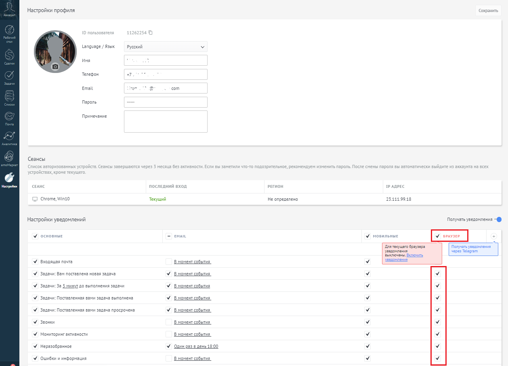

## 2.2 Дополнительные настройки интеграции. Обзор

В зависимости от ваших задач можно указать дополнительные настройки интеграции. На вкладке “Обработка звонков” настраивается логика обработки звонков – нужно ли автоматически создавать контакт или создавать в “неразобранном”, нужно ли ставить задачи по пропущенным звонкам и т.д.: 

На вкладке “SMS” настраивается работа с SMS – нужно ли использовать SMS-визитку, дать сотрудникам возможность отправлять SMS из карточки контакта и т.д.: 23 Интеграция Виртуальной АТС MANGO OFFICE и amoCRM | Версия от 25.08.2025

На вкладке “Дополнительно” настраивается интеграция с Коллтрекингом MANGO OFFICE (сквозная аналитика), Контакт-центром, Digital-воронкой amoCRM, Речевой аналитикой:

На вкладке “Ограничения” указывается, для каких линий Виртуальной АТС работает интеграция с amoCRM 24 Интеграция Виртуальной АТС MANGO OFFICE и amoCRM | Версия от 25.08.2025

## 2.3 Настройка “Сохранять все звонки” или как сохраняются

звонки сотрудников, не указанных в таблице сопоставления Примечание. Данная настройка доступна только в расширенном пакете. Общее Данная настройка будет полезна, если вы указали не всех менеджеров в настройке сопоставления сотрудников, а также, если вы хотите фиксировать звонки сотрудников, которые не работают в amoCRM, но могут звонить клиентам (например, бухгалтер, курьер и т.д.). Если включена настройка “Сохранять все звонки” и в ней указан сотрудник amoCRM, то к этому сотруднику будут автоматически привязаны все звонки, совершенные несопоставленными сотрудниками (то есть, сотрудниками, не указанными в таблице сопоставления виджета интеграции). Подробно об особенностях работы Виджет интеграции игнорирует звонки несопоставленного сотрудника, если выключена настройка “Сохранять все звонки”. В таблице ниже описаны особенности в работе виджета интеграции при включенной настройке “Сохранять все звонки”: 25 Интеграция Виртуальной АТС MANGO OFFICE и amoCRM | Версия от 25.08.2025

| Особенности | Описание работы интеграции при включенной настройке “Сохранять все звонки” |
| --- | --- |
| Обработка входящего или исходящего звонка несопоставленного сотрудника | Данные о звонках всех несопоставленных сотрудников, будут привязаны к одному сотруднику, указанному в этой настройке. |
| Обработка пропущенного звонка на несопоставленного сотрудника | Если пропущенный звонок в группу завершился на несопоставленном сотруднике, и при этом, выключена настройка “Указывать ответственного при пропущенных звонках в группу”, то звонок будет привязан к сотруднику, указанному в настройке “Сохранять все звонки”. |
| Перевод звонка: |  |
| - перевод от несопоставленного сотрудника к сотруднику, указанному в таблице сопоставления | Первое плечо звонка будет фиксироваться на сотрудника, указанного в настройке “Сохранять все звонки”, а второе плечо звонка будет фиксироваться в соответствии с настройками обработки звонков в виджета интеграции. Пример. Бухгалтер позвонил Клиенту, чтобы уточнить сумму заказа, а затем бухгалтер перевел звонок на оператора для уточнения заказа. Звонок будет зафиксирован в amoCRM следующим образом: - разговор Клиента с бухгалтером (то есть, первое плечо звонка) будет сохранен в amoCRM с привязкой к сотруднику, указанному в настройке “Сохранять все звонки”; - разговор Клиента с оператором (то есть, второе плечо звонка) будет сохранен как отдельный звонок на оператора, а также в amoCRM будут созданы сущности, в соответствии с настройкой обработки входящих звонков. |
| - перевод от сотрудника, указанного в таблице сопоставления, к не сопоставленному сотруднику | Первое плечо звонка будет фиксироваться в соответствии с настройками обработки звонков приложения интеграции, а второе плечо звонка будет фиксироваться на сотрудника, указанного в настройке “Сохранять все звонки”. Пример. Клиент позвонил оператору, чтобы уточнить время доставки, а оператор перевел Клиента на курьера. Звонок будет зафиксирован в amoCRM следующим образом: - разговор Клиента с оператором (то есть, первое плечо звонка) будет сохранен как отдельный входящий звонок на оператора, а также в amoCRM будут созданы сущности, в соответствии с настройкой обработки входящих звонков; - разговор Клиента с курьером (то есть, второе плечо звонка) будет сохранен в amoCRM с привязкой к сотруднику, указанному в настройке “Сохранять все звонки”. |
| Сохранение текстов речевой аналитики | Тексты разговоров с Клиентами несопоставленных сотрудников будут сохраняться, при включении настройки “Сохранять данные Речевой аналитики” в приложении интеграции. |
| Показ карточки звонка | Карточка звонка НЕ будет отображаться в amoCRM во время звонка несопоставленного сотрудника. |

26 Интеграция Виртуальной АТС MANGO OFFICE и amoCRM | Версия от 25.08.2025 Как включить настройку По умолчанию данная настройка выключена. Чтобы ее включить, в окне “Основные настройки интеграции” следует: 1. перейдите на вкладку “Обработка звонков”; 2. прокрутите вкладку вниз до конца, так, чтобы отображался блок “Прочее”; 3. активируйте переключатель “Сохранять все звонки”. Будет открыто дополнительное поле;

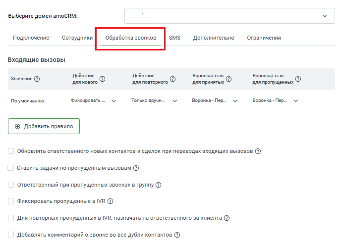

4. укажите сотрудника amoCRM, к которому будут привязаны все звонки несопоставленных сотрудников; 5. нажмите кнопку “Сохранить”.

27 Интеграция Виртуальной АТС MANGO OFFICE и amoCRM | Версия от 25.08.2025

## 2.4 Обработка входящих вызовов от новых Клиентов

Создавать контакт при звонках с новых номеров Если в поле “Действие для нового Клиента”, в выпадающем списке выбрано значение “Создать контакт”, то после каждого принятого входящего звонка с нового номера телефона будет автоматически создан новый контакт в amoCRM. В контакте также сохранится номер телефона, с которого вам звонили. Имя контакта по умолчанию указывается в формате “Новый Клиент, ЧЧ:ММ ДД.ММ.ГГГГ” с указанием даты и времени его создания. Если звонок не был принят – контакт не создается. Можно выбрать значение “Создать контакт и сделку”, чтобы автоматически создавался не только контакт, но и сделка, связанная с контактом. Название сделки по умолчанию в формате “Сделка номер телефона” (к примеру, “Сделка 74955404444”). Примечание. При выборе значения “Создать контакт и сделку” появляется возможность настроить воронку продаж для входящих звонков.

Если при звонках от новых Клиентов нужно фиксировать их в категорию “НЕРАЗОБРАННОЕ”, то в поле “Действие для нового Клиента” нужно выбрать значение “Фиксировать в неразобранное”. Примечание. При выборе значения “Фиксировать в неразобранное” появляется возможность настроить воронку продаж для входящих звонков. Если выбрано значение “Фиксировать в неразобранное”, то при звонке от нового Клиента в amoCRM контакт и сделка не будут созданы, информация о звонке сохранится в категории “НЕРАЗОБРАННОЕ”, можно обработать его в любой момент времени:

28 Интеграция Виртуальной АТС MANGO OFFICE и amoCRM | Версия от 25.08.2025 Если нужно создавать Клиентов (при звонках от новых) только вручную, то нужно выбрать значение “Только вручную”. При такой настройке amoCRM: • при входящем звонке контакт и сделка не будут созданы автоматически; • во время разговора с Клиентом будет открыта карточка звонка, в которой отображена кнопка “Добавить контакт”. Если оператор нажмет на кнопку “Добавить контакт”, то в amoCRM будет создан новый контакт, в котором учтен входящий звонок. Примечание. Дополнительно можно включить настройку “Указывать источник при входящих звонках”. Указывать источник при входящих звонках Если у вас несколько номеров подключено к Виртуальной АТС и нужно разделять Клиентов, обращающихся по разным номерам, то нужно включить флаг “Указывать источник при входящих звонках”. Примечание. Флаг “Указывать источник при входящих звонках” доступен для настройки, если в поле “Действие для нового Клиента” выпадающем списке выбрано одно из следующих значений: Создать контакт, Создать контакт и сделку:

Если флаг включен, то при входящем звонке в карточке звонка отобразится информация о вашем номере, на который поступил звонок от Клиента: 29 Интеграция Виртуальной АТС MANGO OFFICE и amoCRM | Версия от 25.08.2025

В автоматически создаваемом контакте в дополнительном поле “Номер линии MANGO OFFICE” указывается номер, на который поступил звонок:

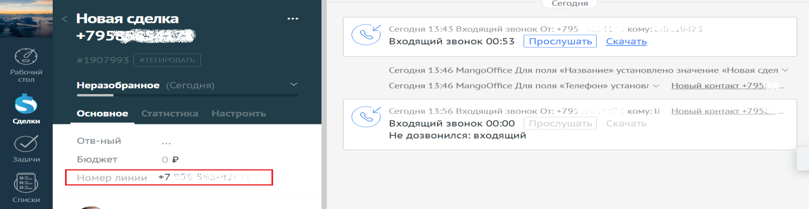

Также можно разделять списки контактов и аналитику продаж по значениям этого поля:

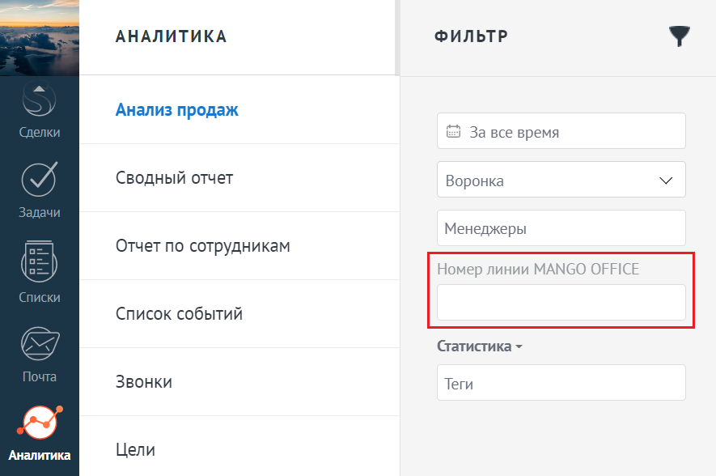

30 Интеграция Виртуальной АТС MANGO OFFICE и amoCRM | Версия от 25.08.2025

## 2.5 Обработка повторных входящих вызовов

Автоматические действия для повторного входящего звонка Если в поле “Действие для повторного” выпадающем списке выбрано значение “Только вручную”, то в amoCRM будут выполнены следующие действия: - при входящем звонке выполняется поиск Клиента по номеру телефона; - если Клиент найден в amoCRM, то контакт и сделка не будут созданы автоматически; • входящий звонок будет учтен в найденном контакте. Если в поле “Действие для повторного” выпадающем списке выбрано значение “Всегда создавать сделку”, то при каждом повторном звонке от Клиента будет автоматически создаваться сделка, связанная с найденным контактом. Название сделки по умолчанию в формате “Сделка номер телефона” (к примеру, “Сделка 74955404444”). Звонок автоматически учитывается для контакта. Примечание. При выборе значения “Всегда создавать сделку” или “Создавать сделку, если нет открытых” появляется возможность настроить воронку продаж для входящих звонков. Порядок настройки воронки продаж описан далее в тексте. Если в поле “Действие для повторного”, выбрать значение “Создавать сделку, если нет открытых”, то в amoCRM: 1. при входящем звонке выполняется поиск Клиента по номеру телефона. При этом, если: – Клиент найден в amoCRM, то выполняется поиск по статусу сделок данного контакта; – нет ни одной открытой сделки, то автоматически создается сделка, связанная с найденным контактом; – есть хотя бы одна открытая сделка, то сделка не создается; 2) звонок учитывается для найденного контакта.

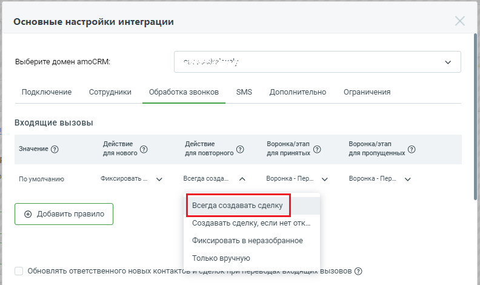

Умные правила распределения входящих звонков Обзор Настройка доступна только для расширенного пакета интеграции. 31 Интеграция Виртуальной АТС MANGO OFFICE и amoCRM | Версия от 25.08.2025 Умные правила могут распределять входящие звонки в зависимости от тех или иных параметров звонка / информации о Клиенте. Вы можете настроить распределение входящих звонков на основе данных о звонке, либо данных amoCRM, либо данных Коллтрекинга MANGO OFFICE. В результате, если входящий звонок соответствует параметрам того или иного умного правила, то виджет интеграции распределит звонок согласно этому правилу. Если входящий звонок НЕ соответствует ни одному умному правилу, то звонок будет распределен Виртуальной АТС по схеме распределения вызовов. Чтобы умные правила работали корректно, вам нужно сначала в схеме распределения вызовов Виртуальной АТС включить голосовое приветствие длительностью не менее 5 секунд, а уже затем, настраивать умные правила. Тогда, при звонке, во время проигрывания приветствия, виджет выполнит анализ данных о звонке / Клиенте и обработает вызов согласно настроенному умному правилу. Предварительные действия. Включение голосового приветствия Чтобы включить голосовое приветствие в схему распределения Виртуальной АТС в Личном кабинете MANGO OFFICE перейдите в раздел “Голосовое меню и распределение звонков”:

В схеме распределения перед распределением звонка укажите звуковое приветствие длительностью не менее 5 сек, а также укажите значение “да” в параметре “ожидать окончания”: 32 Интеграция Виртуальной АТС MANGO OFFICE и amoCRM | Версия от 25.08.2025

Как создать и настроить умные правила Вам нужно открыть вкладку “Обработка звонков” и прокрутить эту вкладку вниз до конца так, чтобы была видна группа полей “Умные правила распределения входящих вызовов”.

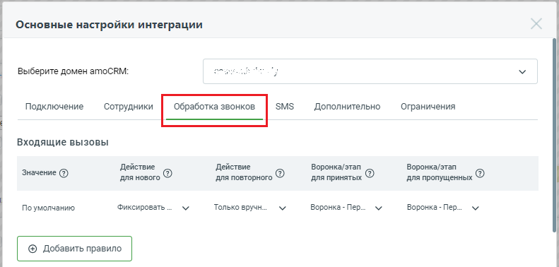

Далее, необходимо: 1) настроить собственный алгоритм распределения, указав правила обработки звонка. Можно указать до 100 правил, при звонке правила анализируются в настроенном порядке, сверху-вниз.

Для изменения порядка правил нужно навести курсор на кнопку с точками , нажать левую кнопку мыши и, не отпуская, перетащить вверх и/или вниз нужно правило в списке правил; 33 Интеграция Виртуальной АТС MANGO OFFICE и amoCRM | Версия от 25.08.2025 2) для добавления нового правила нужно нажать кнопку “Добавить правило”, а для удаления – кнопку “Корзина”; 3) при настройке правила указать, какое значение анализировать: - из данных о текущем звонке; - из данных коллтрекинга о текущем звонке (если к Виртуальной АТС подключен Коллтрекинг MANGO OFFICE, а также на вкладке “Дополнительно” включена интеграция с коллтрекингом). К примеру, Коллтрекинг.medium; - из данных коллтрекинга, ранее сохраненных в amoCRM (к примеру, Контакт.ДКТ:Город); - из amoCRM (для этого в amoCRM выполняется поиск по номеру звонящего и для найденного Клиента выполняется анализ данных) – для контактов, компаний, сделок. По всем полям, в том числе пользовательским, а также по тэгам; 4) указать операцию сравнения (“равно”, “не равно”, “содержит” и т.д.) и указать, с каким значением необходимо сравнивать; 5) указать, какое действие необходимо выполнить, если правило будет выполнено. Например, переадресовать на номер, переадресовать на ответственного и другие; Примечание. При вводе номера телефона в условиях умного правила, нужно указывать номер телефона начиная с 7, без символов “+” и пробелов. Например, если вы хотите указать номер +7(495) 123-45-67, то укажите его так: 74951234567. 6) если правило не будет выполнятся, то будет проверяться следующее правило. Если ни одно правило не подошло, то звонок будет обрабатываться по схеме переадресации, настроенной в Личном кабинете Виртуальной АТС; 7) нажмите кнопку “Сохранить” в нижней части формы. Будет выполнена проверка настройки умных правил, а также проверка корректной настройки схемы распределения вызовов. Если нет проблем, то настройки работы умных алгоритмов будут сохранены.

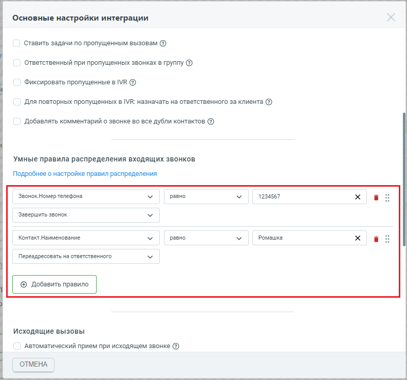

Если указанные выше требования к схеме распределения вызовов не будут выполнены, то: 1) ваши звонки не будут обработаны умными правилами распределения звонков; 2) при настройке умных правил будет выдано следующее сообщение: 34 Интеграция Виртуальной АТС MANGO OFFICE и amoCRM | Версия от 25.08.2025

Тогда, при звонке, во время проигрывания приветствия, виджет выполнит анализ данных о звонке/Клиенте и обработает вызов согласно настроенному умному правилу распределения вызовов. Важно! Для устранения ошибки необходимо перейти в Личный кабинет Виртуальной АТС, открыть в раздел “Голосовое меню и распределение звонков” и настроить схему распределения вызовов так, чтобы она соответствовала указанным выше требованиям.

Как настроить автоматический сброс нежелательного входящего звонка Нежелательные входящие звонки можно автоматически сбрасывать. Можно настроить правило, по которому умный алгоритм распределения входящих вызовов будет распознавать нежелательные входящие вызовы и сбрасывать их. Также, наоборот, можно отменить ранее настроенное правило сброса вызова и перенаправлять входящие вызовы на того или иного сотрудника. Рассмотрим конкретный пример. Чтобы организовать “черный” список Клиентов, можно пометить нежелательные контакты каким-нибудь тэгом, к примеру, “черный список” и создать умный алгоритм с проверкой значения тэга и действием “Завершить звонок”:

Примеры настройки умного алгоритма распределения Пример 1. 35 Интеграция Виртуальной АТС MANGO OFFICE и amoCRM | Версия от 25.08.2025 Типовой алгоритм распределения - распределение звонков по ответственным менеджерам. При входящем звонке виджет определит Клиента по номеру звонящего и затем определит сотрудника, ответственного за Клиента. После чего распределит звонок на данного сотрудника. А если звонок от нового Клиента, то пустить его далее по схеме переадресации. Примечание. В amoCRM может быть заведено несколько Клиентов с одним и тем же номером телефона. Вызов Клиента будет переведен на сотрудника, указанного в Клиенте, который был создан в amoCRM раньше всех.

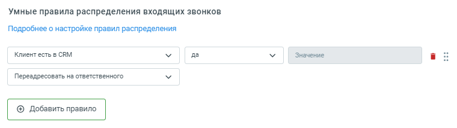

Пример 2. Если звонок от существующего Клиента, то автоматически распределить его на ответственного менеджера. Если звонок от нового Клиента, то если звонок поступил на номер А, то адресовать на внутренний номер 100, а если поступил не на номер А, то не обрабатывать и пустить его далее по схеме переадресации.

Пример 3. Если звонок от существующего Клиента и, если он помечен тэгом VIP - автоматически распределить его на ответственного менеджера, а если не помечен – адресовать на внутренний номер 100. Если звонок от нового Клиента, то если звонок поступил по рекламной кампании “campaign1909”, то адресовать на внутренний номер 101. В остальных случаях не обрабатывать и пустить его далее по схеме переадресации 36 Интеграция Виртуальной АТС MANGO OFFICE и amoCRM | Версия от 25.08.2025

Пример 4. Если звонок от существующего Клиента и, если у Клиента есть сделка на этапе “Доставка”, то распределить его на менеджера отдела доставки, внутренний номер 100. Если нет открытых сделок или сделки на других этапах, то распределить на ответственного менеджера. Новых Клиентов - не обрабатывать, пустить далее по схеме переадресации.

Примечание. При такой настройке при входящем звонке система сначала по номеру звонящего ищет компанию/контакт (приоритетнее компания) для определения Клиента. Далее анализируются все открытые сделки, связанные с Клиентом, и, если будет найдена сделка, у которой этап = “Доставка”, то первое правило сработает и звонок будет переадресован на номер 100. Управление воронкой продаж для входящих звонков Если при входящем звонке должна автоматически создаваться сделка в amoCRM, которая попадает в ту или иную воронку продаж, в форме настройки виджета следует: 1) в поле “Действие для нового” выбрать значение “Создать контакт и сделку” / “Фиксировать в неразобранное” или в поле “Действие для повторного” выбрать значение “Всегда создавать сделку” / “Создавать сделку, если нет открытых”; 2) в поле “Воронка/этап для принятых” выбрать название воронки продаж, ранее созданной в amoCRM, либо выбрать этап воронки продаж, в который должны попадать сделки, созданные автоматически, при приеме звонка от Клиента, соответственно; 3) в поле “Воронка/этап для пропущенных” выбрать название воронки продаж, ранее созданной в amoCRM, либо выбрать этап воронки продаж, в который должны попадать сделки, созданные автоматически, при пропущенном звонке от Клиента. 37 Интеграция Виртуальной АТС MANGO OFFICE и amoCRM | Версия от 25.08.2025 Примечание. Если в поле “Действие для нового” выбрать значение “Фиксировать в неразобранное” или в поле “Действие для повторного” выбрать значение “только вручную”, то будут скрыты поля “Этап для принятых” и “Этап для пропущенных” (то есть, указать этап воронки продаж нельзя).

Отображать карточку звонка Важно! Данная настройка доступна только для пользователей расширенного пакета интеграции. При входящем / исходящем вызове (как от нового Клиента, так и при повторном вызове) в интерфейсе amoCRM появляется карточка звонка.

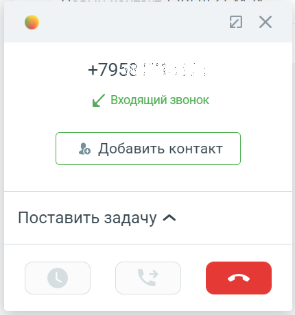

Чтобы настроит отображение карточки звонка, следует прокрутить закладку “Дополнительно” вниз до конца, чтобы отображалось поле “Отображать карточку звонка”:

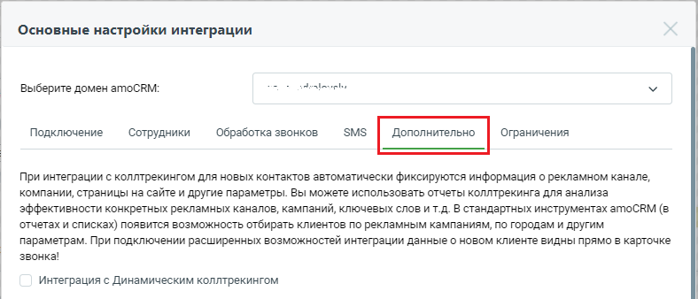

38 Интеграция Виртуальной АТС MANGO OFFICE и amoCRM | Версия от 25.08.2025 В поле “Отображать карточку звонка” доступны следующие настройки ниже. После выбора режима отображения карточки звонка, нажмите кнопку “Сохранить”.

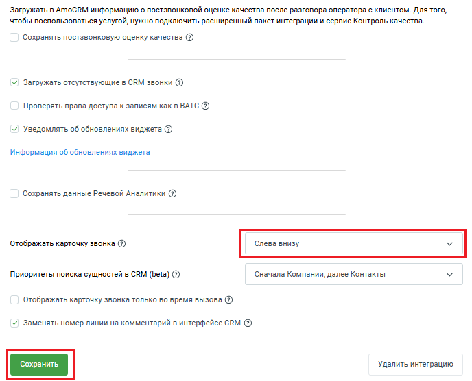

Показывать/скрывать карточку во время звонка Кроме этого, на закладке “Дополнительно” можно включить отображение карточки звонка только во время входящих и исходящих вызовов, для этого нужно установить “галочку” в поле “Отображать карточку звонка только во время вызова”. Если нужно, чтобы после окончания звонка карточка автоматически сворачивалась, то нужно снять данную “галочку”. Далее, нужно нажать кнопку “Сохранить”, чтобы активировать настройки.

39 Интеграция Виртуальной АТС MANGO OFFICE и amoCRM | Версия от 25.08.2025 Приоритеты поиска сущностей в CRM Вы можете увечить скорость работы своей интеграции с телефонией MANGO OFFICE, выбрав подходящий для вашей CRM режим поиска сущностей. Если вы отключите поиск по компаниям, интеграция не будет учитывать наличие новых компании в CRM, за исключением синхронизации с Адресной книгой Виртуальной АТС MANGO OFFICE. Внимание! Выбор сущности, с которой связывается звонок, выполняется на стороне CRM по своим правилам. Изменение приоритета компаний или их исключение из поиска интеграции не означает, что звонок не будет связан с компанией, если такая будет найдена по номеру телефона. Рекомендуем связывать компании и контакты с одинаковыми номерами телефонов для полного отображения звонков. Чтобы установить настройку, надо прокрутить закладку “Дополнительно” вниз до конца, чтобы стало видно поле “Приоритеты поиска сущностей в CRM (beta)”.

В поле “Приоритеты поиска сущностей в CRM (beta)” выберите то или иное значение, затем нажать кнопку “Сохранить”:

40 Интеграция Виртуальной АТС MANGO OFFICE и amoCRM | Версия от 25.08.2025

## 2.6 Обработка исходящих вызовов новым Клиентам

Автоматический прием при исходящем звонке Виджет поддерживает исходящий звонок по клику на номер телефона в интерфейсе amoCRM. Принцип работы этой функции следующий: 1. сотрудник кликает по номеру телефона Клиента; 2. звонит рабочий телефон этого сотрудника. Сотрудник поднимает трубку; 3. после того как сотрудник сам поднимет трубку, начнется звонок на номер телефона Клиента. Внимание! Эта возможность поддерживается не всеми моделями IP-телефонов и софтфонов. Также эта возможность недоступна при использовании сотрудником, к примеру, мобильного телефона. Чтобы установить настройку, надо прокрутить закладку “Обработка звонков” вниз до конца, чтобы стало видно настройку.

Внизу закладки “Обработка звонков”, если флаг “Автоматический прием при исходящем звонке” включен, то сотруднику не нужно самому поднимать трубку (выполнять шаг 2, см. перечисление выше). Звонок на рабочем телефоне сотрудника будет принят автоматически. Нажмите кнопку “Сохранить” внизу закладки “Обработка звонков”, чтобы сохранить настройку.

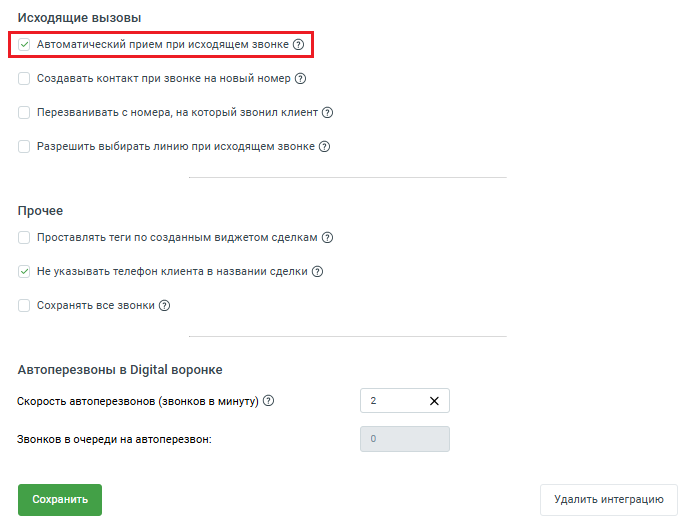

41 Интеграция Виртуальной АТС MANGO OFFICE и amoCRM | Версия от 25.08.2025 Создавать контакт при звонке на новый номер Если флаг “Создавать контакт при звонке на новый номер” включен (на закладке “Обработка звонков”, внизу этой закладки), то при исходящем звонке на новый номер (новый – значит не заведенный в вашей amoCRM) будет автоматически создан контакт. В контакте также сохранится номер телефона, на который вы позвонили. Имя контакта по умолчанию указывается в формате “Новый (16:03 28.11.2020)”, с указанием даты и времени его создания. Если флаг “Создавать контакт при звонке на новый номер” выключен, то при исходящем звонке на новый номер НЕ будет автоматически создан контакт. Флаг нужен, в частности, для того, чтобы при исходящих продажах информация о звонке и его результатах сохранялась в amoCRM. Примечание. Кроме того, если включен флаг “Создавать контакт при звонке на новый номер”, то станет доступна настройка “Создавать сделку”. Нажмите кнопку “Сохранить” внизу закладки “Обработка звонков”, чтобы сохранить настройку.

Создавать сделку при звонке на новый номер Важно. Эта настройка доступна только в том случае, если включен флаг “Создавать контакт при звонке на новый номер”. 42 Интеграция Виртуальной АТС MANGO OFFICE и amoCRM | Версия от 25.08.2025

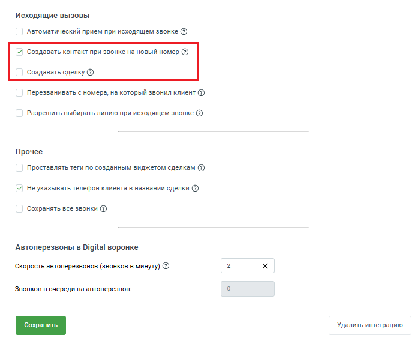

Если настройка включена (включен флаг “Создавать сделку”), то при исходящем принятом звонке на новый (незнакомый) номер автоматически создается сделка в amoCRM. Если флаг выключен, то сделка не будет создана. Нажмите кнопку “Сохранить” внизу закладки “Обработка звонков”, чтобы сохранить настройку.

Перезванивать с номера, на который звонил Клиент Если данный флаг включен, то у всех amoCRM, при клике на номер Клиента, будет совершатся исходящий звонок с номера, на который Клиент звонил ранее. Номер, с которого будет совершен звонок, вы можете посмотреть в контакте или сделке в дополнительном поле “Номер линии MANGO OFFICE”: 43 Интеграция Виртуальной АТС MANGO OFFICE и amoCRM | Версия от 25.08.2025

Если оператор кликнет по номеру телефона, указанный в карточке компании, то звонок будет выполнен в номера первого найденного контакта, связанного с карточкой компании. Ограничения: - данная функция работает только при клике по номеру телефона в интерфейсе amoCRM. Вы можете перезвонить Клиенту другим способом (например, вручную набрать номер на телефоне/софтфоне), но тогда звонок НЕ будет совершен с номера, на который звонил Клиент; - данная функция НЕ работает, если: - Клиент звонил на пассивную SIP-линию или номер коллтрекинга; - отключена линия ВАТС (отключен номер телефона), при помощи которой совершает попытка звонка; - в поле “Номер линии MANGO OFFICE” нет номера телефона. Чтобы включить настройку и перезванивать с номера, на который звонил Клиент, в окне “Основные настройки интеграции” следует: 1) открыть вкладку “Обработка звонков”; 2) активировать переключатель “Перезванивать с номера, на который звонил Клиент” в блоке “Исходящие вызовы”; 3) нажать кнопку “Сохранить” внизу закладки “Обработка звонков”, чтобы сохранить настройку. Теперь, если оператор кликнет на номер телефона Клиента в интерфейсе amoCRM, будет выполнен звонок с номера, на который звонил Клиент.

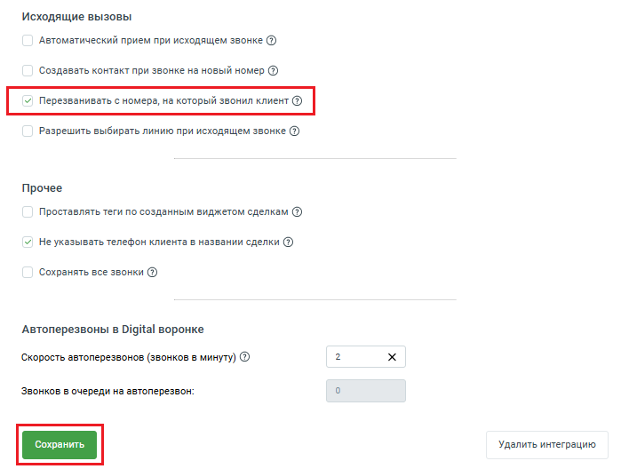

44 Интеграция Виртуальной АТС MANGO OFFICE и amoCRM | Версия от 25.08.2025 Разрешить выбирать линию при исходящем звонке Если флаг установлен, то ваши сотрудники могут выбирать номер линии, с которой будет осуществлен исходящий вызов. Выбор будет доступен только для сотрудников, у которых в настройках Виртуальной АТС НЕ запрещены исходящие вызовы. Нажмите кнопку “Сохранить” внизу закладки “Обработка звонков”, чтобы сохранить настройку.

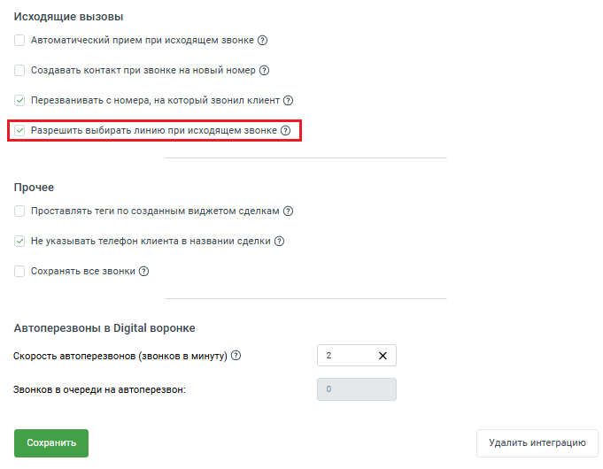

## 2.7 Пропущенные в IVR

Ответственный при пропущенных звонках в IVR Данная настройка позволяет связывать звонки от новых Клиентов, пропущенные в IVR (голосовом меню), с определенным ответственным сотрудником. Эта настройка недоступна, когда для всех звонков от новых Клиентов контакты и сделки создаются только вручную (то есть, настройка недоступна, когда в поле “Действие для нового” (см. рисунок ниже) выбрано значение “Только вручную”). Если включен флаг “Фиксировать пропущенные в IVR”, а также в поле “Действие для нового” выбрано одно из значений: ● Создать контакт; 45 Интеграция Виртуальной АТС MANGO OFFICE и amoCRM | Версия от 25.08.2025 ● Создать контакт и сделку; ● Фиксировать в “неразобранное”; то при каждом звонке, пропущенном в IVR (голосовом меню) от нового Клиента будет: • автоматически создается контакт, либо сделка (если включен флаг “Создать контакт и сделку”); • в контакте (и сделке) указывается ответственный сотрудник, выбранный в данной настройке. Нажмите кнопку “Сохранить” внизу закладки “Обработка звонков”, чтобы сохранить настройку.

Для повторных пропущенных в IVR: назначать на ответственного за клиента Данная настройка (см. рисунок выше) создана для ситуаций, когда в IVR-меню пропущен звонок с номера, ранее уже сохраненного в контакте amoCRM. Если данная настройка включена, то при пропущенном на IVR звонке от Клиента, сохраненного в amoCRM, виджет интеграции будет ставить задачу по пропущенному звонку на ответственного за контакт. Например, если был пропущен в IVR звонок от Клиента ООО “Гермес”, то виджет интеграции автоматически поставит задачу на сотрудника, который назначен ответственным за данного Клиента. Если данная настройка выключена, то задачи по пропущенным в IVR звонкам Клиентов будут ставится на сотрудника, который указан ответственным за все звонки, пропущенные в IVR (см. Ответственный при пропущенных звонках в IVR). Нажмите кнопку “Сохранить” внизу закладки “Обработка звонков”, чтобы сохранить настройку. 46 Интеграция Виртуальной АТС MANGO OFFICE и amoCRM | Версия от 25.08.2025

## 2.8 Ответственный при пропущенных звонках в группу

Если этот флаг включен, а также в поле “Действие для нового” выбрано одно из значений “Создать контакт” / “Создать контакт и сделку” / “Фиксировать в”неразобранное”, то при каждом звонке от нового Клиента, распределенном в любую группу ВАТС и пропущенном: - автоматически создается контакт; - автоматически создается сделка (если включен флаг “Создать контакт и сделку”); - в контакте (и сделке) указывается выбранный ответственный сотрудник. Если флаг выключен, то для такого звонка при создании контакта (сделки) - в качестве ответственного указывается первый сотрудник, на которого распределялся вызов. Нажмите кнопку “Сохранить” внизу закладки “Обработка звонков”, чтобы сохранить настройку. 47 Интеграция Виртуальной АТС MANGO OFFICE и amoCRM | Версия от 25.08.2025

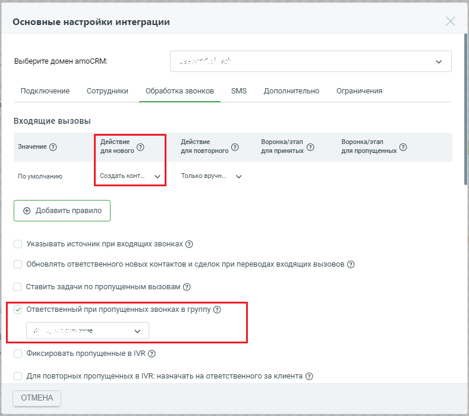

## 2.9 Сохранение данных Речевой Аналитики

Перед началом работы Чтобы сохранять данные Речевой Аналитики в amoCRM, вам нужно подключить: 1. сервис Речевой аналитики; 48 Интеграция Виртуальной АТС MANGO OFFICE и amoCRM | Версия от 25.08.2025 2. сервис Записи разговоров; 3. расширенный пакет интеграции с amoCRM; Важно! Если сервисы Записи разговоров и Речевой аналитики, не будут подключены, а также не будет подключен расширенный пакет интеграции с amoCRM, то сохранять тематики и/или тексты разговоров будет невозможно. Определять тематику и/или тексты можно в разговорах тех пользователей amoCRM, которым указан сотрудник Виртуальной АТС. Определять тематику и/или тексты в разговорах других пользователей amoCRM следует после ввода их данных в основных настройках интеграции. Сохранение тематик разговоров Общие сведения Интеграция Виртуальной АТС с amoCRM предоставляет возможность сохранять тематики разговоров, поскольку они дают возможность понять, использовались ли в разговорах обязательные слова, стоп-слова или ненормативная лексика, автоматически выявлять разговоры, в которых Клиент интересовался тем или иным продуктом или выражал недовольство, конфликтовал с оператором и прочее. Примечание. Кроме данных, также есть возможность сохранять текст распознанной речи разговора. Перечислим некоторые из преимуществ, которые дают тематики разговоров в тегах контактов amoCRM: - Руководитель отдела продаж, не прослушивая записи разговора, может: - увидеть сделано ли Клиенту предложение купить тот или иной продукт, была ли попытка up-sale, что напрямую влияет на средний чек; - провести анализ проваленных сделок на основе информации о том, какие “ключевые теги” использовались в разговорах, например: дорого, нет нужного размера/конфигурации, наименование конкурента и т.д.; - автоматически предоставлять отчетность для отдела маркетинга, для экономии времени; - Руководитель отдела технической поддержки клиентского сервиса может контролировать использование обязательных или “стоп” слов (например, “я буду жаловаться” или “ужасный сервис”) и диалоге с Клиентом, что позволит повысить качество обслуживания Клиентов, быстро выявить и исправить какую-то проблему; - Маркетолог, при анализе эффективности рекламных кампаний, может: - сформировать отчет в amoCRM, в котором приведена информация о том, кто из Клиентов произнес кодовое слово и о сумме сделок с этими Клиентами; - определить целевым или нецелевым было обращение; - с каким первичным интересом приходят входящие звонки (например, чтобы сравнить между собой конкурирующие продукты) и как часто они закрываются в сделки. Как это работает В случае, если пользователю amoCRM поступил звонок, сервис Речевой аналитики (РА) Виртуальной АТС определит тематику разговора, а сервис интеграции сохранит название тематики в тегах контакта. В настройках функции сохранения тематик РА можно выбрать тематики разговора, которые будут сохраняться тегах amoCRM. После завершения разговора с Клиентом, сервис РА анализирует разговор и относит его к той или иной тематике. Если в разговоре определена тематика, выбранная вами в настройках функции сохранения данных РА, то название тематики сохраняется в amoCRM как тэг на карточке Клиента. 49 Интеграция Виртуальной АТС MANGO OFFICE и amoCRM | Версия от 25.08.2025 Кроме этого, в сервисе Речевой аналитики можно не только настроить поиск определенных тематик в разговоре, но и контролировать ОТСУТСТВИЕ слова/фразы в разговоре. Исключение тематик позволяет: • найти контакты, не имеющие отношение к продажам ваших товаров или услуг; • оптимизировать работу операторов, определив круг тематик разговоров с Клиентами; • создавать отчеты в amoCRM, в которых приведены обобщённые данные, отфильтровав при этом узкие или “нишевые” тематики. Как включить сохранение тематик Чтобы включить функцию сохранения тематик Речевой аналитики, следует: 1) Открыть закладку “Дополнительно”, прокрутить закладку вниз, чтобы стало видно поле “Сохранять данные Речевой Аналитики”; 2) Включить флаг “Сохранять данные Речевой аналитики”. Будет показан список тематик; 3) Выбрать тематики, которые нужно сохранять в контактах amoCRM; 4) Нажать кнопку “Сохранить” (внизу окна “Основные настройки”): Как определяются тематики в неразобранных обращениях Если в вашем amoCRM используется категория “НЕРАЗОБРАННОЕ” для фиксации звонков и заведения новых Клиентов и нужно сохранять данные Речевой аналитики по результатам обработки разговора с Клиентом, то необходимо включить флаг “Отслеживать конвертацию” неразобранного” в контакты”, и нажать кнопку “Сохранить”. В этом случае, сервис интеграции будет отслеживать, в течение 24 часов после разговора, конвертацию “неразобранного” в контакт: - если конвертация произойдет, то тематики по разговору автоматически будут добавлены к контакту; - если конвертация из “неразобранного” в контакт не произойдет течении 24 часов, тематики не будут добавлены к контакту.

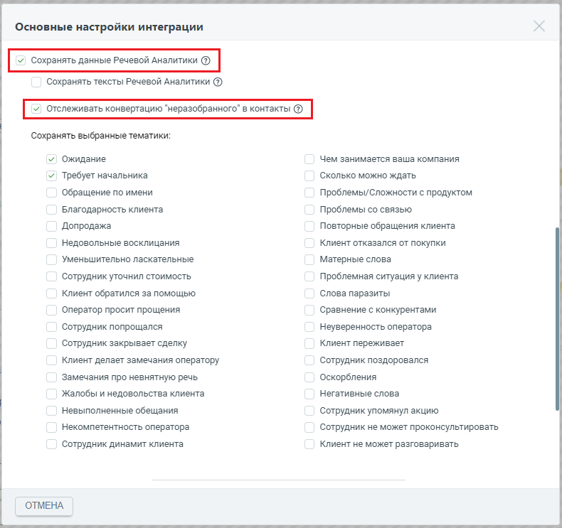

50 Интеграция Виртуальной АТС MANGO OFFICE и amoCRM | Версия от 25.08.2025 Как посмотреть тематику разговора Чтобы вывести на экран название тематики, определенной в том или ином контакте или сделке, в amoCRM следует: 1) открыть контакт или сделку; 2) посмотреть название тематики в тегах контакта или сделки:

Фильтр по тематикам Можно фильтровать список контактов по тематикам разговора, указанным в тегах. Это позволит вам посмотреть список звонков, в которых, например: - оператор сделал допродажное предложение; - использовалась ненормативная лексика, стоп-слова; - не использовались определенные слова. Целью фильтра по тематикам разговора является отображение отчетности о звонках, для контроля качества и оценки эффективности обслуживания Клиентов операторами. Для поиска контактов по тематикам, нужно использовать встроенный в amoCRM фильтр контактов и компаний по тегу. Подробнее о том, как это сделать…

51 Интеграция Виртуальной АТС MANGO OFFICE и amoCRM | Версия от 25.08.2025 Резюме разговора Общие сведения Сервис речевой аналитики может создавать текстовое резюме разговора на основе смыслового анализа, в котором будут отображены основные детали коммуникации. Как это работает  Система записывает разговор и проводит смысловой анализ диалога с помощью AI- технологии.  После анализа - предоставляет расшифровку в виде резюме с обобщенным содержимым разговора с разделами согласно его логическим составляющим. Как настроить Чтобы включить функцию "Резюме разговора", следует: 1) Открыть закладку “Дополнительно”, прокрутить закладку вниз, чтобы стало видно поле “Сохранять данные Речевой Аналитики”;

2) Открыть блок "Речевая аналитика"; 52 Интеграция Виртуальной АТС MANGO OFFICE и amoCRM | Версия от 25.08.2025 3) Установить флаг в чекбоксе "Резюме разговора";

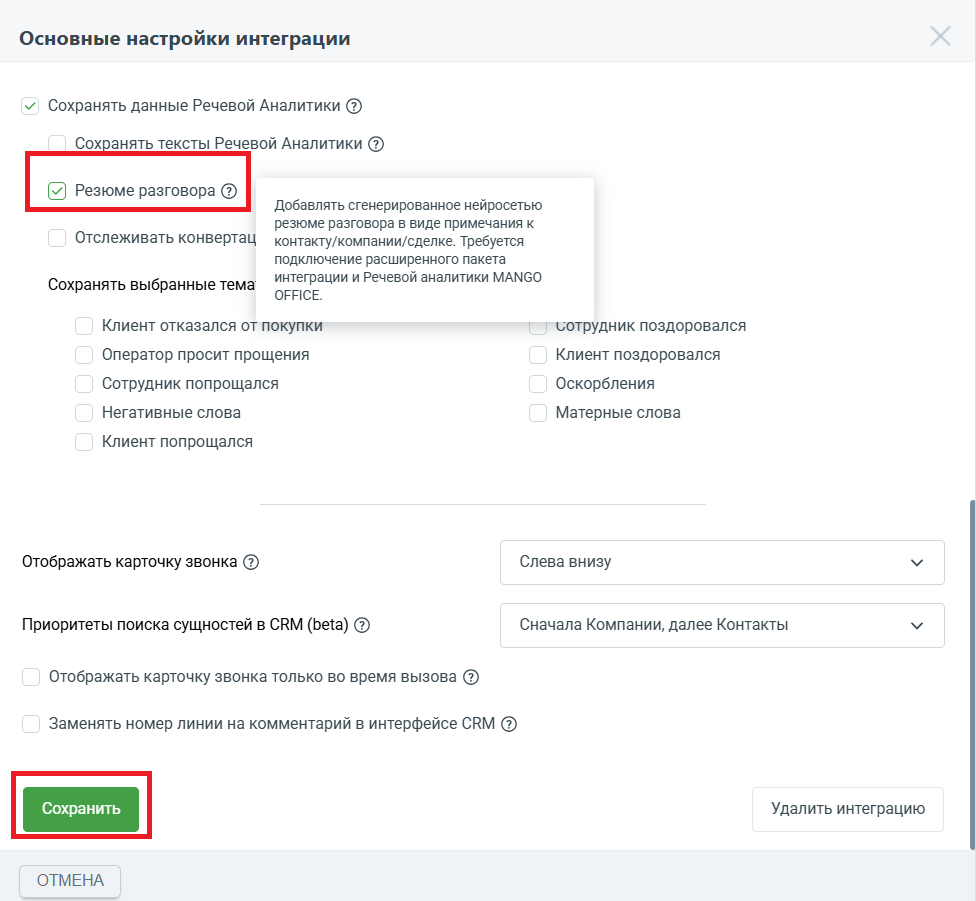

4) Нажать кнопку "Сохранить" в нижней части формы настройки приложения интеграции: Сохранение текстов Речевой аналитики Общие сведения Теперь интеграция Виртуальной АТС с amoCRM позволяет сохранять текст, распознанный сервисом Речевой аналитики. Распознанный текст автоматически сохраняется в Контакте в качестве примечания. Для получения текстов интеграция сама запрашивает результаты распознавания речи в записи разговора у сервиса Речевой аналитики. Результаты распознавания речи запрашиваются в течение 24 часов с момента формирования файла с записью разговора. Обращаем внимание, что по истечении 24 часов передача запроса прекращается, поэтому распознанный текст может не появиться в amoCRM. Распознавать текст разговора можно только в тех записях, которые были загружены интеграцией из Виртуальной АТС в amoCRM. К примеру, если в разговоре были записи А1, А2, А3, но в amoCRM передана запись А1, то только по записи А1 ожидается получение данных Речевой аналитики. Перед тем как включать сохранение текстов Речевой аналитики, следует убедиться, что необходимые сервисы и пакет подключены. 53 Интеграция Виртуальной АТС MANGO OFFICE и amoCRM | Версия от 25.08.2025 Как настроить Чтобы включить функцию сохранения текстов Речевой аналитики, необходимо: 1) открыть закладку “Дополнительно”, прокрутить закладку вниз, чтобы стало видно поле “Сохранять данные Речевой Аналитики”; 2) включить флаг “Сохранять данные Речевой Аналитики”. Будут показаны дополнительные поля; 3) включить флаг “Сохранять тексты Речевой Аналитики”; 4) нажать кнопку “Сохранить”:

Как включить распознавание речи в обращениях категории “НЕРАЗОБРАННОЕ” Если в вашем amoCRM используется категория “НЕРАЗОБРАННОЕ” для фиксации звонков и заведения новых Клиентов и нужно сохранять тексты Речевой аналитики по результатам 54 Интеграция Виртуальной АТС MANGO OFFICE и amoCRM | Версия от 25.08.2025 обработки разговора с Клиентом, то нужно включить флаг “Отслеживать конвертацию ”неразобранного” в контакты” и нажать кнопку “Сохранить”. В этом случае, сервис интеграции будет отслеживать, в течение 24 часов после разговора, конвертацию “неразобранного” в контакт: - если конвертация произойдет, то распознанный текст разговора автоматически будет добавлен к контакту; - если конвертация из “неразобранного” в контакт не произойдет течении 24 часов, разговор не будет распознан и не будет добавлен к контакту. Как посмотреть распознанный текст Чтобы вывести на экран распознанный текст того или иного разговора, в amoCRM следует: 1) открыть контакт или сделку; 2) кликнуть на ссылку “Текст звонка”:

3) посмотреть текст Речевой аналитики:

## 2.10 Ограничение номеров ВАТС

Можно выбрать номера Виртуальной АТС и подключенные SIP-линии, входящие звонки на которые не будут обрабатываться виджетом и не сохранятся в amoCRM. Внимание! 1) по умолчанию входящие звонки на все номера ВАТС и SIP-линии обрабатываются виджетом; 55 Интеграция Виртуальной АТС MANGO OFFICE и amoCRM | Версия от 25.08.2025 2) функция ограничения номеров ВАТС доступна только при подключении расширенных возможностей интеграции. Установка данной настройки выполняется в поле “Вы можете выбрать номера Виртуальной АТС и подключенные активные SIP-линии…”: - если выключен флаг напротив того или иного номера, то входящие звонки на данный номер не будут обрабатываться виджетом; - если включен флаг напротив того или иного номера, то входящие звонки на данный номер обрабатываются виджетом, а сведения о звонках сохраняются в amoCRM. Примечание. На вкладке “Ограничения” в справа от номера отображается комментарий к номеру, указанный в настройках ВАТС (реализовано для удобства настройки ограничений):

## 2.11 Номера других операторов, подключенные к Виртуальной

АТС Если к Виртуальной АТС подключен номер другого оператора, то чтобы пробрасывать в amoCRM значение номера, нужно просто указать его в Личном кабинете при подключении, указать только цифры номера. К примеру, “74955404142”. Это значение номера будет показано в карточке звонка и сохранится в созданном Клиенте в amoCRM.

## 2.12 Поиск по номеру телефона среди записей в amoCRM

Виджет интеграции выполняет поиск по номеру телефона среди контактов и компаний, сначала среди компаний, и, если не найдено, - среди контактов.

## 2.13 Определять внутренние номера SIP-транка

В данной настройке можно указать максимальную длину номера SIP-линии, звонки по которым не будут обрабатываться в amoCRM. Это поможет вам отделить внутренние звонки по SIP- транку и не фиксировать их в вашем amoCRM. В случае, если звонок происходит между внутренними номерами SIP-транка и Виртуальной АТС, он не будет отражен в amoCRM. Чтобы установить настройку, в окне “Основные настройки интеграции” необходимо: 56 Интеграция Виртуальной АТС MANGO OFFICE и amoCRM | Версия от 25.08.2025 1. открыть вкладку “Ограничения”, прокрутить закладку вниз, чтобы стало видно поле “Определять внутренние номера SIP-транка”;

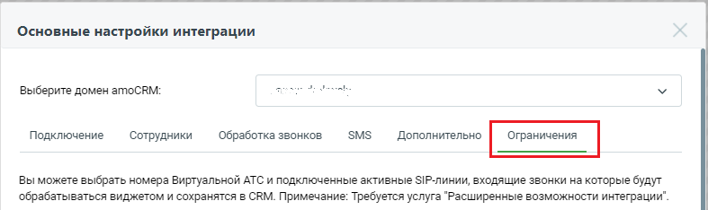

2. активировать переключатель “Определять внутренние номера SIP-транка”; 3. указать максимальную длину номера в поле “Фильтровать звонки с длиной номера менее”; 4. нажать кнопку “Сохранить”:

## 2.14 Наличие дублей контактов в amoCRM

Как сохраняется информация о звонке при дублировании контактов? В виджете по умолчанию включена автоматическая сортировка контактов/компаний во время звонка. Виджет проверяет наличие контактов/компаний, в которых указан одинаковый номер телефона (далее по тексту – дубли). Пример дублирования контактов на рисунке. Если при звонке были найдены дубли, то информация о звонке сохраняется в первом созданном контакте/компании, но не сохраняется в дубле контакта. 57 Интеграция Виртуальной АТС MANGO OFFICE и amoCRM | Версия от 25.08.2025

Как помечать дубли контактов? Чтобы выявлять дубли контактов, помечать их, а также в каждом дубле одного контакта сохранять информацию о звонке, нужно включить флаг “Добавлять комментарий о звонке во все дубли контактов”:

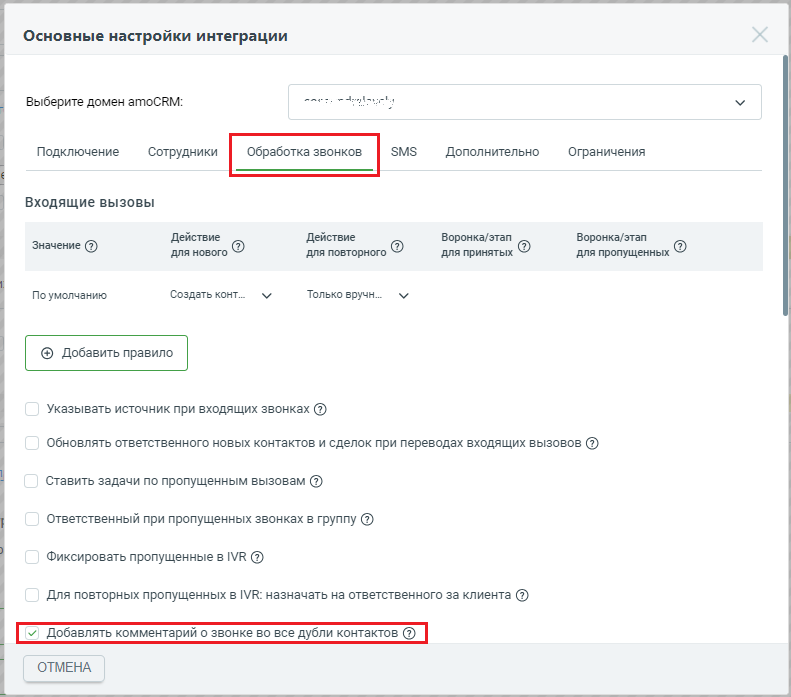

Примечание. Не забудьте сохранить настройки интеграции, нажав кнопку “Сохранить” в самом низу закладки “Обработка звонков”. Тогда, при звонке по номеру контакта виджет интеграции будет выполнять следующие действия: 1) сохранять данные о звонке в первом созданном контакте/компании; 2) сможет помечать дубли контактов/компаний комментарием “Во время звонка были найдены дубли по номеру телефона”. Вот пример отображения такого комментария:

В результате: - в первом созданном контакте/компании будет сохранена информация о звонке по номеру: 58 Интеграция Виртуальной АТС MANGO OFFICE и amoCRM | Версия от 25.08.2025

- в дубле контакта/компании будет указана информация о звонке и пометка “Во время звонка были найдены дубли по номеру телефона”:

## 2.15 Использование способов дозвона до сотрудника и

алгоритмов дозвона Виджет интеграции учитывает возможность использования нескольких средств дозвона до сотрудника, а также различных алгоритмов дозвона и обеспечивает сохранение только одной записи о звонке в amoCRM.

## 2.16 Использование алгоритмов распределения вызовов

Виджет интеграции учитывает возможность использования различных алгоритмов распределения при звонках в группы и обеспечивает сохранение только одной записи в amoCRM о звонке в группу ВАТС.

## 2.17 Ставить задачи по пропущенным вызовам

Общее Виджет интеграции может автоматически ставить задачи по пропущенным от Клиентов звонкам. Возможно ставить задачи как на сотрудника, пропустившего вызов, так и на ответственного за контакт (если звонок был с номера сохраненного в контакты в вашем amoCRM). Внимание! Функция постановки задач по пропущенным звонкам доступна только при подключении расширенных возможностей интеграции. Правило назначения задачи на сотрудника Если флаг “Ставить задачи по пропущенным вызовам” включен: когда виджет определяет пропущенный входящий вызовов на сотрудника, то после фиксации в amoCRM факта 59 Интеграция Виртуальной АТС MANGO OFFICE и amoCRM | Версия от 25.08.2025 пропущенного звонка, система автоматически создает задачу с определенными параметрами на данного сотрудника. Примечание. Задача не дублируется, если по этому Клиенту уже есть аналогичная невыполненная задача. Если при этом включен флаг “Ответственный при пропущенных в IVR” и звонок пропущен в IVR, то задача ставится на выбранного в настройке сотрудника. Если флаг выключен, то ни звонок не зафиксируется с amoCRM, ни задача не будет поставлена. Аналогично, если включен флаг “Ответственный при пропущенных в группу” и звонок пропущен в группе, то задача ставится на выбранного в настройке сотрудника. Если флаг выключен, то задача не будет поставлена.

Описание параметров задачи по пропущенному вызову. Настройка некоторых из них Задачи про пропущенным звонкам, назначаемые автоматически виджетов, имеют следующие параметры: 1) дата/время завершения задачи: - через один час после окончания звонка (если звонок поступил до 20:00, с учетом настроек временной зоны в amoCRM). Это параметр можно редактировать путем изменения срока выполнения задачи. Допустимые значения: “1-1500” минут; - на 9:00 утра следующего рабочего дня (если звонок поступил после 20:00 и до 9:00, с учетом настроек временной зоны в amoCRM. Кроме того, можно настраивать данный временной период): 60 Интеграция Виртуальной АТС MANGO OFFICE и amoCRM | Версия от 25.08.2025

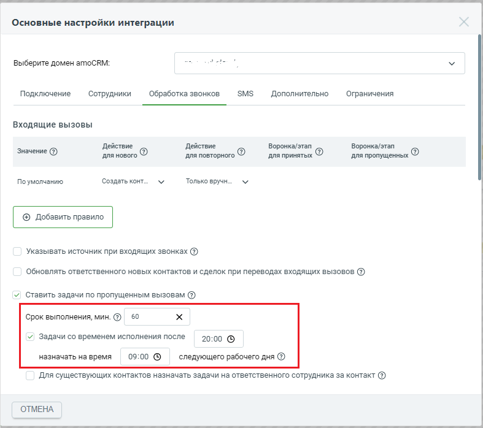

2) ответственный в задаче - тот сотрудник, на кого виджет зафиксировал пропущенный звонок, в том числе если вызов пропущен в IVR/группе - на выбранного в соответствующего настройках сотрудника; Примечание. Если пропущен звонок от контакта, по которому ранее уже был назначен ответственный, то, при включении соответствующей настройки, задача по пропущенному вызову будет автоматически назначаться на ответственного за контакт. 3) если пропущенный звонок был от нового Клиента, то в задаче указывается “(новый Клиент) <номер Клиента>, пропущенный звонок”, к примеру “(новый Клиент) +79260297870, пропущенный звонок”; 4) если пропущенный звонок был от существующего Клиента, то в задаче указывается “<имя Клиента>, <номер Клиента>, пропущенный звонок”, к примеру “ООО”Березка плюс”, +79260297870, пропущенный звонок”; 5) при пропущенных внутренних звонках - задачи не создаются; 6) статус задачи - не завершена; 7) задача связывается с контактом: - но если звонок поступил от нового Клиента и звонок зафиксировался в неразобранном, то задача НЕ связывается со звонком. К сожалению, на текущий момент нет такой возможности в amoCRM; - если звонок поступил от нового Клиента и в настройках виджета указано “Создавать только вручную”, т.е. звонок НЕ зафиксировался в amoCRM, то задача ставится без связей. Задача НЕ ставится повторно, если для Клиента в ЭТОТ день уже была поставлена и не выполнена аналогичная задача по пропущенному звонку (пусть даже поставлена и на другого сотрудника). 61 Интеграция Виртуальной АТС MANGO OFFICE и amoCRM | Версия от 25.08.2025 Как включить автоматическую постановку задачи на ответственного за контакт Если включен флаг “Для существующих контактов назначать задачи на ответственного сотрудника за контакт”, и пропущенный звонок совершен с номера, ранее сохраненного в контакте amoCRM, у которого есть ответственный, то виджет интеграции будет ставить задачу по пропущенному звонку на ответственного за контакт. Если этот флаг выключен и пропущенный звонок совершен с номера, ранее сохраненного в контакте amoCRM, то задача будет поставлена на сотрудника по общим правилам, описанным ранее.

## 2.18 SMS-визитка

SMS-визитка - эффективный инструментом повышения лояльности ваших Клиентов. Есть несколько вариантов использования этого сервиса: - SMS с дополнительной или контактной информацией сразу после первого звонка Клиента в компанию, - SMS-извинение за пропущенный звонок от нового Клиента. Кейс 1. Клиент позвонил в вашу компанию. Он автоматически получит SMS с контактами вашей компании и персонального ответственного. Кейс 2. Клиент позвонил, но все сотрудники заняты и не успели ответить на звонок. Отправьте ему SMS-извинение и попросите дождаться обратного звонка, проявите заинтересованность и не дайте ему уйти к конкурентам. Также можно добавить в SMS-извинение предложение о дополнительной скидке или промокод, чтобы Клиент дождался звонка вашего сотрудника. Внимание! SMS-визитка доступна только при подключении расширенных возможностей интеграции. Стоимость SMS - согласно вашему тарифному плану. Для настройки SMS визитки нужно включить флаг “Включить SMS визитку”. 62 Интеграция Виртуальной АТС MANGO OFFICE и amoCRM | Версия от 25.08.2025

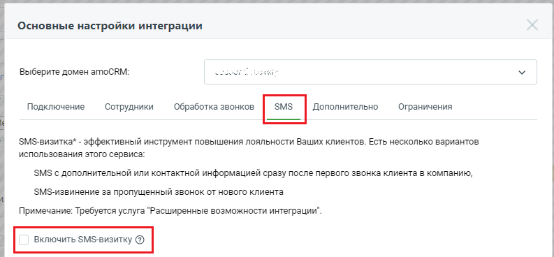

После этого можно настроить раздельные шаблоны SMS для каждого из четырех случаев: - необработанный входящий звонок от нового Клиента: - “необработанный” звонок - звонок в котором не было разговора сотрудника с Клиентом; - “нового” Клиента - если в результате звонка была автоматически создана запись в “неразобранном” или “контакт”, согласно настройкам виджета; - SMS высылается после окончания звонка; - необработанный исходящий звонок новому Клиенту: - “необработанный” звонок - звонок в котором не было разговора сотрудника с Клиентом; - “нового” Клиента - если в результате звонка была автоматически создана запись в “неразобранном” или “контакт”, согласно настройкам виджета; - SMS высылается после окончания звонка; - обработанный входящий звонок от нового Клиента: - “обработанный” звонок - звонок в котором был разговор сотрудника с Клиентом; - “нового” Клиента - если в результате звонка была автоматически создана запись в “неразобранном” или “контакт”, согласно настройкам виджета; - SMS высылается после окончания звонка; - обработанный исходящий звонок новому Клиенту: - “обработанный” звонок - звонок в котором был разговор сотрудника с Клиентом; - “нового” Клиента - если в результате звонка была автоматически создана запись в “неразобранном” или “контакт”, согласно настройкам виджета; - SMS высылается после окончания звонка. SMS отправляется на номер нового/потенциального Клиента. При настройке шаблона SMS можно указать: - от какого сотрудника отправляется SMS. Можно указать конкретного сотрудника или указать “Ответственный”, тогда виджет будет самостоятельно подставлять ответственного; - в текст можно вставить макросы amoCRM. В этом случае, виджет перед отправкой SMS будет автоматически заполнять значения. Если значения нет, то подставляться в SMS не будет; - список поддерживаемых макросов приведен в выпадающем списке “Макросы”. Выбрать макрос из списка – он автоматически добавится в конец шаблона; - можно настроить шаблон и кликнув на “Пример” и посмотреть пример отправляемой SMS. Примечание. Не забудьте сохранить настройки интеграции, нажав кнопку “Сохранить” в самом низу закладки “SMS”. 63 Интеграция Виртуальной АТС MANGO OFFICE и amoCRM | Версия от 25.08.2025

После отправки SMS, в карточке контакта автоматически добавится запись о высланном SMS сообщении. Примечания: 1. если в виджете настроено, что при звонках от новых Клиентов добавлять их в “НЕРАЗОБРАННОЕ”, то SMS отправится, но не будет добавлена запись об отправке SMS; 2. если в виджете настроено, что при звонках от новых Клиентов сохранять их как “компания”, то SMS НЕ будет отправляться.

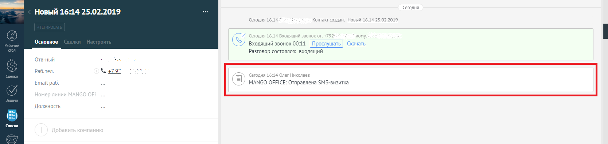

## 2.19 Отправка SMS из карточки Клиента

С помощью виджета интеграции MANGO OFFICE и amoCRM можно вручную отправлять SMS Клиентам из карточки Клиента или сделки. Информация об отправленной SMS автоматически фиксируется в истории коммуникаций с Клиентом и видна в карточке Клиента. Стоимость SMS - согласно текущим тарифам Виртуальной АТС. 64 Интеграция Виртуальной АТС MANGO OFFICE и amoCRM | Версия от 25.08.2025

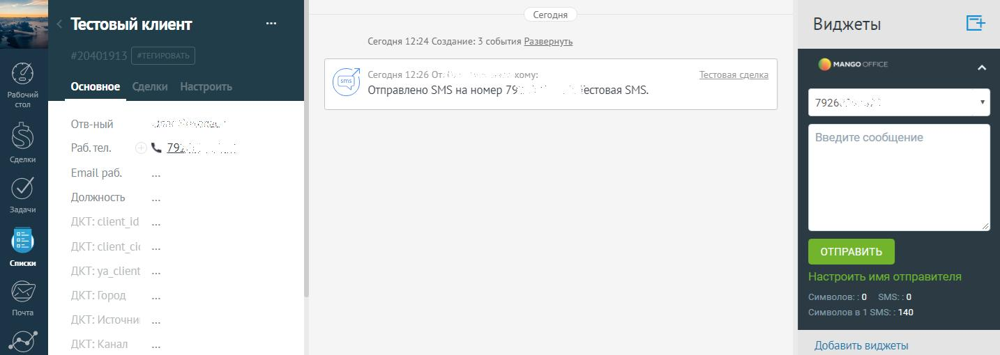

В настройках виджета интеграции можно включить или отключить отображение формы отправки SMS в карточке Клиента и сделки – на вкладке “SMS”, настройка “Отображать форму отправки SMS в карточке Клиента”. В Личном кабинете Виртуальной АТС в разделе Общие настройки/Дополнительные настройки/Вкладка “Отправка SMS”:

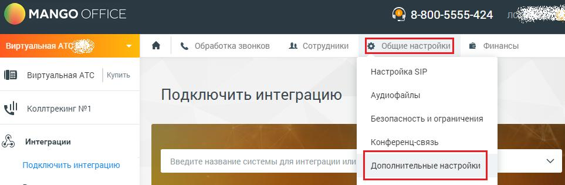

можно подключить и настроить отраслевое или индивидуальное имя отправителя SMS:

## 2.20 Отслеживание звонков с нескольких доменов

Как отслеживается звонок, при использовании нескольких доменов amoCRM? Интеграция позволяет регистрировать звонки ваших сотрудников, использующих разные домены amoCRM. В некоторых случаях (например, если отдел продаж использует один домен, а отдел технической поддержки – другой домен) такой вариант наиболее удобен. 65 Интеграция Виртуальной АТС MANGO OFFICE и amoCRM | Версия от 25.08.2025 Чтобы включить “междоменное” отслеживание, нужно связать Виртуальную АТС с нужными вам доменами amoCRM. Для чего нужно и как работает? Допустим, в вашей компании есть несколько сотрудников, которые зарегистрированы в разных доменах amoCRM. Например: - домен А; - домен Б. При этом ваш amoCRM интегрирован только с одним доменом А. Предположим такую ситуацию: вам звонит Клиент и оператор, зарегистрированный в домене А, принимает звонок, а затем переводит звонок на другого оператора, зарегистрированного в домене Б. Тогда по умолчанию виджет интеграции зарегистрирует звонок в том домене, на который настроен. Однако можно связать виджет интеграции в несколькими доменами, то есть использовать междоменное отслеживание звонка, чтобы в подобных ситуациях (как приведено в примере) звонок фиксировался в соответствующих доменах. Виды звонков и способы фиксации их в amoCRM Интеграция с amoCRM поддерживает несколько способов фиксировать звонки при использовании нескольких доменов. Способ фиксации зависит от вида звонка, а также, в некоторых случаях, от настроек, установленных в интеграции и в Виртуальной АТС. В этом разделе описано, как настроить интеграцию и ВАТС для фиксации разных видов звонков. Звонок, пропущенный в IVR Входящий звонок, пропущенный в IVR (Клиент не дождался распределения звонка на оператора), фиксируется следующим образом: - информация о звонке сохраняется в истории только одного домена, контакт/компания из которого был найден первым; - сделка/контакт создаются в обоих доменах amoCRM. Пропущенный звонок на группу Входящий пропущенный звонок на группу фиксируется по-разному в зависимости от настроек интеграции и Виртуальной АТС. Способы фиксации звонка: 1) ЕСЛИ - ответственный за пропущенные на группу НЕ назначен И • **в настройках распределения звонков Виртуальной АТС алгоритм распределения вызовов - “Одновременно всем” или “Последовательный”: 66 Интеграция Виртуальной АТС MANGO OFFICE и amoCRM | Версия от 25.08.2025

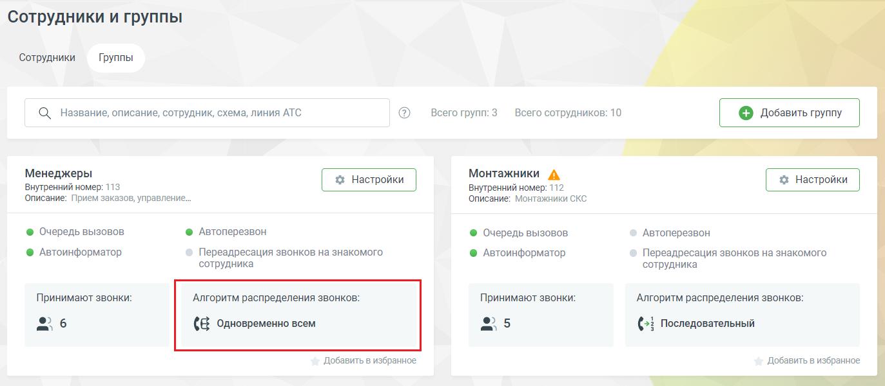

ТО - звонок фиксируется в домене, в котором зарегистрирован сотрудник, кому последним показывалась карточка вызова, на этого сотрудника; - сделка создается в обоих доменах (например, в домене А будет создан контакт, в домене Б создана сделка и запись в неразобранном, к которой привязан звонок). 2) ЕСЛИ - ответственный за пропущенные на группу назначен в обоих доменах И - в настройках распределения звонков Виртуальной АТС алгоритм распределения - “Одновременно всем” или “Последовательный”, ТО - звонок фиксируется только на одного ответственного за пропущенные на группу в одном домене, который был найден первым; - сделка создается в одном домене, в котором зарегистрирован сотрудник, который назначен ответственным за звонок. 3) ЕСЛИ - ответственный за пропущенные на группу назначен в только в одном домене И - в настройках распределения звонков Виртуальной АТС алгоритм распределения - “Одновременно всем” или “Последовательный”, ТО - звонок фиксируется на ответственного за пропущенные на группу, в домене, в котором включена данная настройка; - сделка создается в одном домене, в котором зарегистрирован сотрудник, указанный ответственным за пропущенные. 67 Интеграция Виртуальной АТС MANGO OFFICE и amoCRM | Версия от 25.08.2025 Входящий принятый звонок на группу Входящий принятый звонок на группу фиксируется следующим образом: ЕСЛИ - в настройках распределения звонков Виртуальной АТС алгоритм распределения вызовов - “Одновременно всем” или “Последовательный”, ТО - звонок фиксируется в домене, в котором зарегистрирован сотрудник, принявший вызов; - сделка создается только в одном домене. Входящий отклоненный звонок на группу Входящий отклоненный звонок на группу (звонок, отклоненный всеми сотрудниками группы) фиксируется по-разному в зависимости от настроек интеграции и Виртуальной АТС. Способы фиксации звонка: 1) ЕСЛИ - в настройках распределения звонков Виртуальной АТС алгоритм распределения “Последовательный”, ТО - звонок фиксируется в домене, в котором зарегистрирован сотрудник, последним отклонивший вызов; - сделка создается только в одном домене. 2) ЕСЛИ - в настройках распределения звонков Виртуальной АТС алгоритм распределения - “Одновременно всем”, ТО - звонок фиксируется на сотрудника группы, кому последним показывалась карточка вызова. Звонок фиксируется только в одном домене, в котором зарегистрирован указанный сотрудник; - сделка создается в обоих доменах (например, в домене А будет создан контакт, в домене Б создана сделка и запись в неразобранном, к которой привязан звонок). Перевод вызова между сотрудниками, для которых есть сопоставления с пользователями в разных доменах Перевод вызова между сотрудниками, для которых есть сопоставления с пользователями в разных доменах фиксируется следующим образом: - плечи разговора сотрудников фиксируются в соответствующем домене (например, плечо разговора сотрудника домена А фиксируется в домене А, плечо разговора сотрудника домена Б фиксируется в домене Б); - сделка создается в обоих доменах. Примечание. Плечо звонка — это часть вызова, соединяющая участника звонка и Виртуальную АТС. Таким образом, плечо может быть входящим (часть соединения между вызывающей 68 Интеграция Виртуальной АТС MANGO OFFICE и amoCRM | Версия от 25.08.2025 стороной и платформой) и исходящим (часть соединения между вызываемой стороной и платформой). Как включить междоменное отслеживание звонков Для этого нужно выполнить следующие действия: 1) установить виджет интеграции во всех ваших доменах amoCRM, которые нужно связать с Виртуальной АТС; 2) открыть окно “Основные настройки интеграции” и выбрать ваш домен amoCRM, для которого настраивается интеграция; 3) настроить интеграцию с Виртуальной АТС с этим доменом так, как вам нужно. После установки, нажать кнопку “Сохранить”.

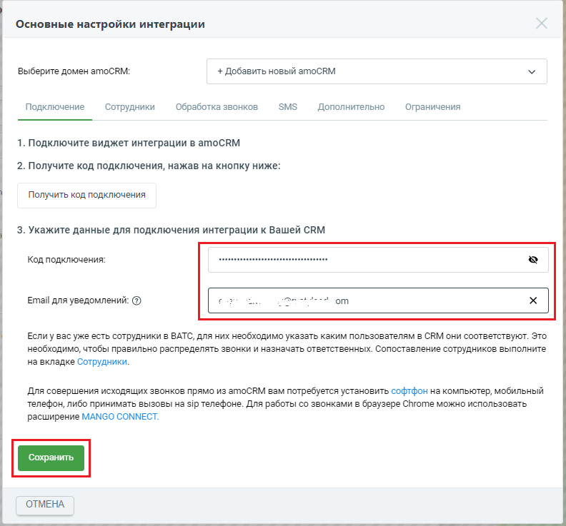

## 2.21 Интеграция Виртуальной АТС одновременно с несколькими

доменами amoCRM Обзор Если у вас несколько доменов amoCRM, можно настроить интеграцию Виртуальной АТС с этими доменами. Тогда учет звонков на номера Виртуальной АТС будет выполняться отдельно в соответствующих доменах amoCRM. Пример: ваша Виртуальная АТС интегрирована с доменом А amoCRM и в этом домене фиксируются все внешние звонки сотрудников, зарегистрированных в домене А. Если вы 69 Интеграция Виртуальной АТС MANGO OFFICE и amoCRM | Версия от 25.08.2025 дополнительно настроите интеграцию с доменом Б amoCRM, то все внешние звонки сотрудников, зарегистрированных в домене Б, будут фиксироваться отдельно в домене Б. В этом разделе описано как настроить интеграцию Виртуальной АТС с несколькими доменами и какие правила и рекомендации при этом надо соблюдать. Как настроить интеграцию Виртуальной АТС с несколькими доменами amoCRM Общие инструкции Чтобы настроить интеграцию Виртуальной АТС с двумя и более доменами amoCRM, необходимо ОТДЕЛЬНО ДЛЯ КАЖДОГО ДОМЕНА amoCRM выполнить следующие действия: 1) подключить виджет интеграции в amoCRM; 2) в ваш виджет интеграции добавить домен; 3) настроить сопоставление сотрудников Виртуальной АТС и сотрудников amoCRM. Кроме этого, если вы подключен расширенный пакет интеграции, то можно настроить ограничения использования номеров виджетом интеграции. Добавление домена в виджет интеграции Чтобы добавить еще один домен в виджет интеграции, вам потребуется в окне “Основные настройки интеграции” выполнить следующие действия: 1) выберите значение “+ Добавить новый amoCRM” в поле “Выбрать домен amoCRM”; 2) нажмите кнопку “Получить код подключения”:

3) будет открыта новая вкладка вашего браузера. На ней, если вы уже вошли в аккаунт AmoCRM, будет открыта форма для предоставления доступа виджету интеграции к вашему аккаунту amoCRM (см. рисунок ниже). В противном случае вам будет предложено авторизоваться в 70 Интеграция Виртуальной АТС MANGO OFFICE и amoCRM | Версия от 25.08.2025 AmoCRM при помощи ваших логина и пароля, а затем открыта форма для предоставления доступа виджету интеграции к вашему аккаунту amoCRM; 4) в поле “Выберите аккаунт” выберите аккаунт AmoCRM, с которым будет настроена интеграция;

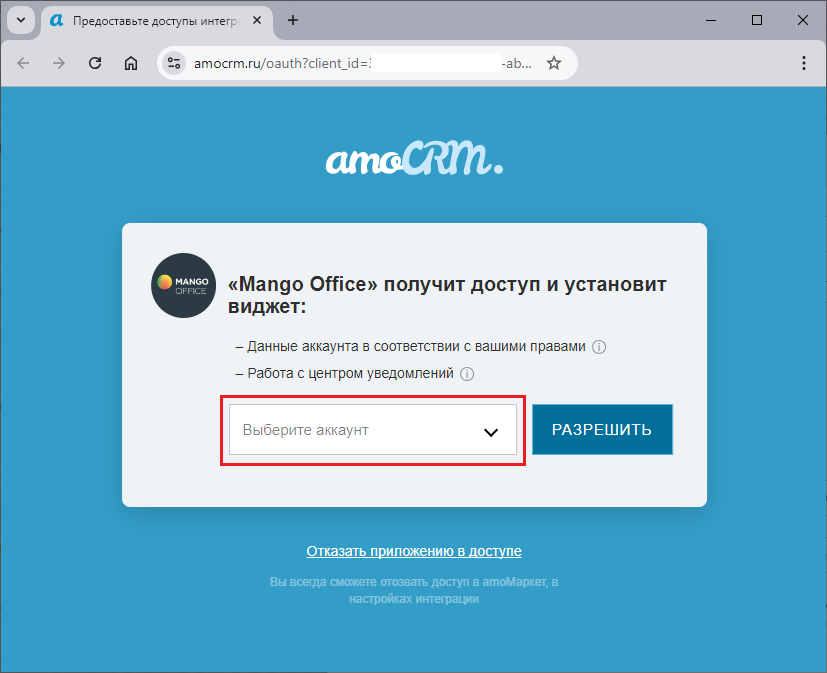

5) нажмите кнопку “Разрешить”, чтобы разрешить виджету интеграции доступ к вашему аккаунту AmoCRM;

6) будет создан код подключения интеграции с amoCRM, который вам необходимо скопировать. Для этого, нажмите кнопку “Скопировать код подключения”: 71 Интеграция Виртуальной АТС MANGO OFFICE и amoCRM | Версия от 25.08.2025

7) в окне “Основные настройки интеграции” вставьте скопированный код в поле “Код подключения”; 8) в поле “Email для уведомлений” укажите электронную почту, на которую хотите получать уведомления от amoCRM; 9) нажмите на кнопку “Сохранить”:

Теперь вам нужно настроить сопоставление сотрудников Виртуальной АТС и домена amoCRM. Настройка сопоставления сотрудников Доступно несколько вариантов настройки сопоставления сотрудников. 72 Интеграция Виртуальной АТС MANGO OFFICE и amoCRM | Версия от 25.08.2025 Вариант 1. Вручную Если вы хотите настроить сопоставление сотрудников amoCRM и Виртуальной АТС вручную, убедитесь, что вы зарегистрировали всех нужных сотрудников в обоих системах. Укажите пару сотрудник ВАТС-сотрудник CRM в поле “Ручное”. Нажмите кнопку “Сопоставить”. Укажите все нужные вам пары сотрудник ВАТС-сотрудник CRM. Вы можете добавлять пары в любом порядке. Примечание. Если группа полей “Ручное” не отображается, значит ранее она была скрыта.

Нажмите на кнопку , чтобы эта группа полей вновь отобразилась на экране. Прокрутите окно “Основные настройки интеграции” вниз до конца, чтобы появилась кнопка “Сохранить”. Нажмите на эту кнопку.

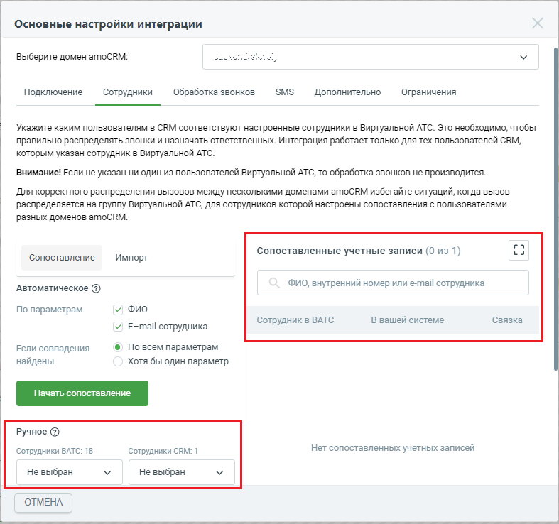

Вариант 2. Автоматически Функция автоматического сопоставления сотрудников сравнивает ФИО иe-mail сотрудников и составляет список совпадающих сотрудников. Учтите, что автоматическое сопоставление требует, чтобы ФИО и email сотрудников были записаны одинаково в вашем amoCRM и в Виртуальной АТС. Если появится сообщение “Пары для сопоставления не найдены”, убедитесь, что ФИО и e-mail сотрудников записаны в вашем amoCRM и Виртуальной АТС одинаково. 73 Интеграция Виртуальной АТС MANGO OFFICE и amoCRM | Версия от 25.08.2025 Чтобы выполнить автоматическое сопоставление сотрудников, выполните следующие действия в группе полей “Автоматическое”: 1) выберите параметры для сопоставления: ФИО, E-mail; 2) выберите режим сопоставления: по всем параметрам (точное совпадение) или хотя бы по одному параметру; 3) нажмите кнопку “Начать сопоставление”. В результате в поле “Сопоставленные учетные записи” будет показан список пар сотрудник ВАТС-сотрудник CRM, либо выдано сообщение “Пары для сопоставления не найдены”; 4) прокрутите окно “Основные настройки интеграции” вниз до конца, чтобы появилась кнопка “Сохранить”. Нажмите на эту кнопку.

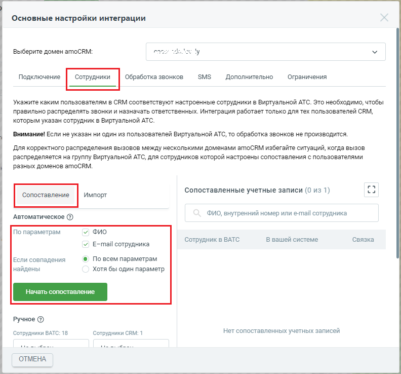

Если группа полей “Автоматическое” не отображается (см. рисунок ниже), значит ранее она была

скрыта. Нажмите на кнопку , чтобы группа полей “Автоматическое” вновь отобразилась на экране. Правила настройки интеграции Виртуальной АТС с несколькими доменами amoCRM 1) Запрещается назначать один внутренний номер Виртуальной АТС двум разным сотрудникам amoCRM даже в случае их регистрации в разных доменах. Рассмотрим на примерах, как работает это правило:

| № | Пример | Настройки интеграции с доменом А | Настройки интеграции с доменом Б | Примечание |
| --- | --- | --- | --- | --- |

74 Интеграция Виртуальной АТС MANGO OFFICE и amoCRM | Версия от 25.08.2025

|  |  | Сотрудник amoCRM | Внутренний номер телефона | Сотрудник amoCRM | Внутренний номер телефона |  |
| --- | --- | --- | --- | --- | --- | --- |
| 1 | Сотрудникам одного домена выдан одинаковый номер телефона | Наталья | 12 | Нет | - | Данная настройка нарушает правило. Будет выдано сообщение об ошибке |
|  |  | Анна | 12 | Нет | - |  |
| 2 | Сотрудникам разных доменов выдан одинаковый номер телефона | Наталья | 12 | Анна | 12 |  |
| 3 | Сотрудникам разных доменов выбран разные номера телефонов | Наталья | 12 | Анна | 13 | Настройка корректная, не нарушает правило. |

2) Запрещается одного и того же сотрудника amoCRM указывать более чем в одном виджете интеграции Данное правило позволяет избежать некорректного распределения звонков между двумя доменами. Рассмотрим на примерах, как работает это правило:

| № | Пример | Настройки интеграции с доменом А |  | Настройки интеграции с доменом Б |  | Примечание |
| --- | --- | --- | --- | --- | --- | --- |
|  |  | Сотрудник amoCRM | Внутренний номер телефона | Сотрудник amoCRM | Внутренний номер телефона |  |
| 1 | В двух виджетах интеграции указан один и тот же сотрудник amoCRM | Наталья | 12 | Наталья | 14 | Данная настройка нарушает правило. Будет выдано сообщение об ошибке. |
| 2 | В двух виджетах интеграции указаны два | Наталья | 12 | Анна | 14 | Настройка корректная, не нарушает правило. |

75 Интеграция Виртуальной АТС MANGO OFFICE и amoCRM | Версия от 25.08.2025

|  | разных сотрудника amoCRM |  |  |  |  |  |
| --- | --- | --- | --- | --- | --- | --- |

Рекомендация Чтобы виджет интеграции корректно распределял звонки между доменами, в настройках виджета интеграции не рекомендуется указывать сотрудника Виртуальной АТС, состоящего в группе, участники которой настроены в другом виджете интеграции (зарегистрированы в другом домене amoCRM). Примечание. Настроить группу можно в любое время. Подробнее о группах см. в Справочнике абонента Виртуальной АТС. Рассмотрим на примерах, как работает эта рекомендация:

| № | Пример | Настройки интеграции с доменом А |  | Настройки интеграции с доменом Б |  | Примечание |
| --- | --- | --- | --- | --- | --- | --- |
|  |  | Сотрудник amoCRM | Внутренний номер телефона | Сотрудник amoCRM | Внутренний номер телефона |  |
| 1 | Есть группа в составе: Сергей, Наталья, Анна. Сотрудники группы зарегистрирован ы в разных доменах amoCRM | Сергей | 11 | Наталья | 12 | Не рекомендуется указывать сотрудника Сергея в настройках интеграции с доменом А, поскольку это может привести к некорректному распределению звонков между доменами. Подробнее… |
|  |  |  |  | Анна | 13 |  |
| 2 | Есть группа в составе: Сергей, Наталья, Анна. Сотрудники группы зарегистрирован ы в одном домене amoCRM | Сергей | 11 | Нет | Нет | Рекомендация выполнена. |
|  |  | Наталья | 12 | Нет | Нет |  |
|  |  | Анна | 13 | Нет | Нет |  |

Дополнительно Настройка ограничений использования номеров Если вами используется расширенный пакет интеграции, то можно настроить ограничения использования номеров Виртуальной АТС в каждом виджете интеграции Виртуальной АТС с каким-либо определенным доменом amoCRM 76 Интеграция Виртуальной АТС MANGO OFFICE и amoCRM | Версия от 25.08.2025 Как виджет интеграции определяет, в какой домен передавать звонок? При интеграции Виртуальной АТС с несколькими доменами звонки учитываются в разных доменах amoCRM следующим образом. Рассмотрим на примере. Допустим, Виртуальная АТС интегрирована с двумя доменами А и Б, и настроено 3 (три) сотрудника. При этом, все трое сотрудников входят в одну группу Виртуальной АТС (схема распределения вызова “Одновременно всем”), однако они зарегистрированы в разных доменах amoCRM. Как в данной ситуации виджет интеграции распределяет звонки между несколькими доменами описано в таблице: 77

| Звонок | Домен А |  |  |  | Домен Б |  |  |  | Примечание |
| --- | --- | --- | --- | --- | --- | --- | --- | --- | --- |
|  | Номер телефона включен в настройках "Ограничения" | Сотрудник принял звонок | Звонок учтен в домене | Включена настройка автосоздания контактов и сделок или фиксировать в "Неразобранное" (зависит от настроек виджета) | Номер телефона включен в настройках "Ограничения" | Сотрудник принял звонок | Звонок учтен в домене | Включена настройка автосоздания контактов и сделок или фиксировать в "Неразобранное" (зависит от настроек виджета) |  |
| Входящий принятый | Да | Да | Да | Создан контакт и/или сделка | Нет | Нет | Нет | Нет | Номер включен в домене "А", сотрудник которого принял вызов, поэтому: - звонок учтен в домене "А"; - сущность создана только в домене "А". |
|  | Да | Нет | Нет | Нет | Нет | Да | Нет | Нет | Номер включен в домене "А", но звонок принял сотрудник домена "Б". Поэтому такой звонок вообще не будет зафиксирован в ни в одном домене amoCRM. |
|  | Да | Да | Да | Создан контакт и/или сделка | Да | Нет | Нет | Нет | Номер включен в обоих доменах. Сотрудник домена "А" первым снял трубку поэтому: - звонок будет зафиксирован в том домене, чей сотрудник первым снял трубку - сущность создана в том домене, чей сотрудник первым снял трубку. |
|  | Нет | Нет | Нет | Нет | Нет | Нет | Нет | нет | Номер отключен в обоих виджетах, звонок не будет учен ни в одном домене. |
| Входящий звонок принят и переведен на сотрудника в домене Б | Да | Да | Да | Создан контакт / сделка | Нет | Да | Да | Создан контакт / сделка | Входящий звонок принят в домене "А", затем сотрудник перевел звонок на другог сотрудника в домен "Б". Сотрудник домена "Б" принял вызов, в результате домене "Б" зафиксирован новый звонок. |
|  | Да | Да | Да | Создан контакт / сделка | Нет | Нет | Да | Зафиксирован пропущенный | Входящий звонок принят в домене "А", затем сотрудник перевел звонок на другог сотрудника в домен "Б". Сотрудник домена "Б" пропустил вызов. В результате домене "Б" зафиксирован пропущенный звонок. |
| Пропущенный | Да | Нет | Да | Зафиксирован пропущенный | Нет | Нет | Нет | Нет | Номер включен в домене "А", сотрудник которого пропустил звонок Пропущенный будет зафиксирован в домене "А". |
|  | Да | Нет | Да | Зафиксирован пропущенный | Да | Нет | Да | Зафиксирован пропущенный | Номер включен в обоих доменах, пропущенный будет зафиксирован в обои доменах. |
| Пропущенный в IVR | Да | Нет | Да | Зафиксирован пропущенный | Нет | Нет | Нет | Нет | Фиксируется пропущенный звонок в домене "А", если в настройках виджет включен номер и включена настройка "Фиксировать пропущенные в IVR" |
|  | Да | Нет | Да | Зафиксирован пропущенный | Да | Нет | Да | Зафиксирован пропущенный | Фиксируется пропущенный звонок в обоих доменах, если в настройках обои виджетов включен номер и включена настройка "Фиксировать пропущенные IVR" |

Работа с предупреждениями В процессе настройки интеграции с несколькими доменами amoCRM могут быть получены следующие сообщения:

| Предупреждение | Причина | Решение |
| --- | --- | --- |
| Этот сотрудник ВАТС уже выбран для другого пользователя из amoCRM. Не разрешается указывать один и тот же номер ВАТС для разных пользователей amoCRM. | В настройках виджета есть сотрудники amoCRM с одинаковыми номерами Виртуальной АТС. Один и тот же номер нельзя присвоить разным пользователям. | Изменить повторяющийся номер телефона или удалить его из настроек интеграции. |
| Пользователь amoCRM (<имя>) настроен в другом виджете интеграций. Чтобы звонки фиксировались корректно, не разрешено указывать одних и тех же пользователей в разных виджетах интеграций. Вы можете перенести данного пользователя в настраиваемый виджет интеграций. После переноса рекомендуется проверить в старом виджете настройки "Ответственный при пропущенных в группу", "Фиксировать пропущенные в IVR". Перенести пользователя в настраиваемый виджет интеграции? | Вы указали сотрудника / нескольких сотрудников amoCRM, который (-е) уже настроен в другом виджете интеграции. | Нажать на кнопку "Да" в сообщении, требуемый сотрудник будет перенес из одного виджета интеграции в другой. или Нажать на кнопку "Нет" и указать другого сотрудника amoCRM. |
| "Сотрудник <Наименование сотрудника ВАТС> входит в группу, для сотрудников которой настроены сопоставления с пользователями разных доменов amoCRM. Распределение звонков может работать некорректно. Продолжить сохранение?". | Указанный сотрудник Виртуальной АТС включен в группу Виртуальной АТС, в которой другие сотрудники уже настроены в других виджетах интеграции. | Выбрать другого сотрудника Виртуальной АТС или отредактируйте группу Виртуальной АТС так, чтобы в ней не было сотрудников, настроенных в разных виджетах интеграции. |
| Для корректной работы умных правил распределения необходимо использовать в схемах распределения Виртуальной АТС мелодию с признаком "Ждать окончания" = "Да" и длительностью не менее 5 секунд. В схемах распределения вашей Виртуальной АТС <Название вашей схемы>"Адресация на Олега", | В схеме распределения вызовов Виртуальной АТС неправильно настроено звуковое приветствие. | Открыть настройки распределения звонков Виртуальной АТС и настроить схему распределения так, чтобы в ней было указано звуковое приветствия с признаком "Ждать окончания" = "Да" и |

Интеграция Виртуальной АТС MANGO OFFICE и amoCRM | Версия от 25.08.2025

| Предупреждение | Причина | Решение |
| --- | --- | --- |
| "Новая схема", "По умолчанию" данное условие не выполняется. При таких настройках звонок может быть не распределен умными правилами распределения. Продолжить сохранение настроек? |  | длительностью не менее 5 секунд. |
| Вы пытаетесь подключиться к домену CRM, для которого уже есть действующая интеграция. Хотите привязать эту интеграцию к вашей Виртуальной АТС? При этом старые настройки будут удалены. | Сообщение выдается, если в процессе сохранения настроек окажется, что Вы пытаетесь подключиться к домену amoCRM, к которому уже есть активная интеграция с другой Виртуальной АТС MANGO OFFICE | Выберите один из вариантов: - Да: виджет интеграции будет привязан к текущей Виртуальной АТС, настройки не переносятся; - Нет: настройки виджета не сохранятся, т.к. домен amoCRM привязан к другой Виртуальной АТС. |

## 2.22 Загружать отсутствующие в amoCRM звонки

Если функция “Загружать отсутствующие в amoCRM звонки” включена, то для вашей интеграции ежедневно в 01:00 МКС будет проводиться процедура поиска и восстановления отсутствующих звонков. Имеющиеся звонки в amoCRM будут сверяться со звонками в Виртуальной АТС. Поиск потерянных звонков происходит за полный прошедший день. Примечание. Данная возможность доступна только пользователям расширенного пакета интеграции. Чтобы включить функцию загрузки отсутствующих в amoCRM звонков, в окне “Основные настройки интеграции” следует: 1. открыть вкладку “Дополнительно”; 80 Интеграция Виртуальной АТС MANGO OFFICE и amoCRM | Версия от 25.08.2025

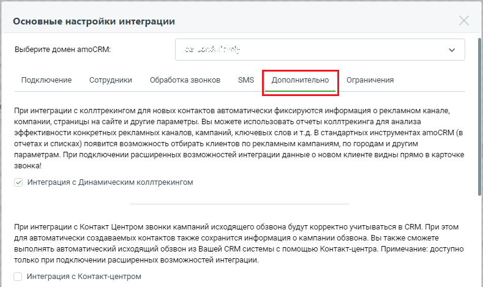

2. установить флаг “Загружать отсутствующие в amoCRM звонки”; 3. нажать на кнопку “Сохранить” внизу окна “Основные настройки интеграции”:

## 2.23 Создание сделок в разных воронках в зависимости от

группы, на которую поступил звонок Обзор Важно! Функция доступна только при подключении расширенного пакета интеграции. В виджете интеграции каждый входящий звонок обрабатывается по правилу “По умолчанию”, которое задается вами на вкладке “Обработка звонков” в таблице “Входящие вызовы”. 81 Интеграция Виртуальной АТС MANGO OFFICE и amoCRM | Версия от 25.08.2025

Однако, если в таблицу “Входящие вызовы” добавить еще одно правило обработки входящего звонка, в котором указать группу сотрудников или телефонную линию ВАТС, а также воронку/этап amoCRM, то входящий звонок на данную группу / линию будет обработан по конкретному правилу, а не по правилу “По умолчанию”. И наоборот, когда входящий звонок поступил на группу / линию ВАТС, НЕ указанную в настройке “Входящие вызовы”, то он будет обработан по правилу “По умолчанию”. Благодаря данной настройке, в вашем amoCRM можно создавать сделки в разных воронках в зависимости от группы, на которую поступил звонок, что позволит лучше учитывать и анализировать обращения Клиентов. Важно! Основные настройки интеграции по умолчанию применяются при обработке всех звонков, не зависимо от группы сотрудников / линии ВАТС, на которую поступил звонок. Ограничения Сделки в разных воронках продаж начнут появляться только после настройки этой функции. Сделки, созданные в amoCRM до этого, не будут заново обрабатываться и распределятся по разным воронкам продаж. Как добавить “пользовательское” правило обработки входящего звонка Чтобы добавить свое правило обработки, необходимо в окне “Основные настройки интеграции”: 1) нажать кнопку “Добавить правило”: 82 Интеграция Виртуальной АТС MANGO OFFICE и amoCRM | Версия от 25.08.2025

2) в таблице “Входящие вызовы” будет добавлена новая строка. В столбце “Значение” нужно

нажать на кнопку ;

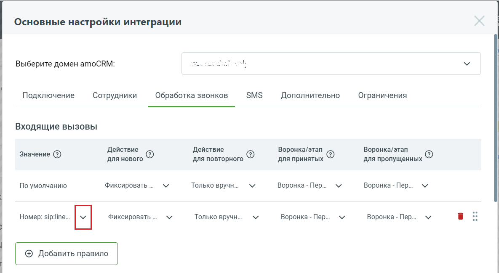

3) в выпадающем списке выбрать группу сотрудников или линию ВАТС, для которой будет создано правило обработки входящего звонка; 4) настроить создание контакта при звонках с новых номеров, поступивших на выбранную группу сотрудников / линии ВАТС; 5) настроить обработку повторных входящих звонков, поступивших на выбранную группу сотрудников / линии ВАТС; 6) нажать кнопку “Сохранить” внизу окна “Основные настройки интеграции”: 83 Интеграция Виртуальной АТС MANGO OFFICE и amoCRM | Версия от 25.08.2025

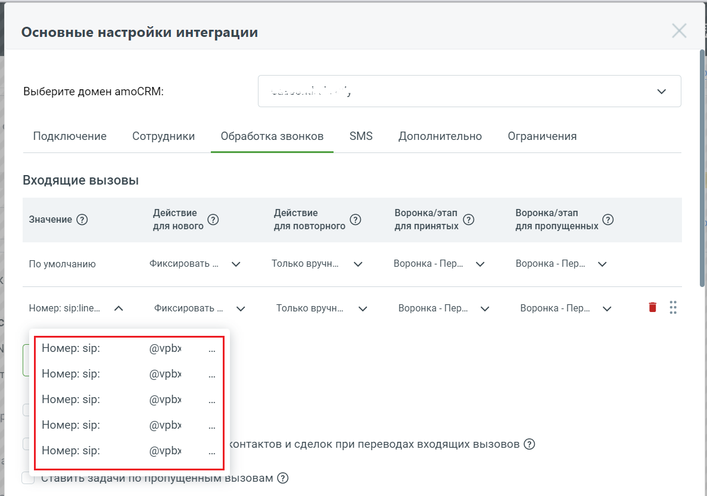

Управление правилами обработки входящих вызовов Общее По умолчанию правила обработки входящих звонков применяются ко входящим звонкам в том порядке, в котором они перечислены в таблице “Входящие вызовы”. Таким образом, если в таблице уже есть несколько правил обработки, то новое правило будет применяться после них. Важно. Правило “По умолчанию” распространяется на все телефонные линии и группы кроме тех, для которых указаны конкретные правила обработки звонков. Как изменить порядок применения правил Чтобы изменить порядок применения правил обработки входящих звонков, необходимо: 1) открыть основные настройки интеграции; 2) открыть вкладку “Обработка звонков”;

3) выбрать нужное правило обработки, нажать и удерживать кнопку . Нужно перетащить мышкой правило вверх или вниз. По завершении нужно нажать кнопку “Сохранить” внизу окна “Основные настройки интеграции”;

4) чтобы удалить правило из таблицы, нужно нажать на кнопку напротив него. 84 Интеграция Виртуальной АТС MANGO OFFICE и amoCRM | Версия от 25.08.2025

## 2.24 Заменять номер линии на комментарий в интерфейсе CRM

Эта настройка отображается на вкладку “Дополнительно” в нижней части:

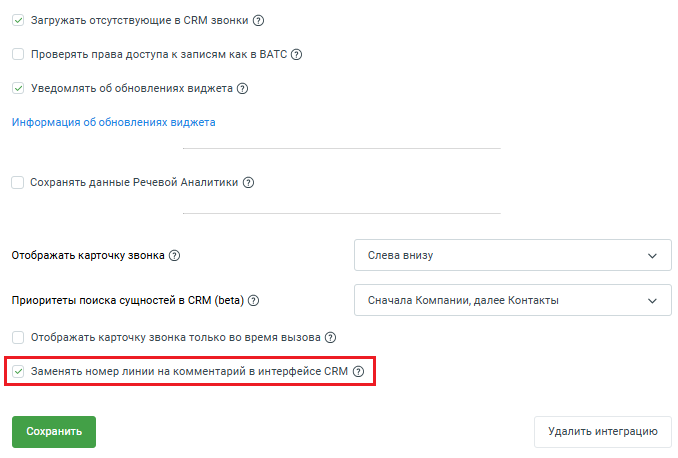

Если настройка включена, то: 85 Интеграция Виртуальной АТС MANGO OFFICE и amoCRM | Версия от 25.08.2025 - в карточке звонка amoCRM, при выборе исходящего номера вы увидите комментарий к этому номеру, загруженный из настроек вашей ВАТС;

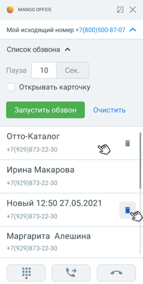

- в контакте и сделке в поле “Номер линии MANGO OFFICE” вместо номера, на который звонил клиент, будет отображаться комментарий к этому номеру, загруженный из настроек Виртуальной АТС. Важно: 1) данная настройка будет работать только в тех случаях, когда поле “Комментарий” заполнено в настройках Виртуальной АТС; 2) при добавлении или изменении комментария в настройках Виртуальной АТС, следует пересохранить настройки интеграции (то есть открыть настройки интеграции на нажать кнопку “Сохранить”). Если настройка выключена: - в карточке звонка в номере линии для выбора отображаются только линии, без комментариев. При входящих и исходящих вызовах в номер входящей/исходящей линии отображается номер линии; - в соответствующей сделке или в контакте, в поле “номер линии MANFO OFFICE” записывается значение номера линии. Если звонок от клиента создает повторную сделку, то правило наименования новой сделки брать на момент создания этой сделки. То есть, предыдущий сделки могут иметь другой формат наименования.

## 2.25 Прочие настройки

Проставлять теги по созданным виджетом сделкам Примечание. Настройка доступна только в расширенном пакете интеграции. 86 Интеграция Виртуальной АТС MANGO OFFICE и amoCRM | Версия от 25.08.2025 Общее Данная настройка влияет на теги, которыми виджет может помечать сделки. Вы можете указать теги, которые следует проставлять в сделках, созданных виджетом интеграции. Теги добавляются в момент создания сделки. Важно. Теги не проставляются по неразобранному. Если вам не нужно тегировать один или несколько источников сделок, оставьте пустое значение тега в настройке. В зависимости от настроек интеграции (в которых определяется порядок обработки входящих и исходящих звонков и подключения интеграции с коллтрекингом), вы можете включить тегирование сделок:

| Наименование | Условие, при выполнении которого, вам будет доступна настройка тегирования | Тег, устанавливаемый по умолчанию | Ограничения |
| --- | --- | --- | --- |
| Входящий новый вызов | В правилах обработки входящих вызовов в графе "Действие для нового" есть \ вам нужно задать хотя бы одно создание сделки | "MANGO Новый входящий вызов" | Длина: 256 символов |
| Входящий повторный вызов | В правилах обработки входящих вызовов в графе "Действие для повторного" есть \ вам нужно задать хотя бы одно создание сделки | "MANGO Повторный входящий вызов" |  |
| Исходящий вызов | В правилах обработки исходящих вызовов включена настройка "Создавать сделку" И настройка "Создавать контакт при звонке на новый номер" | "MANGO Исходящий вызов" |  |
| Формы обратной связи | Если стоит флаг интеграции с ДКТ | "MANGO Формы" |  |

Как включить настройку Чтобы установить настройку, в окне настроек интеграции на вкладке “Обработка звонков” необходимо: 1) активировать переключатель “Проставлять теги по созданным виджетом сделкам”. Будут открыт дополнительные поля. Доступность полей определяется настройками интеграции, читайте таблицу выше; 87 Интеграция Виртуальной АТС MANGO OFFICE и amoCRM | Версия от 25.08.2025 2) в открывшихся полях указаны значения по умолчанию, описанные в таблице выше. Вам нужно выбрать какие сделки нужно тегировать и вместо значения по умолчанию. Например, если нужно чтобы все сделки, созданные автоматически при входящем звонке от новых клиентов, помечались бы тегом “АБВ”, то в поле “Входящий новый вызов” удалите значение “MANGO Новый входящий вызов” и впишите значение “АБВ”; 3) нажмите на кнопку “Сохранить”.

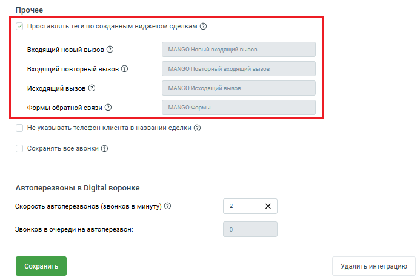

Не указывать телефон клиента в названии сделки Если настройка включена, то в сделках, созданных виджетом интеграции, номер телефона Клиента будет заменен на дату и время создания сделки. После включения настройки, нажмите кнопку “Сохранить”, чтобы активировать настройку:

88 Интеграция Виртуальной АТС MANGO OFFICE и amoCRM | Версия от 25.08.2025
