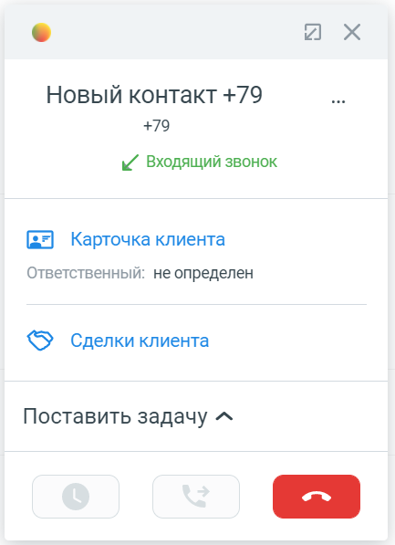

# 3. Входящий звонок

> Трассировка: PDF §3 · сквозные стр. 89-90 · источники: ч.1 `kb/mango-product-docs/sources/integration_amocrm/Mango_office_integration_amoCRM.pdf` с.89-90.

## 3.1 Общее

При входящем звонке у сотрудника зазвонит телефон (указанный в карточке сотрудника в Личном кабинете в качестве средства приема вызова), а в amoCRM покажется карточка звонка. Если звонит новый Клиент и нужно создать новый контакт во время разговора, то достаточно нажать на кнопку “Добавить контакт”:

Важно. Закрытие карточки звонка в amoCRM не завершает разговор. Чтобы завершить разговор нужно положить трубку, либо нажать кнопку “Завершить вызов” (если вы используете софтфон),

либо нажать кнопку в карточке звонка.

## 3.2 Информационное сообщение “Ответственный: не определен”

Информационное сообщение “Ответственный: не определен” может отображаться в карточке звонка. Данное сообщение не является ошибкой и носит информационный характер. Оно означает, что в карточке Клиента в поле “Ответственный” указан сотрудник, для которого не задано сопоставление с сотрудником Виртуальной АТС. Следует добавить в настройки сопоставления пользователей amoCRM с сотрудниками Виртуальной АТС данного сотрудника.

89 Интеграция Виртуальной АТС MANGO OFFICE и amoCRM | Версия от 25.08.2025
