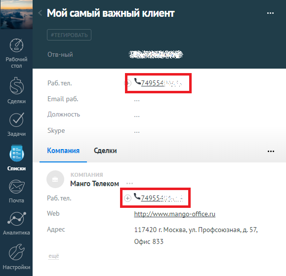

# 4. Исходящий звонок

> Трассировка: PDF §4 · сквозные стр. 90-91 · источники: ч.1 `kb/mango-product-docs/sources/integration_amocrm/Mango_office_integration_amoCRM.pdf` с.90-91.

Сотрудник может кликнуть на номер телефона в amoCRM или набрать его на своем рабочем телефоне, в amoCRM будет показана карточка исходящего звонка. При этом, если сотрудник кликнул на номер телефона в amoCRM, то сначала зазвонит его рабочий телефон, и только после того как сотрудник поднимет трубку – начнется звонок на выбранный номер телефона.

90 Интеграция Виртуальной АТС MANGO OFFICE и amoCRM | Версия от 25.08.2025
