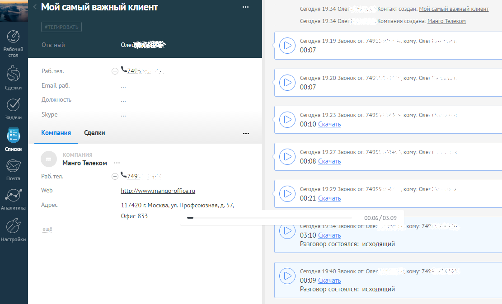

# 6. История вызовов

> Трассировка: PDF §6 · сквозные стр. 92-93 · источники: ч.1 `kb/mango-product-docs/sources/integration_amocrm/Mango_office_integration_amoCRM.pdf` с.92-93.

Каждый звонок от контакта отображается в истории взаимоотношений с контактом. Если в Виртуальной АТС включена услуга записи разговоров, то здесь же можно прослушать или скачать запись разговора. Примечания: 1) запись разговора может отобразиться в карточке контакта с небольшой задержкой; 2) если контакт будет удален, то из amoCRM удалится вся информация о звонках с удаляемым контактом.

92 Интеграция Виртуальной АТС MANGO OFFICE и amoCRM | Версия от 25.08.2025
