# 7. Карточка звонка

> Трассировка: PDF §7 · сквозные стр. 93-108 · источники: ч.1 `kb/mango-product-docs/sources/integration_amocrm/Mango_office_integration_amoCRM.pdf` с.93-108.

## 7.1 Обзор

Карточка звонка предоставляет с инструменты для работы со звонками. Ниже перечислены возможности карточки звонка. Важно! В карточке звонка может не быть некоторых из перечисленных ниже функций (они доступны только в расширенном пакете интеграции). При помощи карточки звонка вы можете: - позвонить или принять звонок; - посмотреть историю звонков оператора; - добавить новый номер в контакты amoCRM; - позвонить на любой номер; - если у Вас несколько номеров подключено к Виртуальной АТС, то можно выбрать номер и позвонить с этого номера (имеются ограничения); - поставить задачу по входящему или пропущенному звонку. По умолчанию карточка звонка отображается в левом нижнем углу интерфейса amoCRM в свернутом виде.

## 7.2 Как управлять отображением карточки звонка

Варианты Доступны следующие варианты отображения карточки звонка: - Не отображать: карточка звонка никогда не отображается в amoCRM (ни при входящем, ни при исходящем звонке); - Отображать карточку звонка только во время вызовов: карточка звонка показана в amoCRM только во время обработки звонка; - Слева внизу: карточка звонка показана в левом нижнем углу amoCRM; - Справа снизу: карточка звонка показана в правом нижнем углу amoCRM.

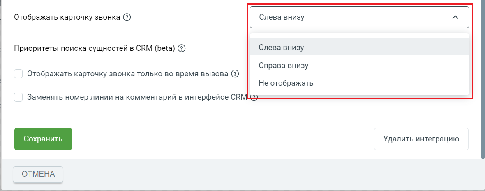

Как свернуть или развернуть карточку звонка Если включено отображение карточки звонка, то можно ее свернуть или развернуть. 93 Интеграция Виртуальной АТС MANGO OFFICE и amoCRM | Версия от 25.08.2025 По умолчанию карточка отображается в свернутом виде:

а) Общий вид карточки звонка в развернутом виде б) Общий вид карточки звонка в свернутом виде Важно. Если вы свернули / развернули карточку, то настройки видимости карточки сохраняются следующим образом: - если Вы свернули карточку в момент окончания разговора, то в дальнейшем она сохранит свое свернутое состояние и положение в интерфейсе amoCRM; - если карточка развернута в момент окончания разговора, то при последующем звонке она сохранит свое развернутое состояние и положение в интерфейсе amoCRM.

Чтобы свернуть карточку звонка, нужно нажать на кнопку . Чтобы развернуть ранее

свернутую карточку звонка, нужно нажать на кнопку :

Как временно скрыть карточку звонка Если нужно временно убрать карточку звонка из интерфейса amoCRM, ее можно скрыть. При скрытии карточки она удаляется из интерфейса amoCRM. Скрывая карточку звонка, работа интеграции не останавливается – карточка будет снова показана при новом входящем звонке или при обновлении страницы браузера (если в настройках интеграции не установлено иное). 94 Интеграция Виртуальной АТС MANGO OFFICE и amoCRM | Версия от 25.08.2025 Важно! Во время разговора скрыть карточку звонка нельзя, а можно только перевести ее в свернутое состояние.

Чтобы скрыть карточку звонка, нужно нажать на кнопку в заголовке карточки звонка:

## 7.3 Об интерфейсе карточки звонка

При входящем / исходящем звонке При входящем либо исходящем звонке в развернутой карточке звонка можно видеть: 1) номер телефона: - номер абонента при звонке с нового номера, ЛИБО • данные контакта (например, сообщение “Новый ДД:ММ ДД.ММ.ГГГГ”), если абонент ранее был сохранен в amoCRM, ЛИБО • контактные данные абонента, если они определены по данным из amoCRM / Адресной книге: 95 Интеграция Виртуальной АТС MANGO OFFICE и amoCRM | Версия от 25.08.2025

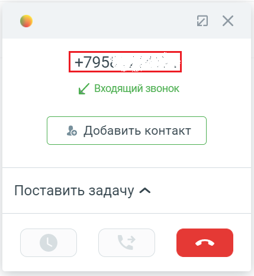

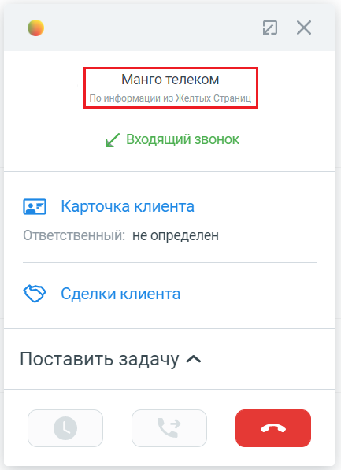

а) б) в) 2) направление звонка (входящий или исходящий); 3) номер линии ВАТС, через который идет вызов. Отображается, только если включена настройка “Указывать источник при входящих звонках”. 4) кнопка “Добавить контакт” при звонке с нового номера, либо, если абонент сохранен в контактах amoCRM, то вместо кнопки “Добавить контакт” будут показаны: - ссылка на карточку Клиента. Кликнув по этой ссылке, будет открыта карточка Клиента в amoCRM; • ссылка на список сделок amoCRM по данному клиенту; 5) имя ответственного сотрудника (отображается при входящем звонке), либо информационное сообщение “Ответственный: не определен”; 5) данные коллтрекинга только для входящего звонка от нового Клиента;

7) кнопка “Отбой” , при помощи которой можно завершить вызов.

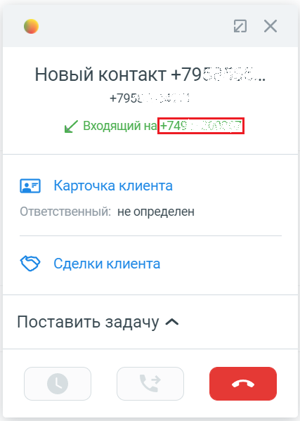

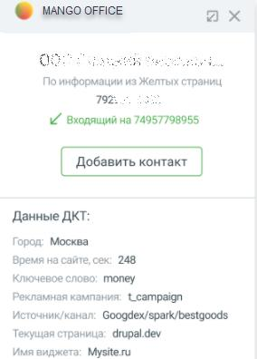

а) б) в) Во время звонка Когда звонок принят в развернутой карточке, к указанным выше элементам добавляется: 96 Интеграция Виртуальной АТС MANGO OFFICE и amoCRM | Версия от 25.08.2025 - длительность звонка;

- кнопка “Перевод вызова” :

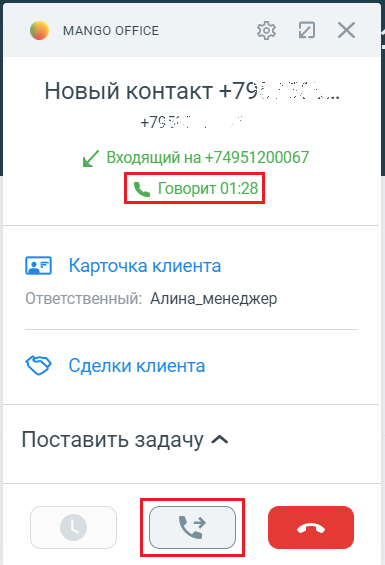

## 7.4 Как позвонить или принять звонок

Общее Виртуальная АТС позволяет установить телефонную связь между абонентами, а система amoCRM – анализировать взаимодействие/сделки с Клиентами. Однако ни одна из этих систем не дает возможности непосредственно совершать или принимать звонки. Поэтому, чтобы принимать и совершать звонки, нужно использовать, либо коммуникатор Mango Talker, либо любой другой телефон, подключенный к вашей Виртуальной АТС. Примечание. Ознакомьтесь с руководством пользователя Mango Talker, которое поможет Вам максимально использовать возможности коммуникатора. Важно! Если вы пользуетесь расширенным пакетом интеграции, вам доступна функция “Мой исходящий номер”, при помощи которой можно выбрать номер, с которого будет совершен звонок. Исходящий звонок Чтобы позвонить при помощи карточки звонка, следует: 1) развернуть карточку звонка, если она находится в свернутом состоянии; 2) если нужно перезвонить по номеру, который вам звонил ранее, то необходимо: - нажать на

кнопку . Будет открыта “История звонков”; - нажать на строку нужным номером. Будут открыты дополнительные поля; - нажать на кнопку “Позвонить”. Будет выполнен исходящий 97 Интеграция Виртуальной АТС MANGO OFFICE и amoCRM | Версия от 25.08.2025 звонок: сначала зазвонит ваш рабочий телефон, и только после того как Вы поднимите трубку – начнется звонок на выбранный номер телефона.

3) если нужно набрать номер самостоятельно, то необходимо: - нажать на кнопку .

Будет открыт “Номеронабиратель”; - набрать нужный вам номер и нажать кнопку . Будет выполнен исходящий звонок: сначала зазвонит ваш рабочий телефон, и только после того как Вы поднимите трубку – начнется звонок на выбранный номер телефона.

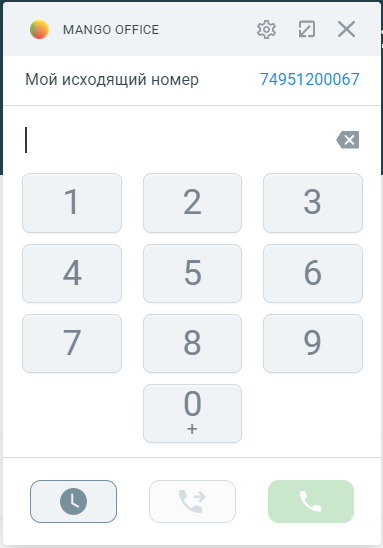

а) б) Входящий звонок При входящем звонке у вас зазвонит телефон и покажется карточка звонка в развернутом виде. Однако, если вы отключили показ карточки звонка в настройках интеграции, карточка звонка не появится. Чтобы принять входящий звонок нужно поднять трубку вашего телефона. 98 Интеграция Виртуальной АТС MANGO OFFICE и amoCRM | Версия от 25.08.2025

## 7.5 Как добавить контакт

Добавить новый номер в контакты amoCRM можно во время звонка или после завершения разговора: - при совершении исходящего вызова / приеме входящего вызова / во время обработки звонка можно в карточке звонка нажать на кнопку “Добавить контакт”. Данная кнопка НЕ отображается, если номер уже сохранен в контактах amoCRM. В противном случае, нажав кнопку “Добавить контакт”, будет открыта форма создания контакта в вашей amoCRM, при этом в поле “Раб.тел” будет показан сохраняемый номер. Далее, нужно заполнить форму нового контакта и нажать кнопку “Сохранить”; - если разговор с абонентом был завершен, то чтобы добавить контакт нужно открыть Историю звонков в карточке звонка и сохранить номер. Кроме этого, контакт может быть создан автоматически, если включена соответствующая опция обработки звонков с новых номеров и/или соответствующая настройка обработки входящих звонков от новых Клиентов.

## 7.6 Как перевести звонок

Общее Виджет интеграции позволяет во время разговора перевести звонок на другого сотрудника или внешний номер. Перевод выполняется в карточке звонка. Доступны следующие варианты: - С консультацией. Этот вариант подходит, если нужно сначала пообщаться (консультироваться) с другим сотрудником, на которого будет переведен звонок. 99 Интеграция Виртуальной АТС MANGO OFFICE и amoCRM | Версия от 25.08.2025 Например, если вы в карточке звонка выберите сотрудника (или введете произвольный номер) и нажмете кнопку “С консультацией”, вы будете соединены с выбранным сотрудником (или номером). При этом, будет переведен в режим удержания звонок, который вы хотите перевести. Если сотрудник, на которого переводится звонок, не берет трубку или в процессе консультации вопрос был решен без необходимости перевода звонка, то можно отменить перевод. • Без консультации. Или по-другому “слепой перевод”. При выборе этого варианта, звонок немедленно переводится на выбранного сотрудника или введенный произвольный номер. Ограничения 1) Перевод звонка можно выполнить только во время обработки звонка (когда установлено соединение между абонентами); 2) Отменить перевод звонка можно только при переводе с консультацией. Порядок действий Чтобы перевести звонок, в карточке звонка необходимо:

1) нажать кнопку . Будет показан список ваших сотрудников ВАТС и поле для поиска и ввода произвольного номера; 2) выполнить одно из следующих действий: – нажать на строку с данными сотрудника, на которого нужно перевести звонок; – в поле для поиска ввести номер телефона, на который нужно перевести звонок; Примечание. Если не видно строку с данными нужного вам сотрудника, воспользуйтесь поиском. Будут показаны кнопки для выбора варианта перевода. 3) выбрать вариант перевода звонка: • С консультацией. Текущий звонок будет поставлен на удержание и начнется звонок выбранному сотруднику или на введенный номер телефона. Как только вызываемый сотрудник снимет трубку, между вами будет установлено соединение. После разговора с сотрудником, чтобы завершить перевод звонка с консультацией нужно положить трубку

или нажать кнопку “Отбой” в софтфоне. После выполнения этого действия звонок из режима удержания будет переведен на целевого сотрудника или номер телефона. Важно. Нажатие кнопки “Отбой” в карточке звонка не приведет к завершению перевода звонка. - Без консультации. Текущий звонок сразу будет переведен выбранному сотруднику или на введенный номер телефона. 100 Интеграция Виртуальной АТС MANGO OFFICE и amoCRM | Версия от 25.08.2025

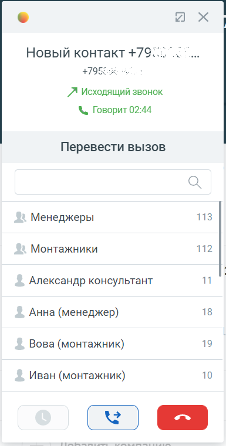

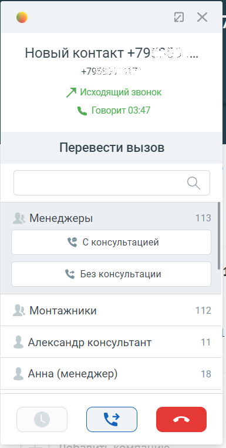

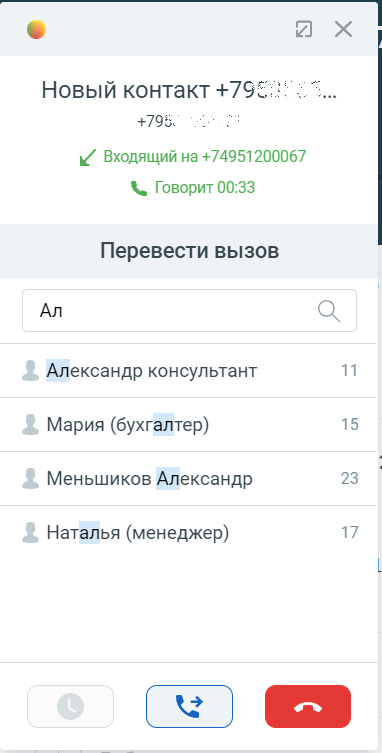

а) б) в) г) Как отменить перевод звонка Важно! Отменить перевод звонка можно только в процессе перевода с консультацией. Чтобы отменить перевод звонка, нужно во время дозвона или разговора с сотрудником, на которого планировался перевод звонка, ДВАЖДЫ нажать на кнопку # (решетка) на вашем телефоне или на экранной клавиатуре вашего софтфона. После отмены перевода звонка: • дозвон или разговор с сотрудником, на которого планировался перевод звонка, прекратится; • звонок будет переведен из режима удержания на вас. Поиск в карточке звонка Поле для поиска находится в верхней части карточки звонка. Оно позволяет: - искать сотрудника ВАТС по имени и/или номеру телефона; - вводить произвольный номер для перевода вызова. Как искать сотрудника В поле поиска нужно начать вводить имя или название, или номер сотрудника. Будет показан список сотрудников, соответствующих параметру поиска. Чтобы перевести звонок, нужно нажать на строку нужного вам сотрудника и выбрать способ перевода. 101 Интеграция Виртуальной АТС MANGO OFFICE и amoCRM | Версия от 25.08.2025

## 7.7 Ставить задачу по звонку вручную

Общее Прямо во время звонка или сразу после него в карточке звонка можно поставить самое себе задачу в amoCRM. В задаче можно указать ее тип (связаться или встретиться), дату и время задачи, а также краткое ее описание. Задачи, созданные при помощи карточки звонка, добавляются в список ваших задач в соответствующий раздел amoCRM. Порядок действий Чтобы поставить задачу, в карточке звонка необходимо: 1) нажать на ссылку “Поставить задачу”; 2) выбрать тип задачи “Связаться” или “Встреча”; 3) в поле “Опишите задачу” добавить описание задачи; 4) в поле “Дата” и “Время” ввести дату и время начала выполнения задачи; 5) нажать на кнопку “Поставить задачу”. А если нужно отказаться от постановки задачи, нужно нажать на кнопку “Отмена”.

а) б)

## 7.8 История звонков

Общее Функция “История звонков” позволяет загружать из ВАТС данные о звонках, совершенных/принятых/пропущенных определенным сотрудником, прямо в карточку звонка. Данные о звонке импортируются в карточку звонка из ВАТС сразу после завершения вызова. 102 Интеграция Виртуальной АТС MANGO OFFICE и amoCRM | Версия от 25.08.2025 Импортированные данные дополняют данные о ранее совершенных вызовах. В результате в карточке звонка будет показана история вызовов по конкретному сотруднику. Как посмотреть историю звонков Для этого в карточке звонка, необходимо: 1) развернуть карточку звонка, если она была в свернутом состоянии;

2) нажать на кнопку в нижней части карточки звонка. Будет показан список звонков, принятых, либо пропущенных, соответствующих сотруднику. По каждому звонку отображается номер телефона второго абонента (участника звонка), дата и время его фиксации, а также тип звонка:

входящий принятый звонок;

входящий пропущенный звонок;

входящий звонок отклонен;

исходящий принятый звонок;

исходящий звонок, отклоненный вызываемым абонентом;

исходящий пропущенный звонок. Как обновить историю звонков Она обновляется автоматически, но если нужно принудительно обновить историю звонков

нужно нажать на кнопку . Как перезвонить по номеру 1) нажать на строку с данными нужного Вам номера. Будут открыты дополнительные элементы интерфейса; 2) нажать на кнопку “Перезвонить”. Будет совершен исходящий звонок на выбранный вами номер: 103 Интеграция Виртуальной АТС MANGO OFFICE и amoCRM | Версия от 25.08.2025

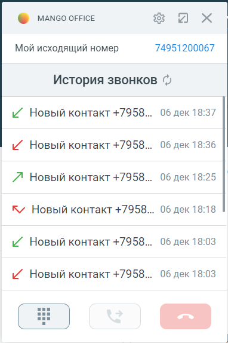

а) б) Как сохранить номер после разговора 1) нажать на строку с данными нужного Вам номера. Будут открыты дополнительные элементы интерфейса; 2) нажать на кнопку “Добавить контакт”. Будет открыта форма “Новый контакт” в amoCRM, нужно заполнить ее и сохранить.

## 7.9 Номеронабиратель

Это функция, которая позволяет вам прямо из карточки звонка набрать номер и позвонить тому или иному абоненту. Как позвонить Чтобы позвонить с помощью номеронабирателя, необходимо: 1) развернуть карточку звонка, если она была в свернутом состоянии; 2) выполнить одно из следующих действий: 104 Интеграция Виртуальной АТС MANGO OFFICE и amoCRM | Версия от 25.08.2025 • если в карточке звонка открыта “История звонков”, то следует нажать на кнопку

; • вместо “Истории звонков” может открывается номеронабиратель;

3) набрать номер на экранной клавиатуре и нажать на кнопку .

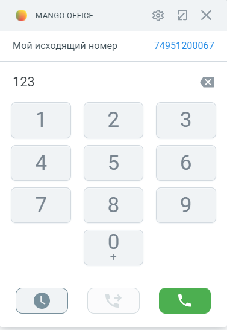

## 7.10 Мой исходящий номер

Важно. Чтобы использовать эту функцию необходимо использовать расширенный пакет интеграции, а также включить опцию “Разрешить выбирать линию при исходящем звонке” в настройках интеграции. Кроме этого, надо проверить, что в настройках Виртуальной АТС ВЫКЛЮЧЕНА настройка “Не указан номер – нет исходящей связи”. Функция “Мой исходящий номер” позволяет увидеть, с какого Вашего номера Виртуальной АТС совершаются исходящие звонки. Кроме этого, можно выбрать любой номер ВАТС и позвонить с выбранного номера телефона. Как изменить исходящий номер: 1) развернуть карточку звонка, если она была в свернутом состоянии; 2) в поле “Мой исходящий номер” будет показан Ваш исходящий номер;

3) нажать на кнопку в поле “Мой исходящий номер”; 4) в выпадающем списке показаны все Ваши номера Виртуальной АТС. Нужно нажать на тот или иной номер, который будет использован для совершения звонков. 105 Интеграция Виртуальной АТС MANGO OFFICE и amoCRM | Версия от 25.08.2025

## 7.11 Информационное сообщение “Ответственный: не определен”

Информационное сообщение “Ответственный: не определен” может отображаться в карточке звонка:

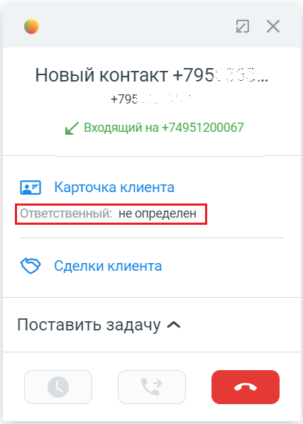

Данное сообщение не является ошибкой и носит информационный характер. Оно означает, что в карточке Клиента в поле “Ответственный” указан сотрудник, для которого не задано сопоставление с сотрудником Виртуальной АТС. Возможно, следует добавить в настройки сопоставления пользователей amoCRM с сотрудниками Виртуальной АТС недостающего сотрудника.

## 7.12 Ограничения по передачи звонка в новый контакт

Если вы завершили разговор с новым абонентом и, спустя некоторое время, вручную добавили этого абонента в контакты amoCRM, то данные нового контакта корректно отобразятся в Истории звонков. При этом, мы не гарантируем, что в новый контакт amoCRM добавятся данные о звонках, совершенных ранее (чем контакт был создан). Например, если сегодня вы вручную добавили контакт Иван Иванов в amoCRM, но с этим абонентом вы созванивались ранее (вчера или позавчера), данные о ранее совершенных звонках могут не отобразится в контакте amoCRM. Если же вы позвонили новому абоненту после того, как добавили его в контакт amoCRM, данные о звонке добавятся в контакт. 106 Интеграция Виртуальной АТС MANGO OFFICE и amoCRM | Версия от 25.08.2025

## 7.13 Пользовательские настройки карточки звонка

Открываются при нажатии на пиктограмму “Шестеренка” в правом верхнем углу карточки:

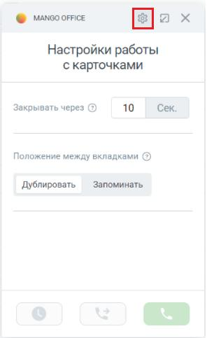

Доступны следующие виды пользовательских настроек: • Закрывать через: время отображения карточки звонка на экране после того, как разговор завершен. По истечении этого времени, карточка будет автоматические закрываться. По умолчанию установлено значение 3 секунды. Вы можете задать любое целочисленное значение (положительное) в диапазоне от 0 до 99 секунд. При этом, значение 99 – никогда не закрывать карточку; - Положения между вкладками: эти настройки определяют положение карточки, которое можно как дублировать между вкладками, так и запоминать после обновления страницы. Настройки применятся после обновления страницы. 107 Интеграция Виртуальной АТС MANGO OFFICE и amoCRM | Версия от 25.08.2025
