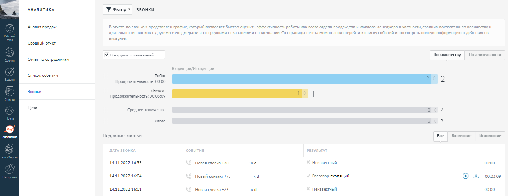

# 9. Аналитика

> Трассировка: PDF §9 · сквозные стр. 111-112 · источники: ч.1 `kb/mango-product-docs/sources/integration_amocrm/Mango_office_integration_amoCRM.pdf` с.111-112.

Каждый звонок учитывается в стандартных инструментах аналитики в amoCRM:

111 Интеграция Виртуальной АТС MANGO OFFICE и amoCRM | Версия от 25.08.2025
