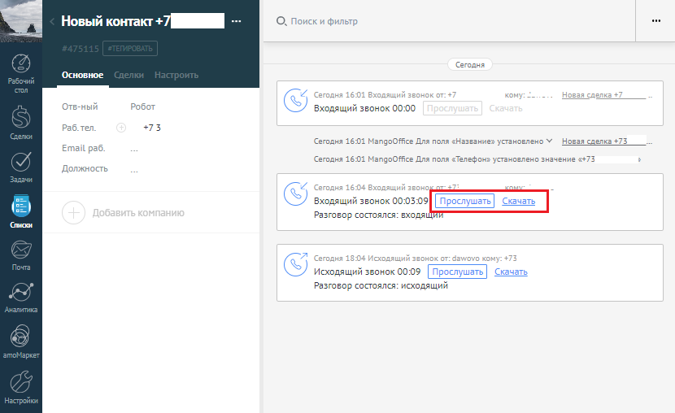

# 10. Запись разговоров

> Трассировка: PDF §10 · сквозные стр. 112-113 · источники: ч.1 `kb/mango-product-docs/sources/integration_amocrm/Mango_office_integration_amoCRM.pdf` с.112-113.

Если в Виртуальной АТС подключена услуга записи разговоров, то при наличии записи разговора ее можно прослушать или скачать в amoCRM:

1. запись разговора может отобразиться в карточке контакта с небольшой задержкой. 2. если длительность разговора менее 6 сек, то запись разговора не сохранится в Виртуальной АТС и соответственно не отобразится в amoCRM. Если в ходе обработки вызова, сотрудники переводили его на других сотрудников, то в amoCRM будет сохранены все записи разговоров Клиентам с каждым из сотрудников; 3. при прослушивании записи разговора осуществляется проверка прав доступа сотрудника к записи согласно модели прав доступа Виртуальной АТС. Права доступа настраиваются в разделе “Безопасность и ограничения” на вкладке “Настройка доступа”. Если прав доступа недостаточно, то пользователь не сможет прослушать запись разговора. 112 Интеграция Виртуальной АТС MANGO OFFICE и amoCRM | Версия от 25.08.2025
