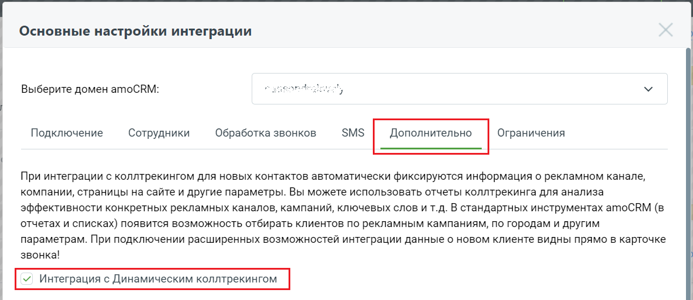

# 11. Интеграция с Коллтрекингом MANGO OFFICE

> Трассировка: PDF §11 · сквозные стр. 113-116 · источники: ч.1 `kb/mango-product-docs/sources/integration_amocrm/Mango_office_integration_amoCRM.pdf` с.113-116.

## 11.1 Обзор

Если вами используется Коллтрекинг MANGO OFFICE, то можно настроить интеграцию с услугой в виджете интеграции с amoCRM. Это позволит вам видеть в amoCRM для каждого нового Клиента, который вам позвонил через номера динамического и статического коллтрекинга, такую информацию, как: - по какому рекламному объявлению Клиент пришел на ваш сайт; - какие слова при этом вводил в поисковой системе; - из какого города посетитель сайта; - сколько времени провел на вашем сайте. Примечание. Коллтрекинг MANGO OFFICE получает информацию на основе utm-меток, указанных в ссылке, по которой Клиент перешел на ваш сайт. Кроме этого, можно использовать отчеты коллтрекинга (в Личном кабинете Виртуальной АТС), отчеты внешних систем для анализа эффективности конкретных рекламных каналов, кампаний, ключевых слов и т.д. В стандартных инструментах amoCRM (в отчетах и списках) появится возможность отбирать Клиентов по рекламным кампаниям, по городам и другим параметрам. В результате можно выявить и отказаться от неэффективных кампаний, каналов, ключевых слов и инвестировать средства в наиболее эффективные объявления и баннеры.

## 11.2 Как настроить

Чтобы настроить интеграцию amoCRM с коллтрекингом MANGO OFFICE, в форме настройки виджета установить флаг “Интеграция с динамическим коллтрекингом”, затем нажать кнопку “Сохранить” внизу окна “Основные настройки интеграции”.

## 11.3 Возможности

Интеграция с коллтрекингом MANGO OFFICE также позволяет сохранять все типы заявок, обрабатываемых коллтрекингом MANGO OFFICE – формы с сайта, обращения в соц. сетях и т.д. 113 Интеграция Виртуальной АТС MANGO OFFICE и amoCRM | Версия от 25.08.2025 Для нового Клиента создаются сущности аналогично настройкам создания неразобранного/контакта/сделок для принятых входящих звонков: 1) если создается контакт, то: - в контакте сохраняются данные коллтрекинга MANGO OFFICE, а также имя, телефон и e-mail; - информация о заявке добавляется в комментарии к Клиенту; 2) если создается сделка к созданному контакту, то она привязывается к Клиенту: - в созданной сделке заполняются данные коллтрекинга MANGO OFFICE; - сделка создается на том же этапе и в той же воронке, где сохраняются входящие принятые звонки от существующих Клиентов; 3) если заявка сохраняется в “неразобранном”, то заявка сохраняется как форма: сохраняются данные коллтрекинга MANGO OFFICE, телефон и e-mail. Для существующего Клиента заявка сохраняется как сделка, привязанная к Клиенту: - в созданной сделке заполняются все данные коллтрекинга MANGO OFFICE; - ответственный в сделке равен ответственному в контакте; - сделка создается на том же этапе и в той же воронке, где сохраняются входящие принятые звонки от существующих Клиентов. Примечание. При настройке коллтрекинга MANGO OFFICE вам понадобится в amoCRM создать форму и использовать ее идентификатор в процессе настройки. Если установлен флаг “Интеграция с Динамическим коллтрекингом”, то для контактов и сделок в amoCRM будут автоматически добавлены следующие поля:

| Поле в amoCRM | Описание |
| --- | --- |
| ДКТ: client_id | Уникальный id посетителя, обязательное поле, не рекомендуется его удалять |
| ДКТ: client_сid | Google CID |
| ДКТ: Город | Город, откуда посетитель. Если не указан, то сохраняется ISO код страны |
| ДКТ: Источник | Источник (utm_source) |
| ДКТ: Канал | Канал (utm_medium) |
| ДКТ: Кампания | Рекламная кампания (utm_ campaign) |
| ДКТ: Содержимое | Содержимое (utm_content) |
| ДКТ: Что искал | Что искал (utm_term) |
| ДКТ: Время на сайте | Время посетителя на сайте с момента входа на сайт, сек. |
| ДКТ: Страница звонка | Текущая страница посетителя (на которой отобразился номер динамического коллтрекинга) |
| ДКТ: Контекст вызова | id контекста вызова, служебный параметр |
| ДКТ: ya_client_id | ClientId Яндекс.Метрики |
| roistat | Уникальный id обращения из Roistat. Заполняется только если включена интеграция с Roistat |
| ДКТ: custom | Дополнительные параметры, передаваемые в код виджета тем, кто разместил его на сайте |
| ДКТ: Тип Заявки | Тип обращения Клиента. Возможные варианты значения: любые, звонки, заявки с сайта, обратные звонки, чаты с Клиентом, письма |
| ДКТ: Имя Виджета | Имя вашего виджета, которое вы присвоили виджету при создании. Если открыть Личный кабинет MANGO OFFICE, раздел "Коллтрекинг", то имя виджета вы увидите в поле "Сайт" |

При необходимости, можно удалить неиспользуемые или не нужные вам дополнительные поля. 114 Интеграция Виртуальной АТС MANGO OFFICE и amoCRM | Версия от 25.08.2025 Важно! Настоятельно рекомендуется не удалять поле “ДКТ: client_id”, оно используется для отчетов коллтрекинга MANGO OFFICE в Личном кабинете Виртуальной АТС. Теперь, при каждом входящем звонке (даже если он и был пропущен) от нового Клиента, в amoCRM будет сохранена информация о посетителе сайта, если выполнено одно из условий: - автоматически создается контакт (если включен флаг “Создавать контакт при входящих звонках”); - автоматически создается сделка (если включен флаг “Создавать сделку”); - звонок сохранился в неразобранном. Примечание. При повторных звонках от Клиента информация о посетителе сайта не обновляется. Если Клиент был сохранен в amoCRM ранее или создан и сохранен вручную, то информация о нем как о посетителе сайта также не будет указана. Если отключить флаг “Интеграция с динамическим коллтрекингом”, то все накопленные данные сохранятся в amoCRM. 115 Интеграция Виртуальной АТС MANGO OFFICE и amoCRM | Версия от 25.08.2025
