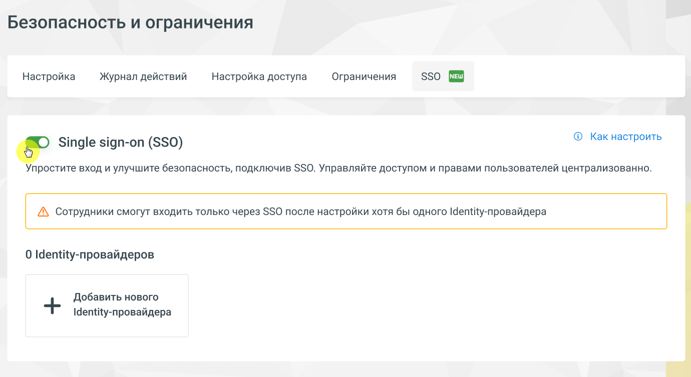

# 2. Общие сведения

> Трассировка: PDF §2 · сквозные стр. 4-5 · источники: ч.1 `kb/mango-product-docs/sources/lk-vats-sso/MANGO_OFFICE_LK_VATS_Auth_SSO.pdf` с.4-5.

Технология единого входа (Single sign-on SSO) — метод аутентификации, который позволяет пользователям аутентифицироваться сразу в нескольких приложениях и сайтах, используя один набор учетных данных. Аутентификация и авторизация в рамках SSO c алгоритмом SAMLv2 обеспечивает более безопасный и удобный способ управления доступом пользователей к множеству ресурсов, так как пользователь может пройти аутентификацию только один раз и затем автоматически получить доступ ко всем приложениям и ресурсам, интегрированным с этой системой SSO. Порядок авторизации: 1 В разделе Identity Provider (IdP) своей системы, клиенту необходимо создать отдельные учетные записи для каждого оператора. 2 Далее перейдите в Личный кабинет ВАТС MANGO OFFICE и настройте ваш IdP. После завершения настройки вы получите специальную авторизационную ссылку, предназначенную для операторов, которые будут использовать созданные учетные записи. 3 Операторы, в свою очередь, могут получить доступ к Личному кабинету ВАТС, используя специальную ссылку, полученную в предыдущем шаге. 4 Личный кабинет инициирует запрос к форме авторизации в IdP. 5 После успешной авторизации IdP генерирует токен, содержащий информацию о пользователе (адрес электронной почты), и передает его обратно в систему SSO с помощью запроса auth-response, направленного в Личный кабинет. 6 Личный кабинет ВАТС автоматически обрабатывает этот ответ и предоставляет операторам доступ к своему функционалу. Учетная запись оператора создается и настраивается автоматически в процессе обработки.

