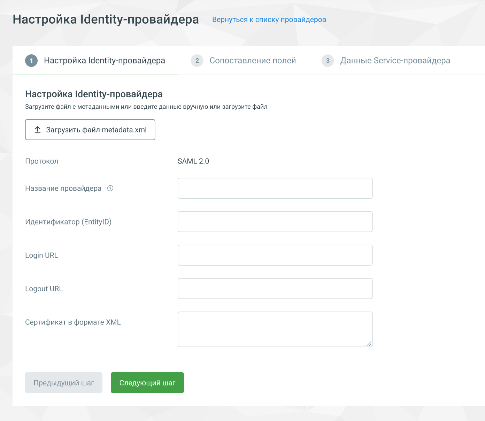

# 3. Настройка IdP в ЛК ВАТС MANGO OFFICE

> Трассировка: PDF §3 · сквозные стр. 5-6 · источники: ч.1 `kb/mango-product-docs/sources/lk-vats-sso/MANGO_OFFICE_LK_VATS_Auth_SSO.pdf` с.5-6.

Для использования возможности авторизации через SSO в Личном кабинете ВАТС должна быть подключена соответствующая услуга. После подключения в ЛК в разделе Общие настройки / Безопасность и ограничения появится вкладка «SSO».

Активируйте услугу переключателем и переходите к добавлению нового провайдера. Максимальное количество провайдеров на продукте – 5.

<!-- изображение на стр. 6: байты не извлечены (PyMuPDF недоступен) -->

<!-- изображение на стр. 6: байты не извлечены (PyMuPDF недоступен) -->
