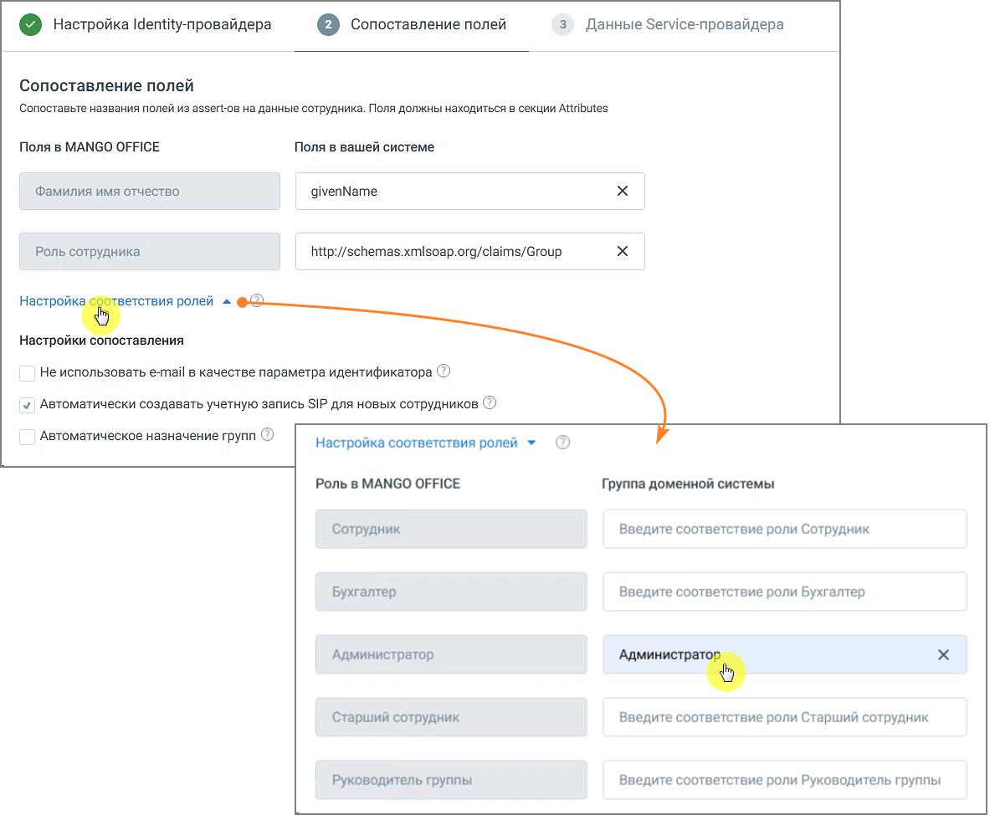
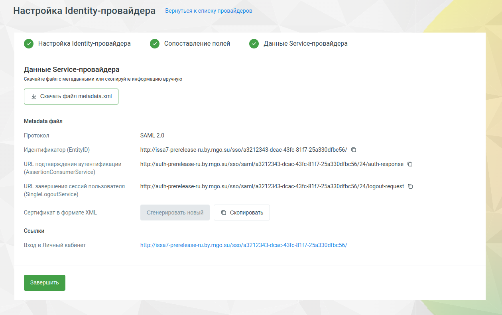
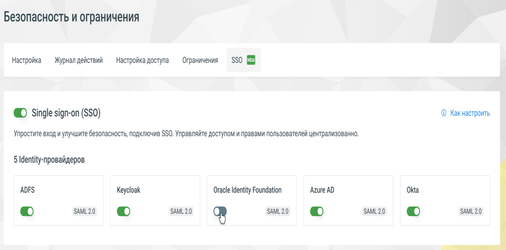
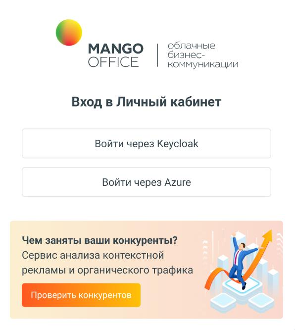

# Шаг 2. Сопоставление полей

> Трассировка: PDF §4 · сквозные стр. 8-12 · источники: ч.1 `kb/mango-product-docs/sources/lk-vats-sso/MANGO_OFFICE_LK_VATS_Auth_SSO.pdf` с.8-12.

| 0MyndmnNB1qV75qQR3b2/W5sGHRv+9AarggJkF+ptUkXoLtVA51wcfYm6 |
| --- |
| hILptpde5FQC8RWY1YrswBWAEZNfyrR4JeSweElNHg4NVOs4TwGjOPwWG |
| qzTfgTlECAwEAATANBgkqhkiG9w0BAQsFAAOCAQEAAYRlYflSXAWoZpFf |
| wNiCQVE5d9zZ0DPzNdWhAybXcTyMf0z5mDf6FWBW5Gyoi9u3EMEDnzLcJ |
| NkwJAAc39Apa4I2/tml+Jy29dk8bTyX6m93ngmCgdLh5Za4khuU3AM3L6 |
| 3g7VexCuO7kwkjh/+LqdcIXsVGO6XDfu2QOs1Xpe9zIzLpwm/RNYeXUjb |
| Sj5ce/jekpAw7qyVVL4xOyh8AtUW1ek3wIw1MJvEgEPt0d16oshWJpoS1 |
| OT8Lr/22SvYEo3EmSGdTVGgk3x3s+A0qWAqTcyjr7Q4s/GKYRFfomGwz0 |
| TZ4Iw1ZN99Mm0eo2USlSRTVl7QHRTuiuSThHpLKQQ==</ds:X509Certi |
| ficate> |
| </ds:X509Data> |
| </ds:KeyInfo> |
| </md:KeyDescriptor> |
| <md:SingleLogoutService |
| Binding="urn:oasis:names:tc:SAML:2.0:bindings:HTTP- |
| Redirect» Location="https://adfs-test.by.mgo.su/adfs- |
| logout.php"/> |
| <md:NameIDFormat>urn:oasis:names:tc:SAML:1.1:nameid- |
| format:emailAddress</md:NameIDFormat> |
| <md:AssertionConsumerService |
| Binding="urn:oasis:names:tc:SAML:2.0:bindings:HTTP-POST» |
| Location="https://adfs-test.by.mgo.su/adfs-resp- |
| receiver.php» index="1"/> |
| <md:AttributeConsumingService index="1"> |
| <md:ServiceName xml:lang="en">SP test</md:ServiceName> |
| <md:ServiceDescription xml:lang="en">Test |
| Service</md:ServiceDescription> |
| <md:RequestedAttribute Name="« NameFormat="« |
| FriendlyName="« isRequired="false"/> |
| </md:AttributeConsumingService> |
| </md:SPSSODescriptor> |
| </md:EntityDescriptor> |

ШАГ 2. СОПОСТАВЛЕНИЕ ПОЛЕЙ На втором этапе настройки требуется указать имена атрибутов для точного сопоставления с учетной записью при процедуре авторизации, а также сопоставить роли сотрудников. ВНИМАНИЕ Для успешной авторизации сотрудника от Identity-провайдера обязательно должны поступить указанные атрибуты. В противном случае сотрудник не сможет выполнить процедуру авторизации.

ВНИМАНИЕ Сопоставление по полю «роль» является строгим. Таким образом, если роль в IdP не совпадет, авторизация не произойдет. Можно привязать несколько доменных групп к одной роли «Сотрудник» (перечислив их через запятую). Если сотрудник подходит под разные роли, система автоматически выберет ту, у которой выше приоритет. Не использовать e-mail в качестве параметра идентификатора. При включении данной опции сопоставление учетной записи будет происходить не по значению e-mail, а по тому, которое придет в nameID. Автоматически создавать учетную запись SIP для новых сотрудников. При включении данной опции у новых сотрудников будет создаваться учетная запись SIP, которую можно использовать для звонков.

Автоматическое назначение групп. Для работы этой опции необходимо заранее добавить группы обзвона в ЛК. При включении данной опции, в момент авторизации, сотрудники будут сопоставлены с раннее созданными группами обзвона. Заполните поля формы и сохраните внесенные изменения кнопкой Сохранить. После сохранения настроек Identity-провайдера в Личном кабинете вы получите ссылку, ведущую на форму авторизации, которую и нужно будет передать своим операторам для входа в ЛК ВАТС.

Также на данной странице есть возможность скачать XML файл с настройками, для более простого импорта на стороне Identity-провайдера. Теперь система способна обрабатывать запросы подтверждения аутентификации и завершения сессий пользователя в соответствии с SAML-спецификацией. Клик по кнопке «Вернуться к списку провайдеров» открывает окно вкладки SSO.

<!-- изображение на стр. 11: байты не извлечены (PyMuPDF недоступен) -->

<!-- изображение на стр. 11: байты не извлечены (PyMuPDF недоступен) -->

<!-- изображение на стр. 11: байты не извлечены (PyMuPDF недоступен) -->

<!-- изображение на стр. 11: байты не извлечены (PyMuPDF недоступен) -->

<!-- изображение на стр. 11: байты не извлечены (PyMuPDF недоступен) -->

Переключатель «on-off» регулирует активацию/деактивацию своего Identity- провайдера.

<!-- изображение на стр. 12: байты не извлечены (PyMuPDF недоступен) -->

<!-- изображение на стр. 12: байты не извлечены (PyMuPDF недоступен) -->

<!-- изображение на стр. 12: байты не извлечены (PyMuPDF недоступен) -->
