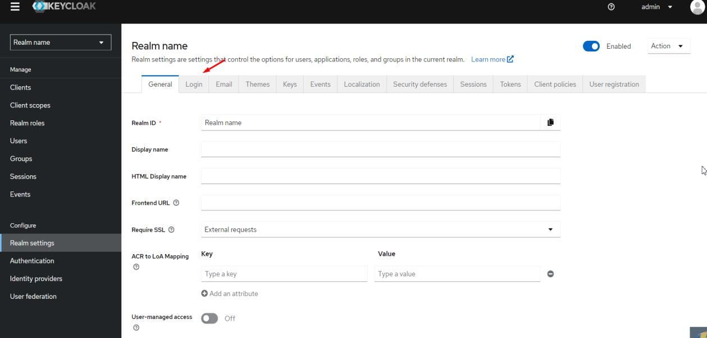

# 5. Вход сотрудника в Личный кабинет ВАТС

> Трассировка: PDF §5 · сквозные стр. 12-13 · источники: ч.1 `kb/mango-product-docs/sources/lk-vats-sso/MANGO_OFFICE_LK_VATS_Auth_SSO.pdf` с.12-13.

После перехода сотрудника по ссылке, полученной на вкладке Данные Service- провайдера, откроется форма выбора Identity-провайдера:

После выбора из списка нужного Identity-провайдера в новом окне будет открыта форма авторизации выбранного провайдера. После успешной авторизации на стороне IdP пользователь будет перенаправлен в Личный кабинет ВАТС MANGO OFFICE. внимание При обработке ответа (auth-response), полученного от IdP, важно наличие в ответе атрибута с именем «nameID», в котором должно быть передано значение e-mail сотрудника. Если этот атрибут отсутствует или значение не соответствует e-mail сотрудника, то авторизация будет невозможной, то есть сотрудник не сможет успешно войти в систему. совет

| Открытие всплывающих окон может быть заблокировано настройками |
| --- |
| браузера. Если после выбора IdP в списке не открывается всплывающее |
| окно, необходимо проверить настройки отображения всплывающих окон в |
| браузере. |

<!-- изображение на стр. 13: байты не извлечены (PyMuPDF недоступен) -->

<!-- изображение на стр. 13: байты не извлечены (PyMuPDF недоступен) -->
