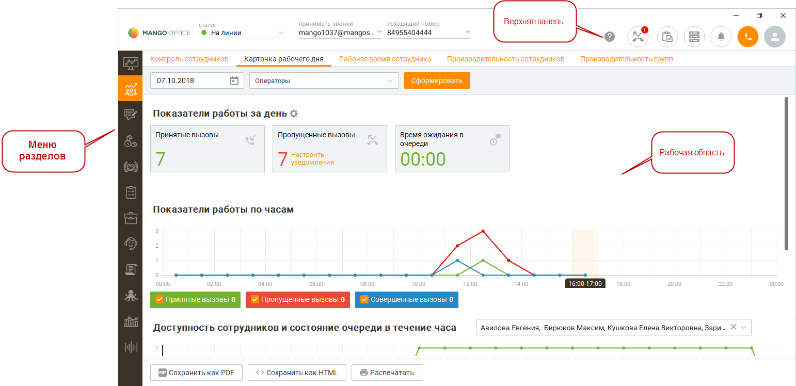
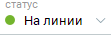
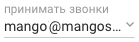
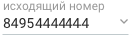

# 2. Главное окно программы

> Трассировка: PDF §2 · сквозные стр. 21-22 · источники: ч.1 `kb/mango-product-docs/sources/mango-cc-manual/CC_manual_1.26.23-part-1.pdf` с.21-22.

После входа пользователя в систему на экране отображается главное окно программы. В этом разделе мы рассмотрим основные элементы пользовательского интерфейса, отображаемые в главном окне, и их функциональное предназначение.

Верхняя панель содержит инструменты:

|  | Окно управления статусом; |
| --- | --- |
|  | Выбор активной линии для совершения вызовов |
|  | Выбор линии в качестве исходящего номера, с пояснительным комментарием к номеру |
|  | Кнопка вызова справки. Открывает меню справочной системы Контакт-центра. Список пропущенных вызовов |
|  | Вызов панели задач |
|  | Вызов панели графика работы |

|  | Окно управления статусом; |
| --- | --- |
|  | Вызов панели очереди обращений |
|  | Вызов панели показателей |
|  | Вызов панели управления телефонией |
|  | Аватар пользователя, Меню программы |

| Панель показателей – значок панели имеет два цвета |
| --- |
| состояния предельного значения какого-либо из показателей. |
| Аватар пользователя – на аватаре пользователя отображается иконка "new" |

• у пользователя есть не пройденный квест; • имеются новые скрипты. Меню разделов находится в левой части основного окна и позволяет переключаться между разделами, отображаемыми в рабочей области основного окна. Выбранный раздел выделяется цветом. Рабочая область находится непосредственно под главным меню и отображает выбранную панель.
