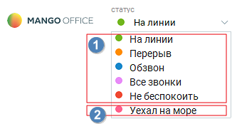

# 2.1. Управление статусом

> Трассировка: PDF §2.1 · сквозные стр. 22-24 · источники: ч.1 `kb/mango-product-docs/sources/mango-cc-manual/CC_manual_1.26.23-part-1.pdf` с.22-24.

Контакт-центр MANGO OFFICE позволяет в любой момент времени выбрать нужный статус пользователя, который определяет его готовность к приему вызовов. Для выбора доступны 1) предустановленные статусы – 5 статусов; 2) пользовательские статусы – до 30 статусов. Чтобы выбрать статус сотрудника, воспользуйтесь раскрывающимся списком в окне управления статусом.

Рассмотрим предустановленные статусы и влияние, которое они оказывают на готовность к приему и обслуживанию вызовов.

| Чтобы статус пользователя оказывал влияние на готовность к приему и обслуживанию |  |  |
| --- | --- | --- |
|  | вызовов, включите настройку Учитывать статус сотрудника при распределении вызовов |  |
|  | на него на вкладке "Контакт-центр" в карточке сотрудника в Личном кабинете. |  |
|  | Чтобы получить дополнительную информацию об управлении учетными записями |  |
|  | пользователей, ознакомьтесь с подразделом «Сотрудники и группы» справочной системы |  |
| Личного кабинета для Виртуальной АТС. |  |  |

На линии Означает, что вы вошли в систему и готовы к приему входящих вызовов, поступающих на вас в соответствии с настройками схемы переадресации и / или группы операторов, в которой вы состоите. В статусе «На линии» вы можете: • принимать все входящие вызовы; • совершать исходящие вызовы; • выполнять все остальные операции, доступные с использованием Контакт-центра MANGO OFFICE. Перерыв Означает, что вы находитесь на рабочем месте, но не готовы принимать поступающие на вас входящие вызовы; либо вы покинули рабочее место, но хотите принимать вызовы, поступающие вам, напрямую на мобильный телефон. В этом статусе вы не можете принимать входящие вызовы, поступающие на вас согласно алгоритму распределения звонков в группе. В статусе «Перерыв» вы можете: • принимать входящие вызовы, приходящие напрямую (не через группу); • совершать исходящие вызовы. Обзвон Означает, что вы вошли в систему, но не можете принимать входящие вызовы, поступающие согласно алгоритму автоматического распределения вызовов. Вы можете обмениваться мгновенными сообщениями с другими пользователями, принимать прямые и внутренние вызовы, а также совершать исходящие вызовы и выполнять другие операции с использованием Контакт-центра MANGO OFFICE. В статусе «Обзвон» вы можете: • принимать входящие вызовы, приходящие напрямую (не через группу); • совершать исходящие вызовы. Все звонки Статус оператора «Все звонки» позволяет осуществлять обработку одновременно очереди входящих вызовов и вызовов в рамках кампаний исходящего обзвона.

Алгоритм распределения назначает освободившемуся сотруднику либо входящий вызов, либо вызов из кампании исходящего обзвона. Если же все сотрудники заняты исходящим обзвоном, то входящий звонок становится в очередь, и далее распределяется на первого свободного. Не беспокоить Означает, что вы не вышли из системы и не покидали рабочее место, но не готовы принимать никакие входящие вызовы. В этом статусе вы не можете принимать никакие входящие вызовы. В статусе «Не беспокоить» вы можете: • совершать исходящие вызовы. Как добавить пользовательские статусы, узнайте здесь.
