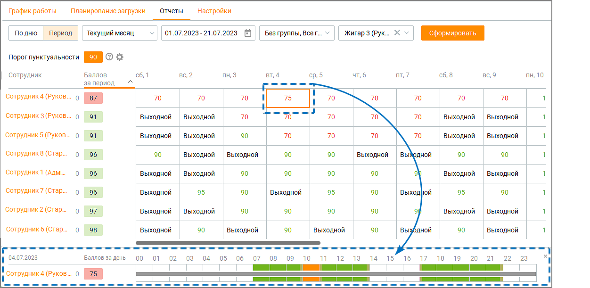
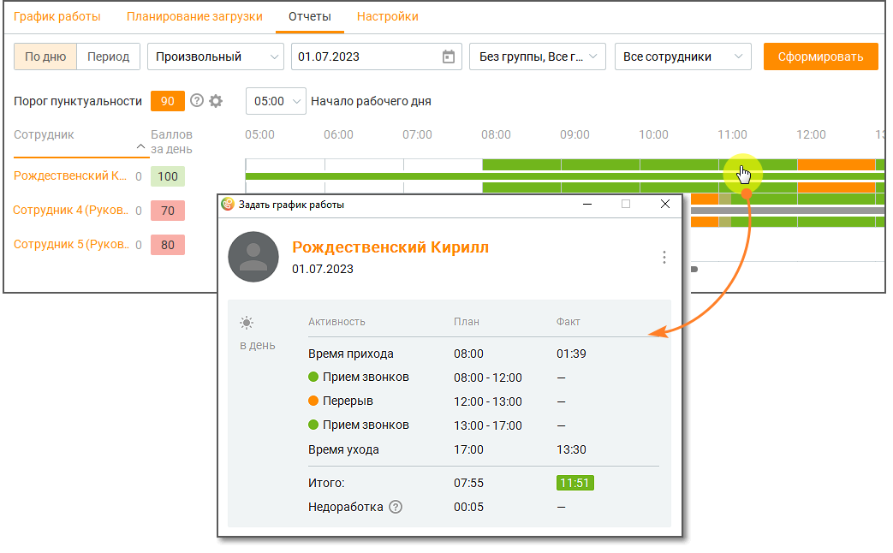
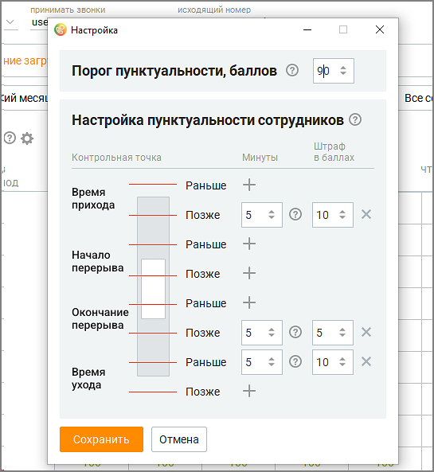
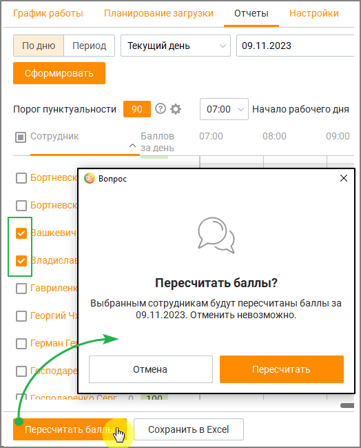

# 8.3. Отчеты

> Трассировка: PDF §8.3 · сквозные стр. 258-262 · источники: ч.3 `kb/mango-product-docs/sources/mango-cc-manual/CC_manual_1.26.23-part-3.pdf` с.56-60.

На вкладке отображается пунктуальность сотрудников, для удобства оперативного контроля за ними, а также настраиваются критерии пунктуальности. Отчет доступен в разрезах по дню и по периоду.

Рис. 1. Отчет пунктуальности в разрезе по периоду Для получения отчета отфильтруйте данные по: • дню/периоду – • если вариант просмотра "день" – вчера, сегодня, произвольный; • если вариант просмотра "период" – сегодня, вчера, последние 2 дня, текущая неделя, текущий месяц, произвольный; • группе – все группы, без группы, конкретная группа; • сотруднику – все сотрудники, конкретный сотрудник; • начало рабочего дня (только для разреза "по дню") – задает время отсчета начала рабочего дня. Клик по кнопке Сформировать формирует таблицу отчета с учетом заданных элементов фильтрации. Цветовая градация ячеек помогает руководителю быстро оценить общую картину пунктуальности сотрудников. Клик по ячейке дня в "Отчете пунктуальности" в разрезе по периоду открывает детализацию дня выбранного сотрудника. Клик по строке сотрудника в Отчете пунктуальности в разрезе по дню открывает детализацию плановой и фактической активности выбранного сотрудника.

Рис. 2. Отчет пунктуальности в разрезе по дню Пользователь может экспортировать отчет о пунктуальности со вкладок "По дню" и "Период" в формате csv. Выгрузка файла осуществляется при нажатии кнопки Сохранить график в нижней части экрана.

Клик по пиктограмме открывает панель настроек критериев пунктуальности.

| Пиктограмма панели настроек критериев пунктуальности отображается только при |  |  |
| --- | --- | --- |
|  | подключенной в ЛК ВАТС услуге "Планирование работы (WFM)" и включенной в ЛК ВАТС |  |
|  | опции "Настраивать порог пунктуальности" (Безопасность и ограничения/Настройка |  |
| доступа/Любая пользовательская роль/Инструменты/WFM). |  |  |

Допустимый для выбора диапазон минут – от 1 до 15, баллов – от 1 до 10. Клик по пиктограмме

удаляет строку критерия. Клик по пиктограмме добавляет строку критерия. В разделе настроек пунктуальности теперь вы можете не только отслеживать приход и уход сотрудников, но и выявлять любые нарушения рабочего статуса в течение дня. Это поможет обеспечить дополнительный контроль за соблюдением установленного рабочего режима. Настройка штрафов за нарушение пунктуальности: • В настройках порога пунктуальности вы можете установить штрафы за несанкционированный переход сотрудников из рабочего статуса в нерабочий и наоборот. • Укажите количество баллов, которое будет отниматься за каждое такое нарушение. Штрафы будут начисляться пропорционально продолжительности времени нарушения. • Вы можете задать минимальное время нарушения, которое будет учитываться, чтобы избежать случайных ошибок. Новые нарушения будут выделены цветом для лучшего визуального восприятия. Временные интервалы, когда были зафиксированы нарушения, теперь отображаются на графике в профиле настройки.

| Мониторинг пунктуальности активен только во время установленной рабочей активности |
| --- |
| сотрудника. |

После настройки критериев сохраните изменения кнопкой Сохранить. Клик по кнопке Отменить отменяет внесенные изменения и закрывает панель настроек.

| ПРИМЕР |
| --- |
| Для сотрудников компании настроены графики работ (активности: прием звонков, перерыв, обед). |
| Возникла форс-мажорная ситуация – отключилась электроэнергия, сотрудники не могут принимать |
| звонки не по своей вине. Чтобы автоматически пересчитать баллы пунктуальности для сотрудников, |
| необходимо произвести следующие действия: |
| 1) Отредактировать график работ на день форс-мажора в Планировании загрузки. |
| 2) На вкладке Отчеты/По дню выбрать сотрудников, для которых необходимо пересчитать баллы |
| пунктуальности, и нажать кнопку "Пересчитать баллы". Подтвердите действие. |
|  |

