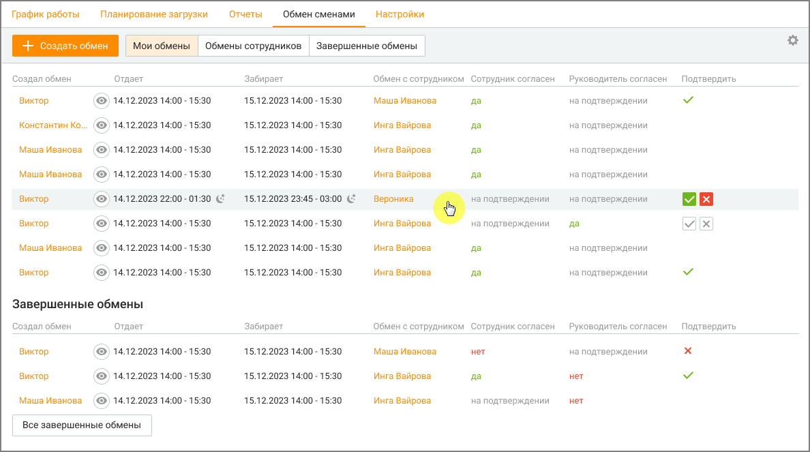
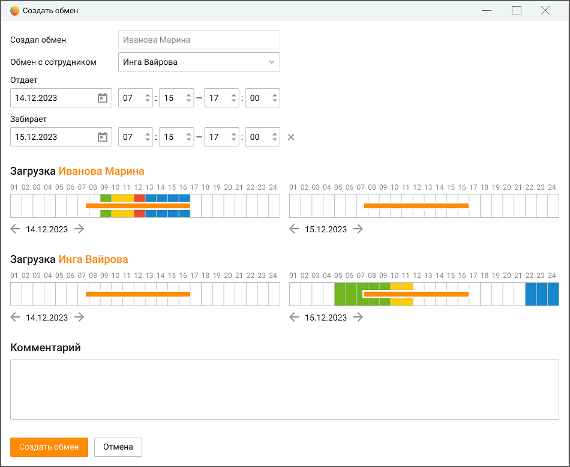
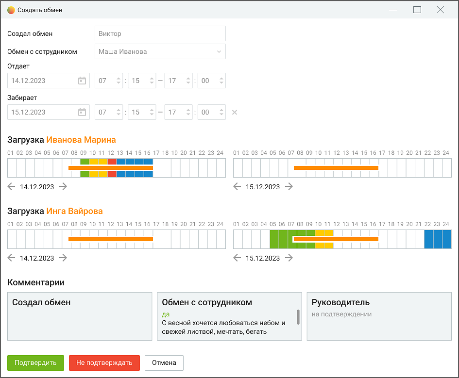

# 8.4. Обмен сменами

> Трассировка: PDF §8.4 · сквозные стр. 262-266 · источники: ч.3 `kb/mango-product-docs/sources/mango-cc-manual/CC_manual_1.26.23-part-3.pdf` с.60-64.

В случае жизненных обстоятельств для сотрудников важно иметь возможность оперативно меняться сменами между собой. В подразделе Обмен сменами сотрудник может совершить обмен сменами (рабочий/нерабочий день) с другим сотрудником. Подраздел "Обмен сменами" позволяет: • Просматривать доступные для обмена смены, свои и подконтрольных сотрудников. • Создавать запросы на обмен сменами. • Управлять запросами на обмен сменами, своими и подконтрольных сотрудников. • Просматривать историю обменов сменами, своими и подконтрольных сотрудников. Подраздел содержит следующие вкладки: • Мои обмены: отображает текущие и будущие обмены сменами сотрудника. • Обмены сотрудников: отображает обмены сменами подконтрольных сотрудников. • Завершенные обмены: отображает историю завершенных обменов сменами, своих и подконтрольных сотрудников.

Действия с запросом на обмен обозначены пиктограммами:

– отклонение запроса на обмен сменами.

– подтверждение запроса на обмен сменами.

- просмотр подробной информации о запросе на обмен (карточки обмена). Доступные функции: • Создание обмена: нажмите кнопку "Создать обмен", чтобы начать процесс обмена сменами. • Опции просмотра: удобные вкладки позволяют сотруднику просматривать свои текущие обмены, обмены между подконтрольными сотрудниками, завершенные обмены (свои и подконтрольных сотрудников) с учетом фильтрации по дате, группе или сотрудникам. • Настройка столбцов таблицы: нажатие кнопки "Настройка столбцов" позволяет выбрать и сохранить столбцы, которые необходимо отображать в таблице.

o Создал – имя сотрудника, который создал запрос на обмен. o Отдает – дата и время смены, которую сотрудник хочет отдать. o Забирает – дата и время смены, которую хочет взять сотрудник. o Обмен с сотрудником – имя сотрудника, с которым хочет поменяться сменами. o Сотрудник согласен – статус согласия сотрудника: "Да", "Нет" или "На подтверждении". o Руководитель согласен – статус согласия руководителя: "Да", "Нет" или "На подтверждении". o Подтвердить – пиктограмма подтверждения обмена (доступна только для создателя запроса). o Обмен состоялся – статус завершения обмена. Создание обмена Для создания запроса на обмен, перейдите на вкладку "Мои обмены", затем нажмите кнопку "Создать обмен". Введите необходимую информацию о желаемом обмене и завершите процесс, нажав кнопку "Создать".

1. Выбор сотрудника • В поле "Обмен с сотрудником" введите имя сотрудника, с которым вы хотите поменяться сменами. • Из списка выберите нужного сотрудника. 2. Выбор даты и времени • В поле "Отдает" выберите дату смены, которую вы отдаете, а также время начала и конца вашей смены. • В поле "Забирает" выберите дату смены, которую вы хотите взять взамен, а также время начала и конца смены. 3. Добавление комментария (необязательно) • В поле "Комментарий" вы можете добавить комментарий к своему запросу на обмен. 4. Отправка запроса

• Нажмите кнопку "Создать обмен". • Ваш запрос на обмен будет отправлен сотруднику, с которым вы хотите поменяться сменами. • Ваш запрос на обмен будет отправлен руководителю для подтверждения обмена. Дополнительная информация: • При создании запроса вы можете просматривать свои запланированные смены в календаре. Цвет элементов смены соответствует настройкам активностей WFM на обозначенное время.

• Вы можете отменить запрос на обмен в любое время, нажав на пиктограмму отклонения запроса. • Если руководитель и сотрудник, с которым вы хотите поменяться сменами, одобрит ваш запрос, вы получите уведомление в Контакт-центре. • Смены не могут пересекаться, и нельзя попросить другого работника отработать, если у него уже назначена смена на этот день. • Ограничения трудового договора не учитываются при переносе смен: сотрудники сами отвечают за соблюдение этих ограничений. • Обмен возможен только между двумя людьми: это ограничение позволяет эффективно управлять процессом обмена. • Просмотр, подтверждение, отклонение обмена Чтобы просмотреть запрос на обмен, свой или подконтрольных сотрудников, необходимо

нажать на пиктограмму у соответствующего запроса из списка. В открывшейся карточке запроса доступна подробная информация о запросе: кто создал запрос, с кем происходит обмен, даты и время смен, а также любые дополнительные комментарии. Также здесь отображается текущий статус запроса.

| Чтобы обмен считался завершенным, участвующий в обмене сотрудник и руководитель |
| --- |
| должны подтвердить обмен. |

Нажмите кнопку "Подтвердить", чтобы подтвердить запрос на обмен, или кнопку "Не подтверждать", чтобы отклонить его. Также можно добавить комментарий к своему действию.
