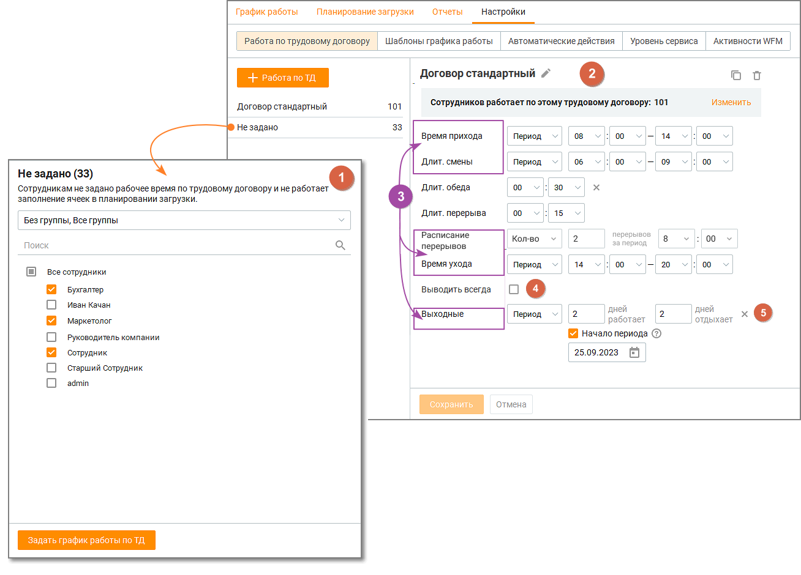
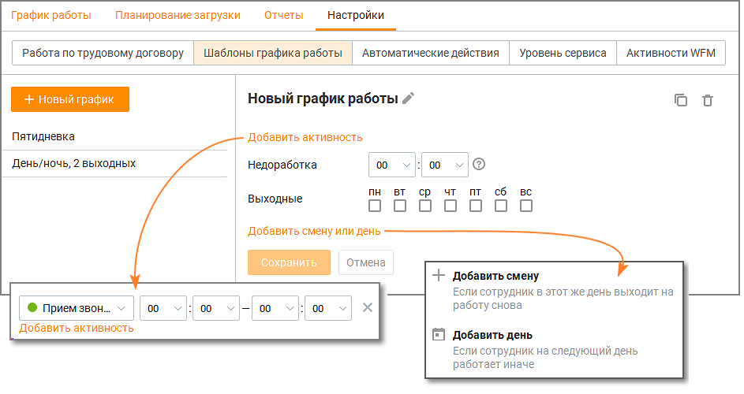
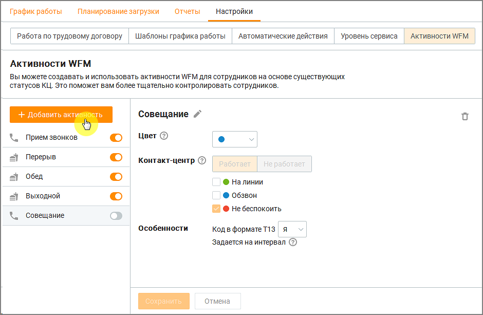

# 8.5. Настройки

> Трассировка: PDF §8.5 · сквозные стр. 266-270 · источники: ч.3 `kb/mango-product-docs/sources/mango-cc-manual/CC_manual_1.26.23-part-3.pdf` с.64-68.

Вкладка Настройки содержит шесть информационных блоков.

| Блоки отображаются только для пользовательских ролей Администратор и Руководитель |
| --- |
| компании при подключенной в ЛК ВАТС услуге "Планирование работы (WFM)". |

• Работа по трудовому договору • Шаблоны графика работы • Автоматические действия • Уровень сервиса • Активности WFM • Производственный календарь Работа по трудовому договору В блоке "Работа по трудовому договору" руководитель имеет возможность задать типовой и пользовательский варианты графика работы сотрудников по Трудовому договору. Таким образом благодаря подсказкам программы по правильному заполнению рабочего времени у сотрудников руководители будут затрачивать меньше времени на подготовку расписания. Вертикальное меню блока содержит список договоров, системную строку "Не задано" и кнопку +Работа по ТД. Клик по кнопке создает новый шаблон трудового договора. 1. Строка "Не задано" содержит список сотрудников, которым не задано рабочее время ни по одному из созданных руководителем шаблонов Трудовых договоров.

2. Чтобы изменить имя трудового договора в шаблоне нажмите пиктограмму "карандаш" возле наименования договора, внесите и сохраните внесенные изменения. 3. Строки шаблона могут содержать варианты: фиксированное время, временной период и количество (для перерывов). Функционал настройки количества перерывов позволяет руководителю задать одинаковое количество перерывов для всех сотрудников, работающих по одному трудовому договору. 4. Чекбокс "Выводить всегда". Эта настройка предназначена для обеспечения постоянной занятости сотрудников, независимо от текущих потребностей. Если чекбокс включен, система будет выводить всех сотрудников на работу, даже в тех случаях, когда это не требуется по прогнозу. Настройка учитывает график работы сотрудников, перерывы и обеденные перерывы, предусмотренные Трудовым договором. 5. Клик по пиктограмме "х" в строке шаблона скрывает строку.

Чтобы скопировать шаблон нажмите пиктограмму . Клик по пиктограмме "корзина" безвозвратно удаляет шаблон трудового договора, после подтверждения удаления. Клик по ссылке "Изменить" открывает всплывающее окно со всеми списками сотрудников:

В списках можно удалять и добавлять сотрудников в графики работ по различным договорам, настроенным в Контакт-центре. Шаблоны графика работы Настроенные шаблоны работы позволяют руководителю быстро настраивать график работы сотрудника или группы. Клик по кнопке Новый график открывает форму создания нового шаблона. Доступно создание не более 20 шаблонов. Клик по строке с созданным шаблоном открывает его для просмотра, редактирования,

удаления или копирования кликом по пиктограмме .

Уровень сервиса В блоке пользователь имеет возможность задать постоянный показатель уровня сервиса – процентное соотношение количества отвеченных звонков к общему количеству звонков. Дневной уровень сервиса задается пользователем в подвкладке "Планирование загрузки". Активности WFM В блоке пользователь имеет возможность задавать нерабочие статусы сотрудникам на любой интервал времени, а также задавать текущие статусы КЦ в WFM. Созданные активности могут быть использованы при настройке автоматических действий.

В блоке по умолчанию размещены 4 активности. В активностях по умолчанию для изменения доступны только цвет и код в формате T13. Активности по умолчанию не могут быть удалены.

Для добавления новой активности нажмите кнопку Добавить активность. Введите наименование новой активности, выберите ее параметры и сохраните внесенные изменения кнопкой Сохранить. Активности, созданные пользователем, могут быть удалены кликом по

<!-- изображение на стр. 270: байты не извлечены (PyMuPDF недоступен) -->

пиктограмме . Пользователь имеет возможность редактировать активности, добавляя или удаляя статусы Контакт-центра, для автоматического обновления расписания. После редактирования активности обновляются связанные с ней данные как для предыдущих, так и для предстоящих периодов времени.
