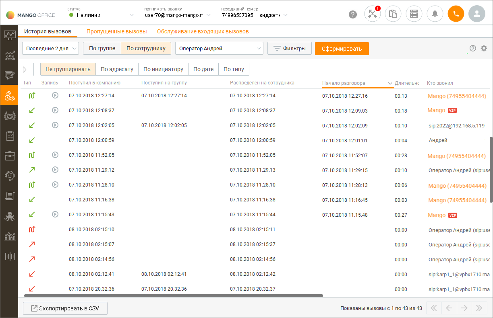

# 9.1. История вызовов

> Трассировка: PDF §9.1 · сквозные стр. 277-281 · источники: ч.3 `kb/mango-product-docs/sources/mango-cc-manual/CC_manual_1.26.23-part-3.pdf` с.75-79.

При первом запуске программы отображается журнал вызовов за последние 2 дня по текущему пользователю, отсортированный по времени вызова, без группировки.

При выходе из программы и повторном входе для периода времени отображения журнала вызовов принудительно устанавливается значение Последние 2 дня.

| В рамках компаний исходящего обзвона в Контакт-центре MANGO OFFICE |  |  |  |
| --- | --- | --- | --- |
|  | предусмотрена возможность скрытия номеров клиентов от сотрудников. Данная |  |  |
|  | возможность является опциональной и подключается только через персонального |  |  |
| менеджера. | менеджера. |  |  |
|  |  | Для пользователей Личного кабинета с ролью "Руководитель компании", а также ролей, |  |
|  | созданных на ее основе, предусмотрена возможность ограничения доступа остальных |  |  |
|  | пользователей к просмотру записей своих разговоров. Для настройки ограничений следует |  |  |
| воспользоваться виджетом "Настройки личной защиты" рабочего стола. |  |  |  |

Вы можете самостоятельно выбрать, какие столбцы будут отображаться на панели. Для этого

щелкните левой кнопкой мыши по пиктограмме и установите/снимите флаги напротив наименований столбов. По умолчанию отображается весь набор столбцов. Отображение списка вызовов осуществляется постранично. Действие фильтров поиска и отбора распространяется на все вызовы в истории, а не только на те, которые отображены на текущей странице. . Для перехода по страницам используются кнопки с изображениями стрелок в правой нижней части рабочей области. Количество записей, выводимых на одну страницу, редактируется в настройках программы.

Для отображения направления и типа совершенных вызовов используются следующие значки:

— Входящий (принятый);

— Входящий (пропущенный);

— Исходящий (состоявшийся);

— Исходящий обзвон (состоявшийся);

— Исходящий (несостоявшийся);

— Внутренний (состоявшийся);

— Внутренний (пропущенный, несостоявшийся);

— Обратный звонок (пропущенный);

— Обратный звонок (принятый);

| Чтобы оперативно ознакомиться с текстовой информацией о направлении и типе |
| --- |
| совершенного вызова, наведите курсор на нужный значок. |

Чтобы получить подробную информацию об участнике вызова, нажмите на ссылку с именем в столбце Кто звонил или Кому звонил. В результате на экране отобразится карточка контакта. Сотрудники и клиенты, карточки которых имеются в Контакт-центре, выделены цветом. Чтобы привязать вызов к контакту или создать новый с этим номером, щелкните правой кнопкой по номеру в строке нужного вызова. В результате в рабочей области панели отобразится контекстное меню (см. пример на рисунке ниже). Нажмите нужную ссылку, чтобы создать новый контакт или обновить существующий.

Вы можете скопировать информацию в буфер обмена. При копировании номеров из столбцов Кто звонил и Кому звонил щелкните по нужному номеру левой кнопкой мыши, затем воспользуйтесь сочетанием клавиш на клавиатуре либо нажмите правую кнопку и в контекстном меню выберите команду: • Копировать – копировать текст в буфер обмена; При копировании информации из столбцов Куда звонил и Комментарий щелкните левой кнопкой мыши по нужной строке в соответствующем столбце и при помощи комбинации Ctrl+C скопируйте выделенную информацию в буфер обмена. В дополнение к возможности прослушивания разговоров предусмотрена возможность повторных исходящих вызовов — как по номеру инициатора вызова, так и по номеру адресата вызова. Чтобы совершить повторный вызов, наведите курсор на строку с нужным вызовом и

нажмите появившуюся кнопку с трубкой в нужном столбце таблицы (Кто звонил или Кому звонил). Дополнительные возможности инструмента История вызовов приведены в следующих подразделах: • Фильтрация, группировка, отбор и поиск вызовов; • Прослушивание разговоров и повторные вызовы; • Редактирование информации о вызовах;

• Экспорт данных из истории вызовов.

<!-- изображение на стр. 281: байты не извлечены (PyMuPDF недоступен) -->
