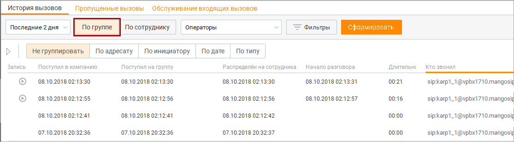
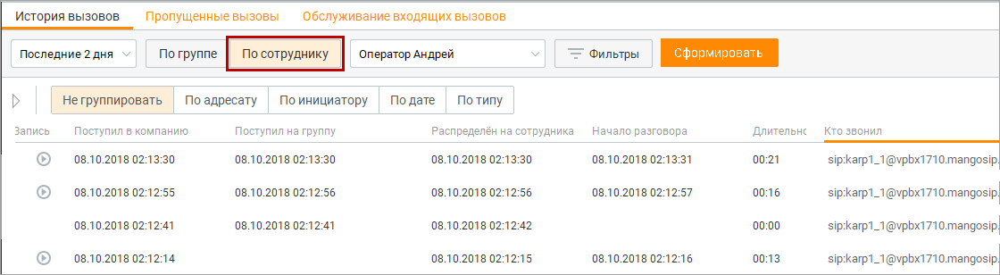
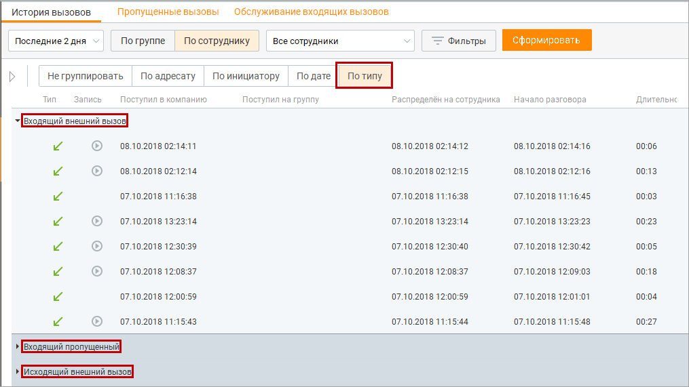
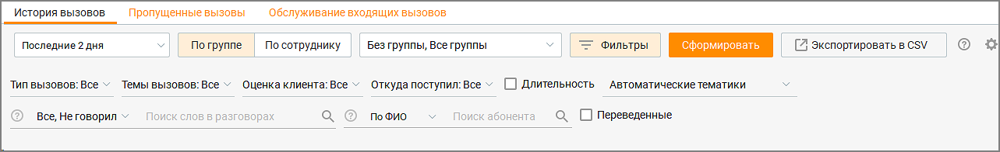
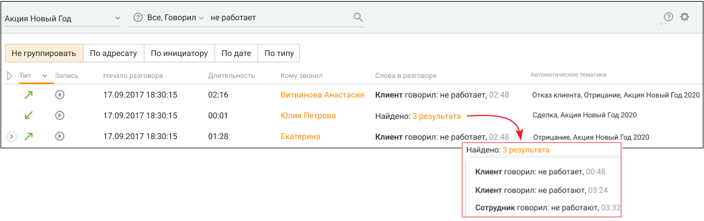
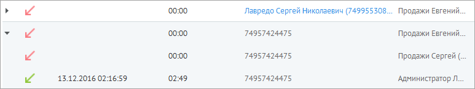

# 9.1.1. Фильтрация, группировка, отбор и поиск вызовов

> Трассировка: PDF §9.1.1 · сквозные стр. 281-285 · источники: ч.3 `kb/mango-product-docs/sources/mango-cc-manual/CC_manual_1.26.23-part-3.pdf` с.79-83.

Для удобства работы с журналом совершенных вызовов предусмотрены различные элементы интерфейса, позволяющие осуществлять фильтрацию, группировку, отбор и поиск вызовов. В этом подразделе мы подробно рассмотрим их использование для выполнения нужных вам задач.

| Для более эффективной фильтрации вызовов вы можете комбинировать критерии |  |  |
| --- | --- | --- |
|  | фильтрации, группировки, отбора и поиска. Чтобы уменьшить продолжительность ожидания |  |
|  | результатов, рекомендуем указывать этих критерии таким образом, чтобы получить |  |
| наименьшую по числу вызовов выборку. |  |  |

Фильтрация вызовов Для последующего анализа истории вызовов вам необходимо выбрать один из двух фильтров: По группе или по сотруднику. По умолчанию выбран фильтр По сотруднику. Чтобы фильтровать вызовы по группе операторов, выберите фильтр По группе, используя переключатель. Затем при необходимости выберите из списка нужную группу. После этого в рабочей области панели отображаются вызовы из всех групп или выбранной группы (в примере на рисунке ниже выбрана группа «Операторы»).

| В фильтре По группе отображаются группы пользователей, для которых история вызовов |  |  |  |  |  |  |  |  |  |  |  |
| --- | --- | --- | --- | --- | --- | --- | --- | --- | --- | --- | --- |
|  | доступна текущему пользователю в соответствии с его ролью. |  |  |  |  |  |  |  |  |  |  |
|  | По умолчанию выбран вариант Все группы, при этом: |  |  |  |  |  |  |  |  |  |  |
|  | — «все группы» в данном случае означает все группы операторов, для которых история |  |  |  |  |  |  |  |  |  |  |
|  | вызовов доступна текущему пользователю в соответствии с ролью; |  |  |  |  |  |  |  |  |  |  |
|  | — вариант Все группы выбран, если пользователю доступна история вызовов для |  |  |  |  |  |  |  |  |  |  |
|  | нескольких групп; |  |  |  |  |  |  |  |  |  |  |
|  | — если вариант Все группы недоступен для выбора (например, если пользователь является |  |  |  |  |  |  |  |  |  |  |
|  | оператором только в одной группе), то по умолчанию используется группа, где он имеет |  |  |  |  |  |  |  |  |  |  |
|  | роль Оператор; |  |  |  |  |  |  |  |  |  |  |
|  | — для пользователей с ролью Сотрудник данный фильтр недоступен. |  |  |  |  |  |  |  |  |  |  |
|  |  | Выбранные значения фильтра хранятся локально для каждой учетной записи и |  |  |  |  |  |  |  |  |  |
|  | используются при каждом входе на вкладку отчета, в том числе после перехода. Дата всегда |  |  |  |  |  |  |  |  |  |  |
| выбирается текущая. |  |  |  |  |  |  |  |  |  |  |  |

Чтобы фильтровать вызовы по сотруднику, выберите вариант По сотруднику, используя переключатель. Затем при необходимости выберите из списка нужного сотрудника или вариант Все сотрудники (если он доступен). После этого в рабочей области панели отображаются вызовы всех сотрудников или выбранного сотрудника; при этом сотрудник может быть как инициатором, так и адресатом вызовов (как в примере на рисунке ниже).

| В фильтре По сотруднику отображаются сотрудники, для которых история вызовов |  |  |  |  |  |
| --- | --- | --- | --- | --- | --- |
|  | доступна текущему пользователю в соответствии с его ролью. |  |  |  |  |
|  | По умолчанию фильтр установлен на текущего пользователя, при этом: |  |  |  |  |
|  | — «все сотрудники» в данном случае означает всех сотрудников, история вызовов которых |  |  |  |  |
|  | доступна текущему пользователю в соответствии с ролью; |  |  |  |  |
|  | — вариант Все сотрудники присутствует для выбора, если пользователю доступна история |  |  |  |  |
| вызовов для нескольких сотрудников. |  |  |  |  |  |

В случае указания фильтра по группе для поиска совершенных группой исходящих звонков (Исходящие, Обратные звонки, Автоперезвоны, Внутренние): сначала ищутся все сотрудники, входящие в искомую группу на момент построения отчета, затем отбираются звонки, совершенные этими сотрудниками. Если сотрудник состоит более, чем в одной группе, звонки сотрудника будут отображаться и для одной и для другой группы. Установленные параметры фильтрации сохраняются при выходе из программы и повторной авторизации. Группировка вызовов Чтобы сгруппировать вызовы по адресату, инициатору, дате или типу, выберите нужный вариант из списка Группировать. После этого в рабочей области панели отображаются вызовы, сгруппированные в соответствии со сделанным выбором. См. пример на рисунке ниже для группировки вызовов по типу.

Дополнительная фильтрация вызовов Дополнительная фильтрация вызовов открывается нажатием кнопки Фильтры.

Чтобы отобрать вызовы по дате и времени совершения, выберите нужный период из списка Период. Доступны следующие варианты: сегодня, вчера, последние 2 дня, текущая неделя, текущий месяц, произвольный. При выборе первых четырех вариантов (исключая Произвольный) результаты отбора подгружаются в рабочую область панели немедленно. При выборе варианта Сегодня также становятся доступными поля для выбора по времени суток. При выборе варианта Произвольный длительность выбранного период не может превышать один месяц. Для подгрузки результатов отбора необходимо нажать кнопку Обновить. Чтобы отобрать вызовы по времени суток, выберите вариант Сегодня. После этого становятся доступными поля для выбора по времени суток. Введите начальное и конечное время суток в соответствующие поля или укажите его, используя регуляторы. Чтобы отобрать вызовы по длительности, включите настройку Задать длительность разговора и введите минимальную и максимальную длительность вызова в соответствующие поля или укажите ее, используя регуляторы. После этого нажмите кнопку Обновить.

Допускается отбор вызовов с нулевой длительностью.

Чтобы отобрать вызовы по типу вызовов, выберите нужные типы вызовов в поле Тип Вызовов. Чтобы отобрать вызовы по темам вызовов, выберите нужные темы в поле Темы вызовов из вариантов, настроенных в Справочнике тематик обращений. Чтобы отобрать вызовы по оценке клиента, выберите нужную оценку в поле Оценка клиента. Варианты оценок: Отлично, Хорошо, Нормально, Плохо, Очень плохо. В фильтре оценок не учитываются сотрудники, подключавшиеся к разговору в режиме прослушивания или суфлирования.

| Если в Личном кабинете ВАТС подключена услуга "Контроль качества (постзвонковая |  |  |
| --- | --- | --- |
|  | оценка)", то фильтр отбирает все разговоры, в которых есть хотя бы одна из отмеченных в |  |
| нём оценок. |  |  |

Чтобы отобрать вызовы по источнику, выберите соответствующие источники в поле Откуда поступил. Варианты значений: • Распределён с группы — вызов поступил сотруднику из группы. Не важно, как вызов попал в группу: через IVR, по прямому номеру, через донабор и т. д. • Персональный — вызов был направлен на конкретного сотрудника через пункт меню «Перевод на сотрудника». • Набран добавочный сотрудника — вызов поступил после того, как внешний абонент набрал внутренний номер сотрудника. • Перехвачен сотрудником — вызов был перехвачен другим сотрудником до того, как был доставлен адресату. • Переведён сотрудником — вызов был переведён на сотрудника другим сотрудником (любым способом — слепым или консультационным переводом). • Переведён роботом — вызов был перенаправлен сотруднику роботом после обработки сценария. • Другие — значение отсутствует, если тип распределения не относится ни к одному из перечисленных вариантов

Чтобы отобрать вызовы конкретного абонента, выберите По ФИО или По номеру и введите не менее трех символов для поиска в поле Поиск абонента. Чтобы отобрать переведенные вызовы установить галочку в чекбоксе "Переведенные". В табличной части отчета поле, "Переведено на" отображает куда был переведен звонок. Иконка

раскрытия в столбце "?" показывает, сколько переводов было сделано в рамках одной переадресации.

| ПРИМЕР |
| --- |
| Задача: сделать отбор по переведенным звонкам определенной группы и посмотреть – куда они |
| были переведены. |
| Решение: сделать фильтр только по связанным вызовам и добавить отображение куда был |
| переведен звонок. Далее выбрать искомую группу, проставить чекбокс "переведенные" и |
| посмотреть – куда ушел звонок. Добавив количества "плеч" звонка, можно посмотреть сколько раз |
| клиента "переводили". |

Чтобы отобрать вызовы по тематикам Речевой аналитики, выберите нужные варианты в поле Автоматические тематики. Подробнее о тематиках Речевой аналитики узнайте здесь.

| Для работы фильтра в Личном кабинете пользователя должна быть подключена услуга |
| --- |
| Речевая аналитика. |

Чтобы отобрать вызовы по ключевым запросам задайте перечень ключевых запросов (терм) в поле Поиск слов в разговорах, а также в фильтре:

Подробнее о правилах ввода терм здесь. В таблице результатов поиска отображаются заданные ключевые слова, их количество, а также минута:секунда разговора, на которой они были произнесены.

<!-- изображение на стр. 285: байты не извлечены (PyMuPDF недоступен) -->

Поиск вызовов Чтобы оперативно найти нужный вызов по ФИО контакта или имени сотрудника, введите в поле абонент ФИО контакта или имя сотрудника, или его номер. Искомый текст проверяется на совпадение с ФИО контакта из Адресной книги, или имени сотрудника, или номером связи. При вводе искомого текста работает автоподбор — по мере ввода отображается до 5 элементов автоподбора (номеров или ФИО контактов / сотрудников), которые начинаются с введенного искомого текста. После щелчка по элементу автоподбора в поле Абонент автоматически подставляется полное ФИО контакта. Затем по подставленному тексту выполняется поиск из истории вызовов. Чтобы найти нужные вызовы по имени абонента, введите в поле Абонент имя или его часть. После этого осуществляется поиск вызовов всех абонентов, ФИО которых начинается с комбинации символов, соответствующих искомому тексту. Чтобы найти нужные вызовы по телефонному номеру, введите в поле Абонент телефонный номер или его часть. После этого осуществляется поиск вызовов всех абонентов, телефонный номер которых начинается с указанной комбинации символов. Связные вызовы Чтобы просмотреть информацию о связных вызовах, разверните вызов. Для этого щелкните по значку со стрелкой слева от строки с вызовом. После этого вызов разворачивается, и в рабочей области отображается информация о связных вызовах. Для того, чтобы свернуть/развернуть все связные, нажмите на иконку свернуть/развернуть.

<!-- изображение на стр. 285: байты не извлечены (PyMuPDF недоступен) -->

Данная иконка имеет три состояния: • Свернуть всё – свернуть все связные вызовы; • Развернуть всё – развернуть все связные вызовы; • Пользовательский – в рамках этого режима запоминается информация о состоянии вызовов, которое вы установили сами.
