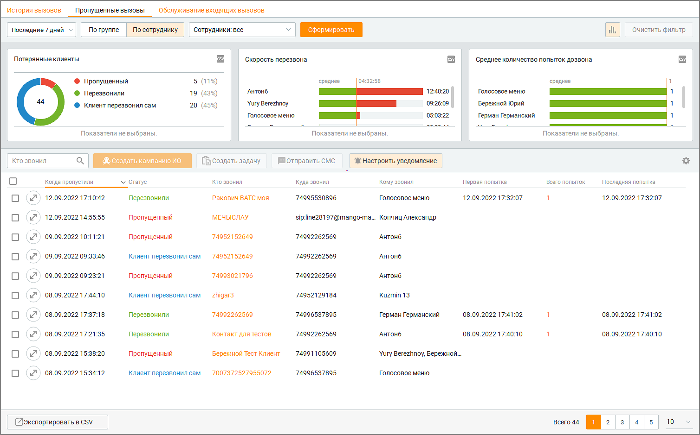
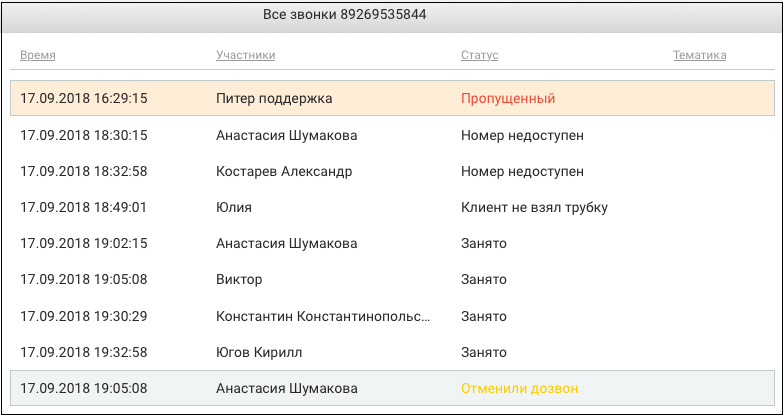
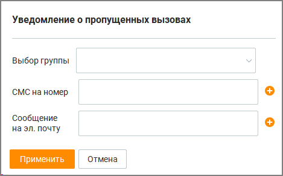

# 9.3. Пропущенные вызовы

> Трассировка: PDF §9.3 · сквозные стр. 291-296 · источники: ч.3 `kb/mango-product-docs/sources/mango-cc-manual/CC_manual_1.26.23-part-3.pdf` с.89-94.

Отчет "Пропущенные вызовы" позволяет получить детальную информацию в рамках истории перезвона по пропущенным групповым вызовам за выбранный период по выбранной группе.

Для получения отчета выберите нужный период времени и выставьте фильтры, по которым необходимо получить аналитические данные: по времени, по группе или сотруднику, источник вызова и др. После завершения выбора критериев нажмите кнопку Сформировать. Клик по кнопке Очистить фильтр удаляет заданные параметры фильтрации.

| Выбранные значения фильтра хранятся локально для каждой учетной записи и |
| --- |
| используются при каждом входе на вкладку отчета, в том числе после перевхода. Дата по |
| умолчанию текущая. |

Отчет отображается в виде трех графиков и табличной формы. Клик по иконке открывает блок графиков отчета. ГРАФИКИ Предусмотрены следующие графики:

| Потерянные клиенты — график отображает абсолютное и относительное количество |
| --- |
| историй перезвона по статусам историй перезвона по выбранным группам/сотрудникам за |
| выбранный период. Е |

она не отображается в таблице при фильтрации по группе/сотруднику.

| Скорость перезвона — среднее значение времени между временем инициации |
| --- |
| пропущенного входящего вызова, являющегося самым ранним в рамках одной истории |
| перезвона, и временем инициации исходящего вызова в адрес абонента, в рамках которого |
| состоялся разговор с клиентом (т. е. только по историям перезвона со статусом |
| "Перезвонили", остальные истории перезвонов не учитываются) по каждой выбранной |
| группе/сотруднику и по всем выбранным группам/сотрудникам в целом за выбранный |
| период. Сортировка выполняется по убыванию значения. |
| Среднее количество попыток дозвона — среднее количество исходящих вызовов в |
| рамках историй перезвона в статусе "Перезвонили" по каждой выбранной |

| группе/сотруднику и по всем выбранным группам/сотрудникам в целом за выбранный |
| --- |
| период. |

| Клик по области графика (легенде либо изображению) приводит к фильтрации списка историй |  |  |
| --- | --- | --- |
| перезвона в таблице соответственно выбранному значению. Повторный клик по этой области |  |  |
| приводит к отмене фильтрации. |  |  |
| Клик по кнопке |  | приводит к открытию стандартного окна экспорта данных в CSV. Экспорт |
| производится с учетом выбранных в фильтрах или с помощью поисковой строки значений. |  |  |

ТАБЛИЦА В табличной части отчета отображается детальная информация о пропущенных групповых вызовах за указанный период времени. Вы можете самостоятельно выбрать, какие столбцы будут отображаться на панели. Для этого

щелкните левой кнопкой мыши по пиктограмме и установите/снимите флаги напротив наименований столбцов. По умолчанию отображается весь набор столбцов. Также на панели пользователю доступен выбор одного из следующих массовых действий: • Создать задачу – выбранным контактам, у которых имеется Ответственный, осуществляется массовая постановка задачи. Если Ответственный не проставлен, для данного контакта задача не создается. Кнопка доступна, если к Контакт-центру подключен модуль "Задачи" и выбран хотя бы один контакт; • Создать кампанию ИО – клик по кнопке приводит к открытию мастера создания кампании Исходящего обзвона на первом шаге. Кнопка доступна, если к Контакт-центру подключен модуль "Исходящие кампании (Исходящий обзвон)" и выбран хотя бы один контакт; • Отправить смс – кнопка доступна, если к Контакт-центру подключена услуга "Исходящие кампании (СМС-рассылки)" и выбран хотя бы один контакт. Выполнение массовых действий сопровождается системными информационными уведомлениями. ИСТОРИЯ ПЕРЕЗВОНОВ

При нажатии на иконку на экране отображается соответствующая история перезвонов.

В Истории перезвонов отображается следующая информация по каждому событию: 1. Дата и время события 2. Участники o при статусе «Пропущен» отображается группа, пропустившая вызов, либо голосовое меню, если вызов был пропущен в IVR; o при статусах «Не дозвонились», «Перезвонили», «Занято», «Клиент не взял трубку», «Номер недоступен» — имя оператора, инициировавшего исходящий вызов; o при статусе «Отменён дозвон» — имя оператора, отменившего последний вызов в истории; o при статусе «Клиент перезвонил сам» — имя оператора, принявшего входящий вызов от клиента. 3. Статус 4. Тематика — отображаются все тематики вызова без возможности редактирования. Экспорт данных производится через кнопку Экспорт в нижней части страницы. КНОПКА "НАСТРОИТЬ УВЕДОМЛЕНИЕ" Для настройки уведомлений о пропущенных вызовах предусмотрена кнопка Настроить уведомление. Нажатие на кнопку открывает окно параметров уведомлений, позволяющее задать способы получения оповещений для выбранной группы.

В открывшемся окне доступны следующие элементы управления: 1. Выбор группы: Поле предназначено для указания группы, по которой требуется получать уведомления о пропущенных вызовах. Все дальнейшие параметры применяются только к выбранной группе. 2. СМС на номер: Поле используется для указания телефонного номера, на который будут направляться СМС-уведомления о пропущенных вызовах. Кнопка «+» добавляет дополнительные номера для получения сообщений. 3. Сообщение на эл. почту: Поле предназначено для указания адреса электронной почты, на который будут направляться уведомления. Кнопка «+» позволяет добавить несколько адресов для получения оповещений. 4. Кнопки управления

• Применить — сохраняет установленные параметры уведомлений и активирует их для выбранной группы. • Отмена — закрывает окно настройки без сохранения изменений.

