# 10.1. Контакты (адресная книга)

> Трассировка: PDF §10.1 · сквозные стр. 296-306 · источники: ч.3 `kb/mango-product-docs/sources/mango-cc-manual/CC_manual_1.26.23-part-3.pdf` с.94-101; ч.4 `kb/mango-product-docs/sources/mango-cc-manual/CC_manual_1.26.23-part-4.pdf` с.1-3.

Контакты Адресной книги доступны пользователю в соответствии с его ролью в Контакт- центре.

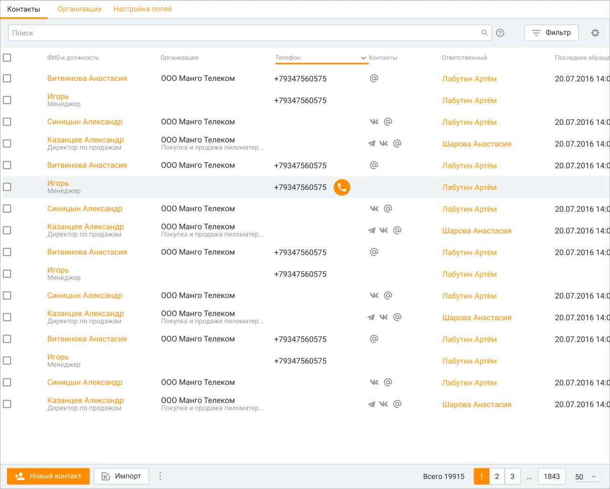

|  | столбцу ФИО и должность. | Пользователю |
| --- | --- | --- |
| доступна сортировка по любому из полей таблицы, включая пользовательские. Полный |  |  |
| список стандартных полей Контактов приведен в описании вкладки Информация. |  |  |

Вы можете самостоятельно выбрать, какие столбцы будут отображаться на панели. Для этого

щелкните левой кнопкой мыши по пиктограмме и установите/снимите флаги напротив наименований столбцов.

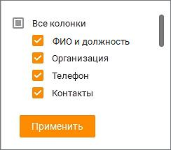

| Пользовательские поля в списке клиентов на вкладке Контакты по умолчанию не |  |  |
| --- | --- | --- |
|  | показываются. При наличии пользовательских полей их необходимо вносить в таблицу |  |
| самостоятельно, щелкнув по пиктограмме |  |  |

По клику на кнопке "Фильтры" открывается окно фильтрации. При выборе хотя бы одного из контактов отображается панель массовых действий с контактами Адресной книги. Как работать с фильтрами Окно фильтрации состоит из двух блоков: 1. Блок настройки параметров фильтрации. 2. Блок сохраненных фильтров. Пользователь может добавлять поля фильтрации кнопкой "Добавить поле". Для фильтрации доступны все поля Контактов, включая пользовательские. Подробнее о пользовательских полях в подразделе Настройка полей.

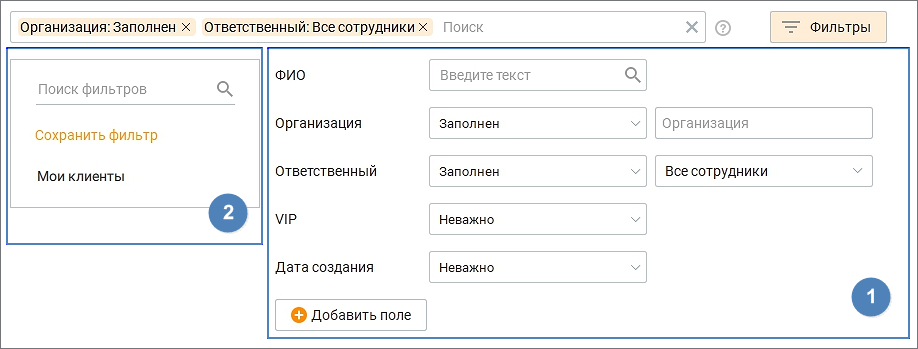

1. Блок настройки параметров фильтрации.

| Пользователю доступна фильтрация по любому из полей таблицы, а также по признаку |  |  |
| --- | --- | --- |
| наличия/отсутствия у контакта задач, сделок, обращений, контактных данных (телефон, |  |  |
| соцсети). В полях ФИО и Организация возможен поиск как по полным данным, так и по |  |  |
| частичному наименованию. В поле Телефон допускается выбор нескольких значений. |  |  |
| Кнопка | Добавить поле | открывает список доступных для выбора полей. Каждое поле |
| пользователь может выбрать только один раз. |  |  |

Выберите фильтры и нажмите кнопку Применить фильтр. Таблица контактов отобразится с учетом выбранных параметров:

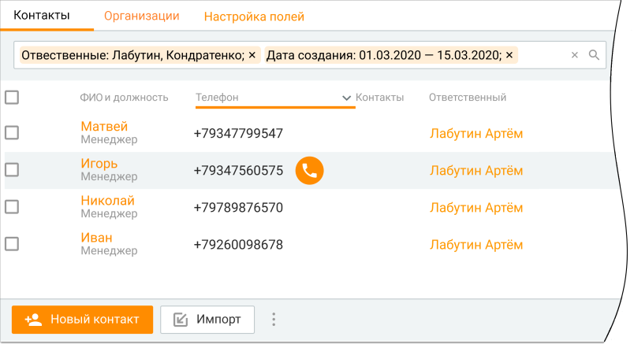

2. Блок сохраненных фильтров Пользователь, независимо от своей роли в Контакт-центре, может сохранить выбранный фильтр. Сохраненный фильтр будет доступен всем пользователям Контакт-центра. В качестве фильтра сохраняется следующий набор данных: • набор выбранных полей;

• приоритет выбранных полей; • значения во всех выпадающих списках и календарях, соответствующих этому полю (включая значение по умолчанию); • наименование сохраненного фильтра – в сохраненном фильтре доступно только редактирование наименования фильтра. Изменение наименования фильтра доступно любому сотруднику, и будет отображаться в измененном виде у всех пользователей Контакт-центра. • приоритет фильтра среди других сохраненных фильтров – изменить приоритет фильтра можно путем перетаскивания его на необходимый уровень в списке фильтров. Только что созданный фильтр имеет наивысший приоритет. Приоритет фильтра у одного пользователя Контакт-центра не влияет на приоритет этого же фильтра у другого пользователя. Сохраненный фильтр может удалить любой сотрудник, удаленный фильтр исчезает у всех пользователей продукта. Пользователям доступен поиск в сохраненных фильтрах – по наименованию фильтра (полному или частичному). На каждом продукте есть один предустановленный сохраненный фильтр "Мои клиенты". К нему применяются все правила, как и к другим сохраненным фильтрам: его можно переименовать, удалить, поменять приоритет только у себя на компьютере, применить. Как работать с панелью массовых действий Панель массовых действий с контактами Адресной книги размещается под поисковой строкой.

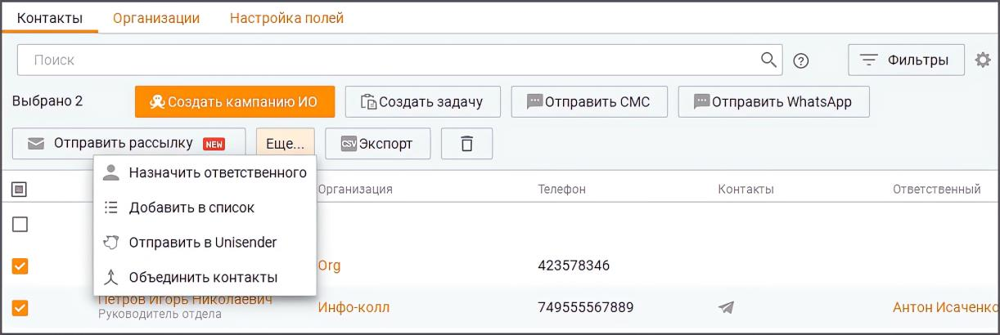

На панели доступны следующие действия: • Создать задачу – Выбранным контактам, у которых имеется Ответственный, осуществляется массовая постановка задачи. Если Ответственный не проставлен, для данного контакта задача не создается. Кнопка доступна, если к Контакт-центру подключен модуль "Задачи" и выбран хотя бы один контакт; • Создать кампанию ИО – клик по кнопке приводит к открытию мастера создания кампании Исходящего обзвона на первом шаге. Кнопка доступна, если к Контакт-центру подключен модуль "Исходящие кампании (Исходящий обзвон)" и выбран хотя бы один контакт; • Отправить СМС – кнопка доступна, если к Контакт-центру подключена услуга "Исходящие кампании (СМС-рассылки)" и выбран хотя бы один контакт; • Отправить WhatsApp – кнопка доступна, если в Контакт-центре настроены канал и шаблоны сообщений для отправки WhatsApp, а также выбран хотя бы один контакт. Массовая отправка сообщений WhatsApp возможна не более, чем 50 контактам одновременно. Обращения, отправленные из панели массовых действий: o закрываются сразу по отправлении; o не отображаются в интерфейсе "Мои обращения" (в том числе в списке закрытых); o доступны для просмотра в Истории обращений.

• Отправить рассылку - кнопка доступна, если к Контакт-центру подключена услуга "Текстовые рассылки". Клик по кнопке открывает раздел "Текстовые рассылки" Контакт- центра. • Еще – клик по кнопке отображает выпадающий список: o Назначить ответственного – если у контакта уже имеется Ответственный, то назначение нового Ответственного осуществляется без уведомления о переназначении; o Добавить в список – добавление выбранных контактов в существующие списки, а также создание новых списков контактов; o Отправить в Unisender – отправление выбранных контактов в список рассылки Unisender; o Объединить контакты – объединение данных выбранных контактов. Также на панели массовых действий имеются кнопки: • Экспорт – экспорт выбранных контактов в формате CSV. Подробнее в подразделе Импорт и экспорт контактов; • Корзина (удалить контакты) – после системного предупреждения происходит удаление выбранных контактов. Как работать с "Избранным" Пользователь может: • добавить/удалять контакт из общей адресной книги в избранные контакты, поставив соответствующую метку на контакте; • создавать избранный контакт, при этом созданный контакт автоматически отобразится и в общей адресной книге; • изменять контакт в избранном контакте, при этом все изменения отобразятся в общей адресной книге. Как работать с личными контактами (с пометкой "Ответственный") Контакт, для которого назначен ответственный сотрудник, считается личным контактом.

| Работа с контактами, у которых есть ответственный, доступна только сотрудникам с |  |  |
| --- | --- | --- |
|  | правом "Просматривать персональные контакты". Для остальных сотрудников такие |  |
| контакты являются "чужими контактами". |  |  |

Сотрудник, обладающий правом "Просматривать персональные контакты", может: • сделать себя ответственным у контакта, если ответственный контакта отсутствует; • поменять ответственного за контакт, если он сам является этим ответственным либо ответственным является сотрудник в подконтрольной ему группе; • при создании нового контакта указать себя ответственным. Если у контакта назначен ответственный, то все звонковые обращения в компанию от такого контакта будут автоматически распределяться на ответственного сотрудника, если сотрудник доступен на момент обращения. Распределение текстовых обращений на ответственного также можно настроить, проставив чекбокс "Автоматическое распределять текстовыe обращения на ответственного оператора" в Личном кабинете ВАТС в разделе "Обработка звонков/Настройки дозвона и сообщений по умолчанию". Пользователь может открыть карточку "чужого контакта" для просмотра в ограниченном режиме. У "чужих контактов" доступны для просмотра следующие поля: Организация, ФИО, Ответственный, Избранное. В карточке "чужого контакта" доступно для редактирования только поле Избранное. Чужой контакт не может быть удален. При попытке экспорта "чужих контактов" никакая информация о таких контактах не попадет в выгружаемый файл. Если поле "Ответственный" отображается в подразделе Настройка полей как обязательное для показа, то при создании контакта в поле Ответственный автоматически подставляется

ответственным текущий пользователь. Это правило работает только для пользователей, не обладающих правами "Просматривать персональные контакты". Как отправить контакты в Unisender Чтобы иметь возможность отправлять контакты в сервис рассылок Unisender, в Контакт- центре должна быть подключена соответствующая интеграция. На вкладке Контакты выберите контакты, которые необходимо отправить в Unisender, и нажмите кнопку "Еще" на панели массовых действий. В выпадающем списке выберите пункт меню "Отправить в Unisender".

После клика на пункт меню "Отправить в Unisender" откроется окно настройки отправки:

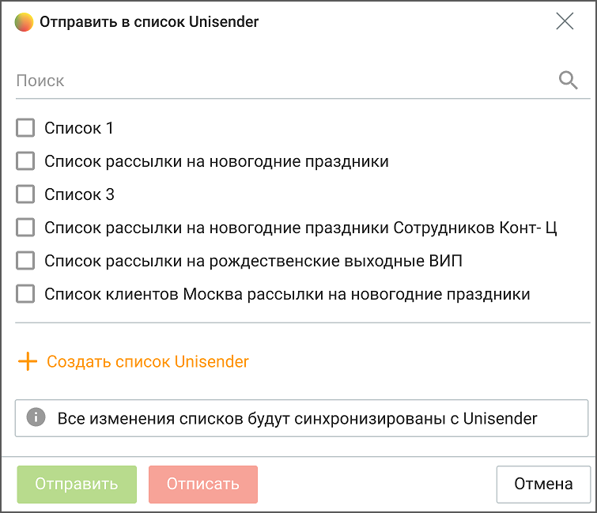

Отметьте списки, в которые необходимо отправить данные клиента или создайте новый список. После кика по кнопке Отправить, данные клиентов будут отправлены в сервис рассылки. Клик по кнопке Отписать удалит данные клиентов из отмеченных списков.

| При первом использовании функционала рекомендуется создавать новый список |  |  |
| --- | --- | --- |
|  | Unisender для тестовой отправки данных. В этом случае все отправленные в тестовом режиме |  |
| контакты несложно будет удалить из сервиса путем удаления целого списка. |  |  |

Для удаления списка нажмите пиктограмму в строке выбранного списка. Для

редактирования наименования нажмите пиктограмму

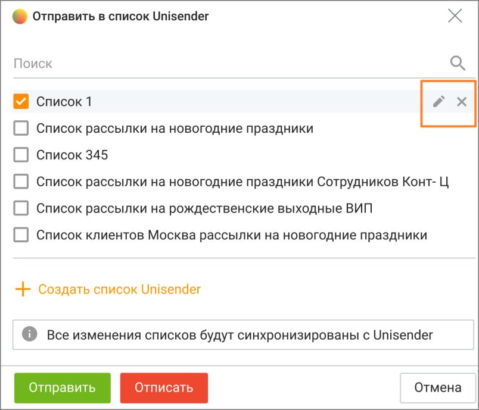

Как отобразить контакты постранично Отображение списка клиентов осуществляется постранично. Действие фильтров поиска и отбора распространяется на все записи, а не только на те, которые отображены на текущей странице. Для перехода по страницам используются кнопки с указанием номера страницы в правой нижней части рабочей области. Там же редактируется количество записей, выводимых на одну страницу. Поиск клиентов Для оперативного поиска клиента введите в поле поиска имя, отчество, фамилию или иные данные клиента. При вводе искомого текста работает автоподбор. Введенный текст проверяется на совпадение с данными клиента, указанными в его карточке. Поиск производится по всем основным полям контактных данных – ФИО, Организация, Должность, Телефон, Электронный адрес, Список, Сайт, Комментарий, ID, Ответственный, Автор, а также по пользовательским полям.

Для поиска нужного клиента введите в поле "Поиск" искомый текст (в качестве разделителя слов можно использовать пробел ' ' или дефис '-' и нажмите кнопку Найти либо клавишу Enter. После этого осуществляется поиск контактов по введенному искомому тексту. После завершения поиска в рабочей области панели отображаются все клиенты, где в указанных выше полях данных которых есть слова, содержащие поисковый запрос. Для точного поиска заключите поисковый запрос в кавычки – "текст поискового запроса". Чтобы найти всех клиентов, связанных с конкретной организацией, наведите курсор на строку

нужного контакта, затем нажмите кнопку .

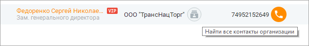

После завершения поиска в рабочей области панели отображаются все клиенты, где в поле "Организация" указана такая же организация. Максимально допустимое количество символов в поисковом запросе – 70.

| Текстовый поиск осуществляется для всех клиентов, а не только для клиентов, |  |  |
| --- | --- | --- |
|  | отображаемых в текущий момент на экране. Чтобы очистить поле поиска, нажмите кнопку |  |
| . |  |  |

Как скопировать в буфер обмена Чтобы скопировать номер по умолчанию в буфер обмена, выберите номер левой кнопкой мыши, затем нажмите правую кнопку и выберите команду Копировать номер в контекстном меню. Как позвонить, отправить SMS, сообщение в соц.сетях или e-mail Чтобы позвонить клиенту, наведите курсор на строку с ФИО и нажмите соответствующую кнопку. Стрелка на кнопке означает наличие нескольких номеров. Жирным шрифтом выделен номер, указанный в карточке клиента как основной. При наличии в карточке клиента телефонного номера с типом "Мобильный" при наведении курсора на строку с ФИО контакта дополнительно отобразится форма для отправки СМС- сообщения.

Больше узнать о настройке шаблонов СМС-сообщений можно здесь. Изменение текста выбранного шаблона не приводит к изменению отображения выбранного шаблона или в каким-либо другим действиям с шаблоном. Чтобы отправить клиенту письмо по электронной почте, щелкните по адресу электронной почты в столбце e-mail. После этого в операционной системе запускается зарегистрированный по умолчанию почтовый клиент, где создается новое письмо. В поле Кому автоматически подставляется соответствующий адрес электронной почты.

Чтобы отправить клиенту сообщение в социальных сетях необходимо выбрать в адресной книге иконку контактных данных. Сотрудник может отправлять текстовое обращение в Telegram, ВКонтакте, Max, WhatsApp.

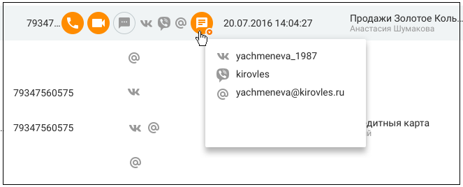

Больше информации узнайте в разделе Мои обращения/Исходящие обращения. Как объединить контакты От одного клиента может поступить несколько обращений, через различные каналы. Как правило, по каждому из обращений сотрудники создают отдельного клиента в адресной книге т.к. не всегда понятно, что клиент уже обращался через другой канал связи. Такие дублированные контакты можно объединять в один. Чтобы объединить контакты, на вкладке Контакты выберите контакты, которые необходимо объединить, и нажмите кнопку "Еще" на панели массовых действий. В выпадающем списке выберите пункт меню "Объединить контакты". Для объединения можно выбрать от 2-х до 10-ти контактов.

Для объединения нельзя выбирать контакты из внешних источников.

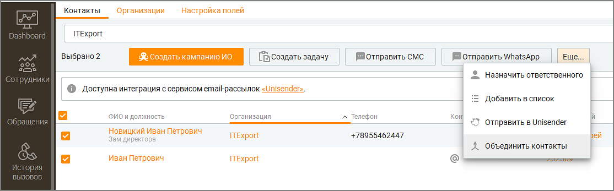

После клика на пункт меню "Объединить контакты" откроется окно объединения.

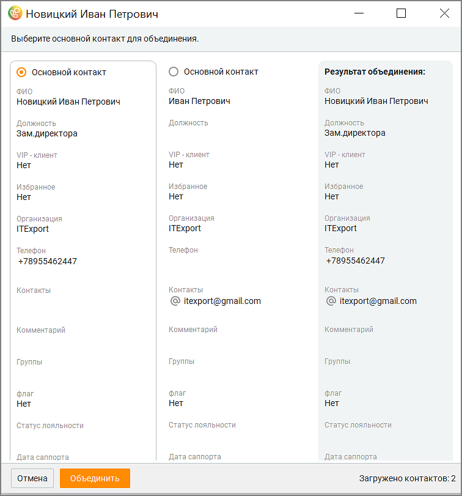

В окне объединения можно провести следующие действия: • Выбрать основной контакт. • Просмотреть результат объединения контактов • Объединить контакты кликом по кнопке "Объединить" • Отменить операцию объединения кликом по кнопке "Отменить"

| При объединении все данные переносятся в основной контакт. После объединения |
| --- |
| контакт, не отмеченный как основной, будет удален. |

Также на вкладке присутствуют кнопки: • Новый контакт - добавление нового контакта в Адресную книгу; • Импорт – импорт контактов в Адресную книгу;

• Пиктограмма - удаление всех контактов Адресной книги (доступна только пользователям с правом "Администратор"). Далее: • Создание, редактирование, удаление контактов • Импорт и экспорт контактов

