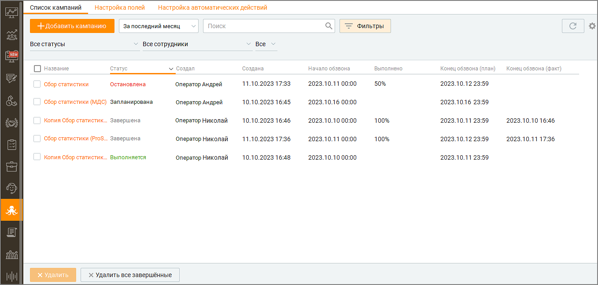
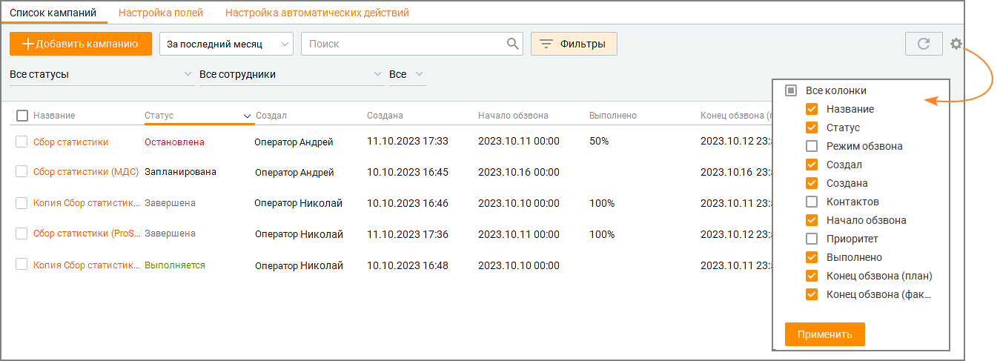
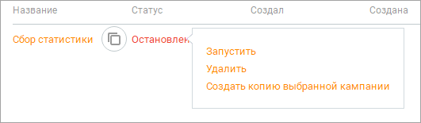
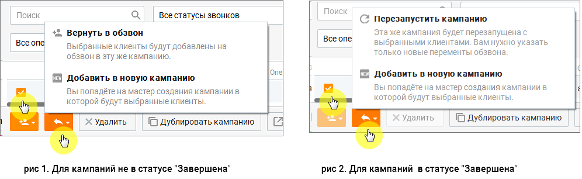
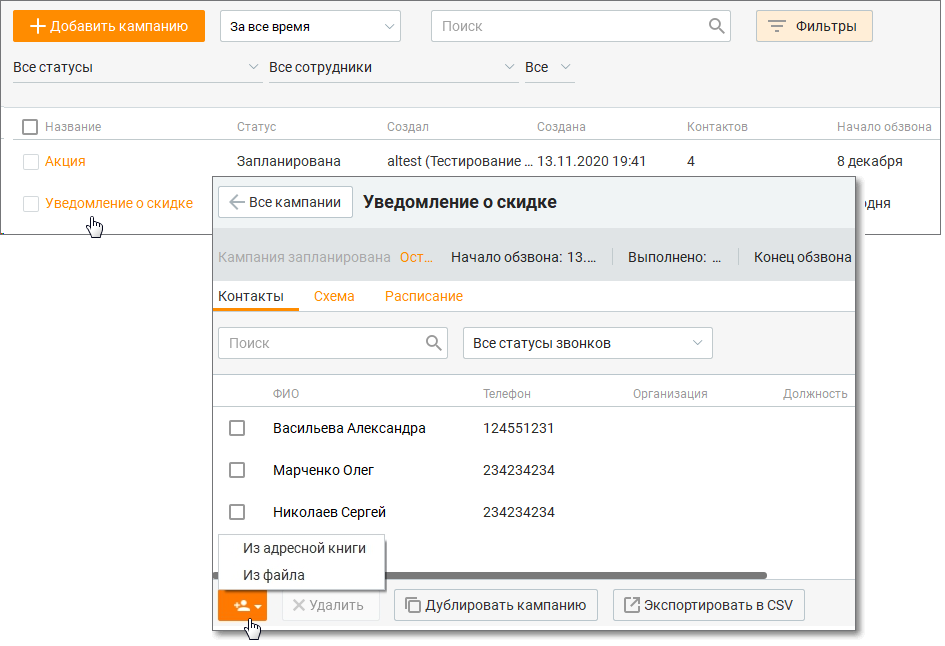
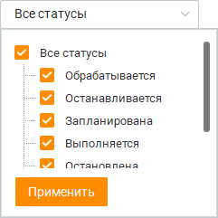
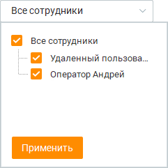
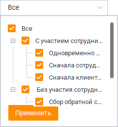

# 11.1. Список кампаний

> Трассировка: PDF §11.1 · сквозные стр. 331-337 · источники: ч.4 `kb/mango-product-docs/sources/mango-cc-manual/CC_manual_1.26.23-part-4.pdf` с.28-34.

При первом запуске окно Исходящего обзвона открывается на списке кампаний. В дальнейшем окно модуля может быть открыто на карточке кампании – это зависит от того, что было открыто перед последним закрытием модуля. Данные о последнем открытом модуле хранятся локально в рамках текущего ПК пользователя. Вид модуля со списком кампаний приведен на рисунке ниже.

| Количество кампаний, возможность выбора режимов обзвона, а также количество |  |  |  |  |
| --- | --- | --- | --- | --- |
|  | контактов в одной кампании зависит от версии | продукта и количества лицензий | . Чтобы |  |
|  | увеличить количество контактов, смените версию продукта, докупите лицензию либо |  |  |  |
| обратитесь в клиентский отдел компании в вашем регионе. |  |  |  |  |

Какие поля содержит таблица Список кампаний исходящего обзвона отображается в виде таблицы со следующими полями:

1. Название – название кампании, заданное при создании; 2. Статус – один из списка: "Запланирована", "Выполняется", "Останавливается", "Остановлена", "Завершена". 3. Режим обзвона – режим обзвона, заданный при создании кампании; 4. Создал – ФИО оператора, создавшего кампанию; 5. Создана – дата и время создания кампании; 6. Контактов – количество контактов, заведенных в кампании; 7. Начало обзвона – дата начала кампании; 8. Приоритет – задачи из кампании с более высоким приоритетом обрабатываются в первую очередь; 9. Выполнено – процент обзвона кампании. Рассчитывается как отношение количества контактов, по которым состоялся разговор, к общему количеству контактов в кампании; 10. Конец обзвона (план) – планируемая дата завершения кампании в формате dd.mm.yyyy hh:mm. Для расчета используется формула Текущая Дата + (Текущая Дата – Дата начала

кампании)*100/% обзвона кампании. Если "% обзвона кампании" = 0, то планируемая дата не определяется, 11. Конец обзвона (факт) – фактическая дата завершения кампании в формате dd.mm.yyyy hh:mm. Отображается только для кампаний в статусе "Завершена". 12. Время обработки – время, которое потребовалось оператору на обработку обращения с момента взятия в работу до закрытия обращения 13. Время ожидания в очереди – время, в течение которого обращение находилось в очереди до распределения на оператора 14. Время ожидания ответа оператора – время, которое потребовалось оператору на ответ с момента взятия в работу обращения Вы можете самостоятельно выбрать, какие столбцы будут отображаться на панели. Для этого

щелкните левой кнопкой мыши по пиктограмме и установите/снимите флаги напротив наименований столбцов. По умолчанию отображается весь набор столбцов. Клик по кнопке F5 обновляет данные в отчетах. Как открыть карточку кампании Для этого следует щелкнуть левой кнопкой мыши по названию кампании. Описание карточки кампании приведено в подразделе "Карточка кампании". Как изменить статус кампании Для этого следует щелкнуть правой кнопкой мыши по названию кампании и в выпадающем списке выбрать нужный статус. Доступные действия определяются текущим статусом кампании.

Ниже приведено описание всех возможных статусов: 1. Обрабатывается – кампания создаётся или обновляется. Доступна кнопка Остановить. 2. Запланирована – доступно несколько состояний кампании для одного статуса: • Кампания создана и ожидает запуска; • Кампания ожидает добавление новых заданий для обзвона, если достигнуто максимальное количество попыток дозвона по всем контактам, а дата завершения еще не наступила. Доступны кнопки Запустить и Остановить. Для изменения доступны значения "Название", "Даты начала обзвона", "Дата окончания обзвона". 3. Выполняется – кампания началась. Доступна кнопка Остановить. Для изменения доступны значения "Дата окончания обзвона", "Список операторов", "Список контактов". 4. Останавливается – кампания находится в процессе остановки. Доступных кнопок нет. 5. Остановлена – кампания временно остановлена, может быть запущена повторно. Доступны кнопки Запустить и Удалить. Для изменения доступны "Название", "Даты начала обзвона", "Дата окончания обзвона", список операторов, список контактов. 6. Завершена – кампания полностью остановлена. Доступна кнопка Удалить. Как добавить новую или продублировать существующую кампанию Для добавления новой кампании нажмите кнопку "Добавить кампанию". Шаги по добавлению новой кампании описаны в подразделе "Добавление кампании".

Для добавления новой кампании на базе существующей щелкните правой кнопкой мыши по наименованию нужной кампании и выберите пункт меню "Создать копию выбранной кампании". Также дублирование компании осуществляется при наведении курсора на наименование кампании и щелчке по кнопке "Копировать кампанию". Как вернуть кампанию в обзвон или перезапустить Чтобы вернуть кампанию в обзвон или перезапустить кампанию, следует открыть карточку

кампании, отметить абонентов обзвона, кликнуть на пиктограмму и выбрать один из вариантов: • Вернуть в обзвон – при этом предыдущие попытки дозвона обнуляются, обзвон осуществляется в соответствии с настройками кампании. Возврат кампании в обзвон невозможен для кампаний в статусе Завершена. Чтобы вернуть в обзвон кампанию в статусе Завершена, сначала необходимо ее перезапустить. • Перезапустить кампанию – измените настройки в открывающихся последовательно окнах Мастера кампаний и перезапустите кампанию. Только для кампаний в статусе Завершена; • Добавить в новую кампанию – при выборе этого пункта происходит дублирование кампании с выбранными абонентами, в обзвон запускается дубль.

Также вернуть незавершенную задачу кампании в обзвон можно из карточки обращения, созданного в рамках кампании исходящего обзвона. Для этого кликните по кнопке Вернуть в ИО, находящейся рядом со счетчиком времени разговора. О результате возвращения – успешно или не успешно – пользователь уведомляется системным сообщением. Завершенный звонок Исходящего обзвона оператор Контакт-центра может перенести вручную на удобное клиенту время. Узнать больше в разделе Перенос задания кампании Исходящего обзвона на другое время. О результате возвращения пользователь уведомляется системным сообщением.

| Кнопка "Вернуть в ИО" доступна, если у пользователя имеются права на редактирование |
| --- |
| кампании Исходящего обзвона, а кампания не находится в статусе Завершена. |

Как добавить/удалить абонентов кампании В существующую кампанию Исходящего обзвона можно добавить задачи. Для этого откройте

карточку кампании и, кликнув по пиктограмме , добавьте в список обзвона новых абонентов.

Если кампания находится в статусе "Завершена", добавление новых абонентов невозможно. Для удаления абонентов отметьте их в карточке компании и нажмите кнопку Удалить. Удаление возможно только для абонентов, по которым еще не начался дозвон. Как найти кампанию по названию Для этого следует использовать поисковое поле. Поиск осуществляется по полю Название. По мере ввода символов в списке автозаполнения отображаются первые пять (или менее) кампаний. Как выполнить отбор (фильтрацию) кампаний Для отбора (фильтрации) кампаний вы можете использовать следующие способы. 1. По статусу. Для этого в выпадающем списке следует выбрать одно или несколько значений. Значение фильтра для данного пользователя сохраняется при повторном входе в систему.

2. По ФИО пользователя, который создал кампанию. Для этого в выпадающем списке следует выбрать одно или несколько значений. Значение фильтра для данного пользователя сохраняется при повторном входе в систему.

3. По режиму обзвона. Для этого в выпадающем списке следует выбрать одно или несколько значений. Значение фильтра для данного пользователя сохраняется при повторном входе в систему.

Как удалить кампанию Для этого наведите курсор на строку кампании, которую следует удалить, и щелкните правой кнопкой мыши. Выберите из контекстного меню пункт Удалить. Также предусмотрено удаление кампании из её карточки. Можно выбрать и удалить одну или несколько кампаний, находящихся в статусах Завершена, Остановлена. Для массового удаления завершенных кампаний следует кликнуть по кнопке Удалить все завершенные.

| Нельзя удалить кампанию, которая находится в статусах: Обрабатывается, |
| --- |
| Запланирована, Останавливается, Выполняется. |

Экспорт данных в файл CSV осуществляется с учетом выставленных в фильтрах значений. Для экспорта доступны все поля данных кампании, включая пользовательские.

