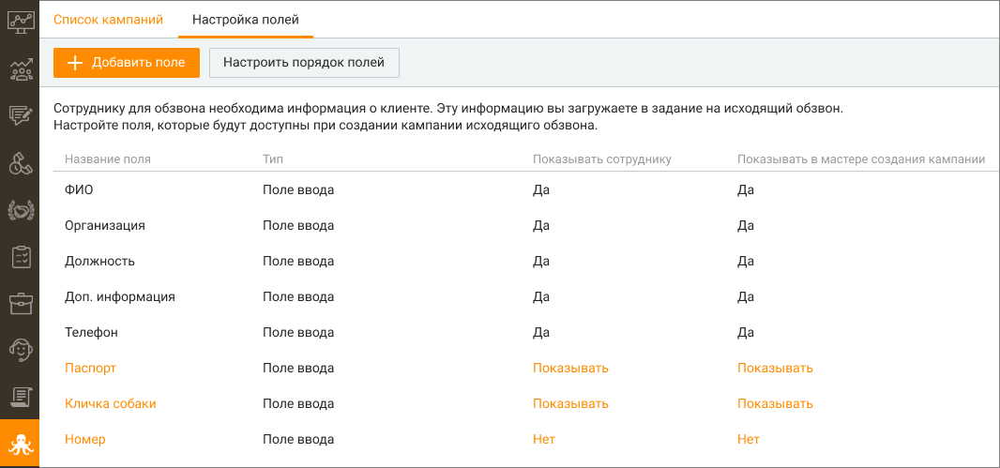
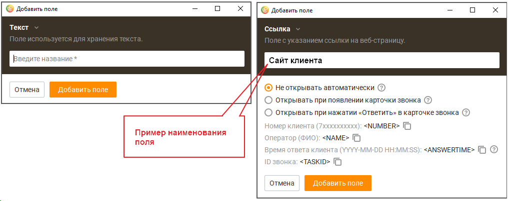
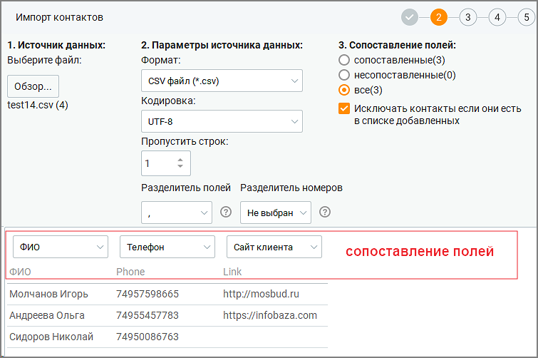
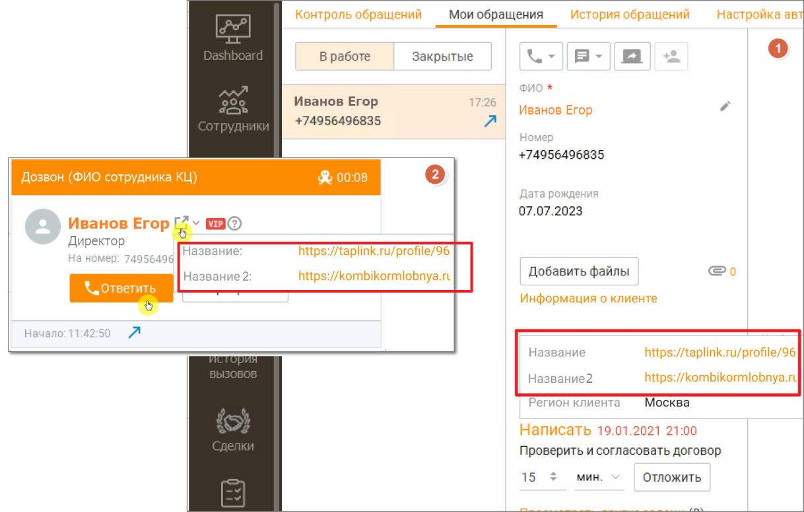

# 11.2. Настройка полей

> Трассировка: PDF §11.2 · сквозные стр. 337-339 · источники: ч.4 `kb/mango-product-docs/sources/mango-cc-manual/CC_manual_1.26.23-part-4.pdf` с.34-36.

На вкладке настраиваются пользовательские поля, информация которых используется во время исходящего обзвона. Имя пользовательского поля является переменной, которую можно добавить при настройке кампаний Исходящего обзвона.

Максимальное количество пользовательских полей – 30. Для изменения имени поля, кликните на поле и в открывшемся окне внесите необходимые изменения. Кнопка Настроить порядок полей предназначена для формирования очередности отображения пользовательских полей в списке. В открывшемся окне зафиксируйте курсор на наименовании поля и, удерживая левую кнопку мыши нажатой, переместите поле вверх или вниз. В списке полей настраиваются следующие параметры: • Показывать сотруднику – при значении "Показывать" соответствующее поле и его значение будут отображаться в карточке обращения, поступающего оператору в рамках кампании Исходящего обзвона. • Показывать в мастере создания кампании – при значении "Показывать" соответствующее поле будет отображаться в списке доступных полей в мастере создания кампании Исходящего обзвона. Добавление поля Чтобы добавить новое пользовательское поле, нажмите кнопку Добавить поле. Выберите тип добавляемого поля: Текст или Ссылка.

Текст – в открывшемся окне введите наименование поля и сохраните внесенные изменения кнопкой Сохранить. Ссылка – заполните наименование поля (например "Сайт клиента"). Далее выберите один из трех вариантов показа данных поля: • Не открывать автоматически – ссылка не будет открыта во внешней системе и по ссылке можно будет перейти из карточки звонка; • Открывать при появлении карточки звонка – ссылка будет открыта в браузере при появлении карточки звонка оператору; • Открывать при нажатии «Ответить» в карточки звонка – ссылка будет открыта в браузере при нажатии оператором в карточке звонка кнопки Ответить.

| Ссылка будет автоматически открыта в режиме дозвона "Сначала клиенту потом |
| --- |
| оператору". |

Параметры number, name, answertime, taskid могут быть переданы в составе ссылки во внешнюю систему при выбранном режиме открытия и использованы для персональных целей. Параметры содержат информацию о звонке.

|  | – |
| --- | --- |
| – |  |

• answertime – время поднятия трубки абонентом • taskid – идентификатор звонкового задания

| Информация в параметре «answertime» доступна только в режимах дозвона «Сначала |
| --- |
| клиенту, потом оператору», «Предиктивный набор» и «Одновременно сотруднику и |
| клиенту» |

Ссылки можно добавлять, импортируя контакты из файла csv при создании кампании ИО. Ссылка не фигурирует в отчетах и будет недоступна после окончания работы со звонковым заданием.

На примере ниже показано отображение данных поля Ссылка в карточке обращения (1), а

также в карточке звонка (2) после клика по пиктограмме .

<!-- изображение на стр. 339: байты не извлечены (PyMuPDF недоступен) -->
