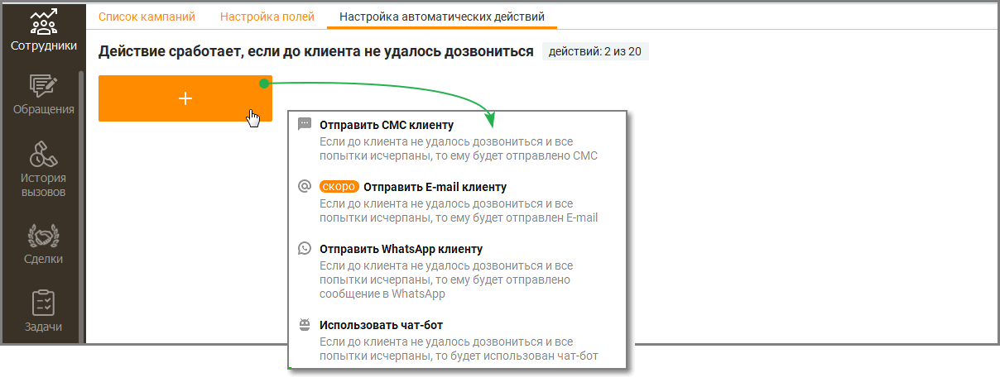
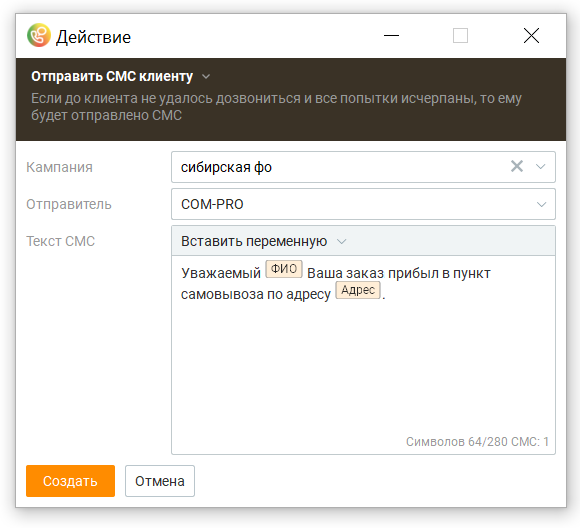
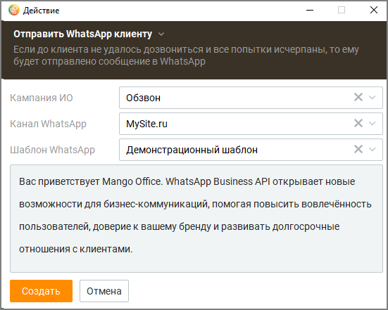
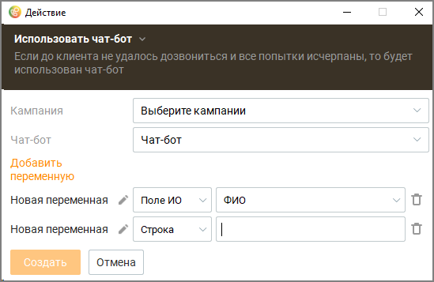
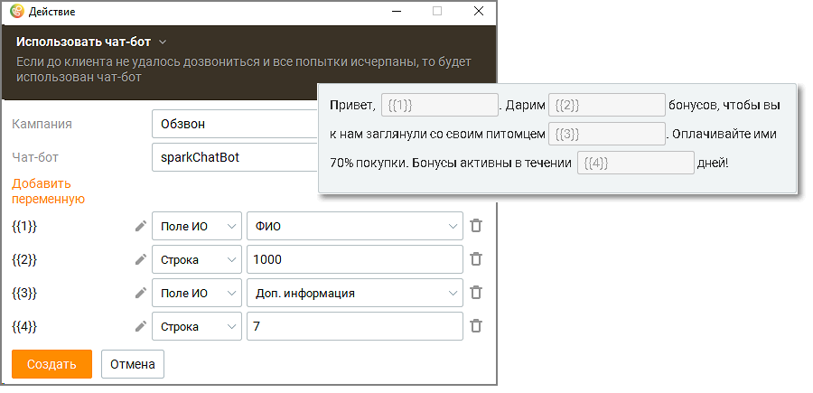
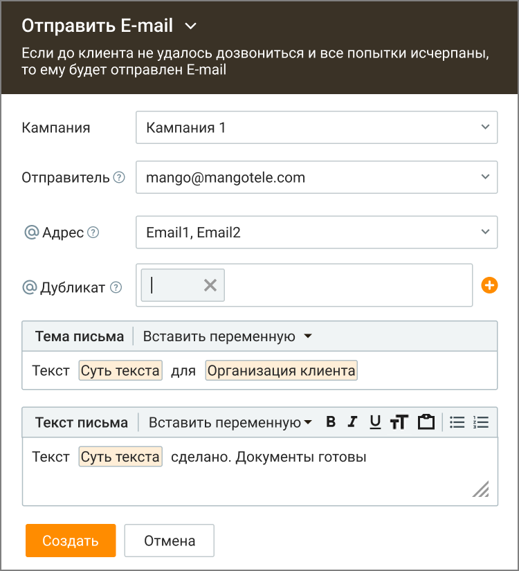

# 11.3. Настройка автоматических действий

> Трассировка: PDF §11.3 · сквозные стр. 339-345 · источники: ч.4 `kb/mango-product-docs/sources/mango-cc-manual/CC_manual_1.26.23-part-4.pdf` с.36-42.

Вкладка предназначена для настройки автоматических действий по результатам кампании Исходящего обзвона. Пользователь с ролью "Администратор" может настроить отправку СМС сообщения с заданным текстом и переменными на номер телефона клиента, если до него не удалось дозвониться. Максимальное количество автоматических действий – 20.

Отправка СМС сообщения с заданным текстом и переменными на номер телефона

Кампания – выбор кампании Исходящего обзвона, по итогам которой будет отправлено СМС; Отправитель – Блок выбора имени отправителя. Доступен при подключении услуги "Отраслевое имя отправителя СМС" или "Индивидуальное имя отправителя СМС" в Личном кабинете ВАТС. Текст СМС – Блок данных для создания СМС-уведомления, с информацией об атрибутах создаваемого СМС-сообщения. Клик по кнопке "Создать" создает сообщение и закрывает окно создания. Клик по кнопке "Отменить" отменяет внесенные изменения и закрывает окно создания сообщения. Отправка WhatsApp сообщения с заданным текстом и переменными по предустановленному шаблону Чтобы отправлять автоматические сообщения на WhatsApp клиенту необходимо предварительно настроить шаблон. Как настроить шаблон для отправки сообщений узнайте здесь: Шаблоны WhatsApp . После настройки доступные шаблоны будут отображаться в списке шаблонов «Контакт- центра».

Кампания – выбор кампании Исходящего обзвона, по итогам которой будет отправлено WhatsApp-сообщение; Канал WhatsApp – блок выбора канала. Доступен при наличии хотя бы одного канала WhatsApp, подключенного в Личном кабинете ВАТС. Шаблон WhatsApp – блок выбора шаблона. Доступен при наличии хотя бы одного шаблона WhatsApp в списке шаблонов «Контакт-центра». Текст шаблона – блок данных для создания WhatsApp-уведомления на основе выбранного шаблона. Клик по кнопке "Создать" создает сообщение и закрывает окно создания. Клик по кнопке "Отменить" отменяет внесенные изменения и закрывает окно создания сообщения. Отправка сообщения с помощью чат-бота При недозвоне во время Исходящего обзвона робот или оператор могут запустить чат-бота для работы с клиентом. Для этого на продукте должен быть подключен чат-бот, а также настроен скрипт диалога чат-бота.

Чат-бот можно подключить, оставив заявку здесь или заполнив форму в модуле Роботы.

Кампания – выбор кампании Исходящего обзвона, по итогам которой чат-ботом будет отправлено сообщение; Чат-бот – блок выбора чат-бота. Доступен при наличии хотя бы одного чат-бота, подключенного в ЛК ВАТС. Добавить переменную – блок добавления переменной. Чат-бот отправит сообщение в соответствии со своим преднастроенным скриптом. К скрипту можно добавить выбранные переменные. Пример сообщения чат-бота:

Клик по кнопке "Создать" создает сообщение и закрывает окно создания. Клик по кнопке "Отменить" отменяет внесенные изменения и закрывает окно создания сообщения.

Отправка e-mail сообщения Действие «Отправить e-mail» используется для отправки письма по триггеру по результатам кампании Исходящего обзвона, если исчерпаны все попытки дозвона клиенту.

| Для отправки триггерных Email-уведомлений необходим авторизованный Email в разделе |
| --- |
| Все настройки -> Телефония и email -> Электронный адрес кампании |

В окне настройки действия указываются параметры: • Выберите кампании — выбор кампании Исходящего обзвона, по итогам которой выполняется отправка письма. • Отправитель — e-mail отправителя по умолчанию (авторизованный e-mail компании). Адрес noreply@mangotele.com в списке отправителей не отображается, отправка с него недоступна. При отсутствии настроенного e-mail компании при сохранении

отображается ошибка «Не настроен email компании, обратитесь к администратору системы». • Адрес — адрес(а) получателя. Доступна вставка текстовых переменных из полей ИО (включая пользовательские). Доступен множественный выбор. Поле не обязательно для заполнения. • Дубликат — адрес(а) для копии письма, ввод вручную. Несколько адресов указываются через разделитель «;» или «,». Поле не обязательно для заполнения. На данные адреса сервис будет отдельно дублировать все Email-уведомления, отправленные при срабатывании триггера • Тема письма — тема письма. Доступна вставка переменных из полей ИО (включая пользовательские) и ввод текста. Поле обязательно для заполнения (минимум 1 символ). • Текст письма — текст письма. Доступна вставка переменных из полей ИО (включая пользовательские) и ввод текста. Поле не обязательно для заполнения. Клик по кнопке "Создать" создает сообщение и закрывает окно создания. Клик по кнопке "Отменить" отменяет внесенные изменения и закрывает окно создания сообщения. Чтобы удалить автоматическое действие, откройте его и нажмите кнопку "Удалить".
