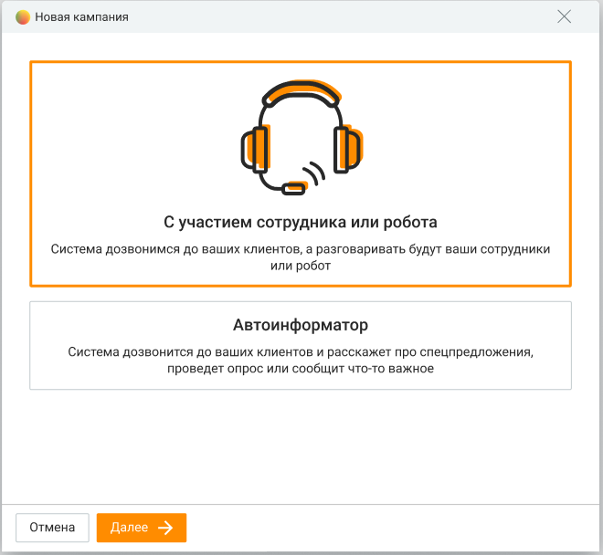

# 11.4. Добавление кампании

> Трассировка: PDF §11.4 · сквозные стр. 345-347 · источники: ч.4 `kb/mango-product-docs/sources/mango-cc-manual/CC_manual_1.26.23-part-4.pdf` с.42-44.

Добавление новой кампании или кампании на базе существующей разбито на несколько шагов в зависимости от выбранного режима шаблона обзвона. После нажатия кнопки Добавить кампанию запускается Мастер создания кампании. Выберите режим и шаблон обзвона.

| Выбор режима автоматического дозвона доступен только при наличии соответствующей |  |  |  |  |
| --- | --- | --- | --- | --- |
|  |  | Выбор режима автоматического дозвона доступен только при наличии соответствующей |  |  |
|  | подключенной услуги. В противном случае для пользователя с правами Администратора |  |  |  |
|  | доступна возможность подключения режима нажатием кнопки Подключить с последующим |  |  |  |
|  | выбором нового тарифа. Узнать больше для получения более подробной информации об |  |  |  |
|  | услуге на сайте компании. |  |  |  |

С участием сотрудника или робота • Сначала клиенту, потом сотруднику или роботу - сперва осуществляется дозвон внешнему абоненту. В момент поднятия трубки начинается выбор свободного оператора или робота и дозвон до него. • Одновременно сотруднику и клиенту – сперва осуществляется дозвон внешнему абоненту. В момент дозвона до абонента (появление гудка) начинается выбор свободного оператора и дозвон до него. • Сначала сотруднику, потом клиенту – сперва осуществляется дозвон оператору. В момент поднятия трубки начинается дозвон внешнему абоненту. • Предиктивный обзвон – на основании данных о ходе кампании система определяет возможность дозвона до следующего клиента до того момента, как оператор освободится. В данном режиме недоступно назначение роботов в качестве участников кампании. Для кампаний с участием сотрудника доступна обработка вызовов с использованием АнтиРобота (при подключении соответствующей услуги). Если на продукте подключена услуга "АнтиРобот", в режиме "Предиктивный обзвон" система учитывает и вызовы, которые находятся в обработке АнтиРоботом.

| Предиктивный режим обзвона доступен только при подключенной услуге "Исходящий |
| --- |
| обзвон PRO". |

Без участия сотрудника

• Сбор обратной связи – дозвон внешнему абоненту, поочередное проигрывание вопросов с предложением выбора одного из нескольких вариантов ответа на каждый вопрос. После каждого вопроса фиксируется вариант ответа абонента (нажатая им кнопка). • Специальное предложение для клиентов – дозвон внешнему абоненту, проигрывание голосового приветствия и коммерческого предложения. В случае заинтересованности абонент выбирает пункт меню (нажимает нужную кнопку), после чего выполняется переадресация на группу, либо завершение вызов. • Уведомление – Осуществляется дозвон внешнему абоненту. В момент поднятия трубки начинается проигрывание звукового фрагмента. Дозвон на несколько номеров Автоматический дозвон осуществляется на основной номер клиента. Если в карточке клиента в адресной книге имеется несколько контактных номеров, автодозвон может осуществляться на каждый контактный номер. Для этого в Личном кабинете должна быть подключена услуга "Исходящий обзвон PRO". Если услуга подключена, при загрузке контактов в кампанию из адресной книги следует выбрать: • звонить на один основной номер клиента • звонить на все номера из карточки клиента (в кампанию ИО попадают до 5-ти номеров). При этом интервал между звонками на разные номера одного клиента соответствует настройкам кампании. Если произошел дозвон по одному из номеров клиента, то дозвон по остальным номерам этого клиента не производится. При возвращении задач в обзвон в случае наличия у клиента нескольких номеров телефонов, в обзвон возвращаются все номера. Кампания Исходящего обзвона может быть создана и в случае, если в Личном кабинете ЛК ВАТС в качестве исходящего номера имеется SIP-trunk, но нет номера телефонной сети общего пользования. Ограничения кампаний Исходящего обзвона: • Максимальное количество кампаний исходящего обзвона для одной компании – 1 000; • Максимальное количество контактов в рамках одной кампании исходящего обзвона – 10 000; • Максимальное количество операторов в рамках одной кампании исходящего обзвона – 50. При превышении лимита отображается соответствующее информационное сообщение. Далее будут рассмотрены шаги создания кампании в зависимости от выбранного режима и шаблона: • С участием сотрудника • Без участия сотрудника
