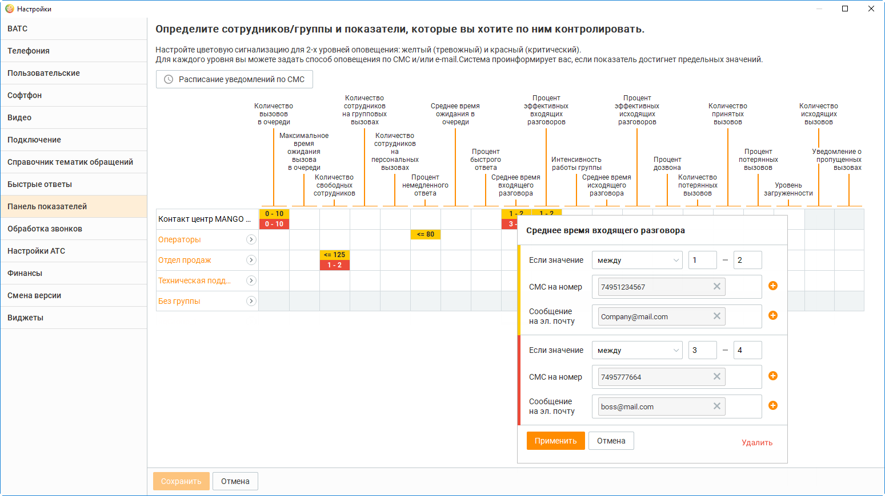
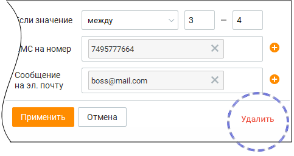

# 2.4.2. Настройка пороговых значений показателей производительности

> Трассировка: PDF §2.4.2 · сквозные стр. 43-46 · источники: ч.1 `kb/mango-product-docs/sources/mango-cc-manual/CC_manual_1.26.23-part-1.pdf` с.43-46.

Пороговыми значениями показателей производительности считаются значения или диапазоны значений, при превышении которых (или при попадании в диапазоны) возникает критичная ситуация, о которой необходимо предупредить пользователя. Предусмотрено два типа ситуаций: желтые («внимание») и красные («предупреждение»). Пороговые значения показателей являются общими для всех пользователей данного продукта Контакт-центра MANGO OFFICE. Чтобы настроить пороговые значения показателей производительности, перейдите на вкладку "Панель показателей" в настройках программы. Щелкните на пересечении столбца с нужным показателем производительности и строки с нужным объектом (Контакт-центр MANGO OFFICE в целом, группой сотрудников, сотрудником (оператором). После этого на экране отображается форма ввода пороговых значений.

Используя эту форму, вы можете указать красное и желтое пороговые значения (диапазоны значений), используя поля ввода с соответствующим фоновым цветом. Выберите из списка нужный ограничитель (меньше или равно, между, больше или равно) из списка и введите нужное пороговое значение (значения) в соответствующие поля. После завершения ввода щелкните вне формы для ее закрытия. Напомним, что если показатель у объекта превышает указанные пороговые значения, то вся строка объекта подкрашивается желтым или красным цветом. При этом: • если по объекту хоть один показатель превышает красное пороговое значение, объект подкрашивается красным; • если по объекту хоть один показатель превышает желтое пороговое значение, и нет показателей, превышающих красное значение, объект подкрашивается желтым.

| Если сотрудник (оператор) входит в несколько групп и пороговые значения показателей |  |  |  |  |  |
| --- | --- | --- | --- | --- | --- |
|  | для этих групп настроены индивидуально, то проверка идет по пороговым значениям всех |  |  |  |  |
|  | таких групп. |  |  |  |  |
|  | Если вы выбрали ограничитель между и ввели только нижнюю границу диапазона |  |  |  |  |
|  | значений, условие порогового значения работает по правилу больше или равно (>=). |  |  |  |  |
|  | Если вы выбрали ограничитель между и ввели только верхнюю границу диапазона |  |  |  |  |
| значений, условие порогового значения работает по правилу меньше или равно (<=). |  |  |  |  |  |

| Для удаления пороговых значений показателей щелкните по ссылке Удалить и подтвердите |
| --- |
| свое действие во всплывающем окне уведомления. |

Расписание уведомлений по СМС Для того, чтобы оперативно узнать о превышении предельных (красных и/или желтых) значений показателей, используйте отправку СМС-уведомлений и/или уведомлений на электронную почту. Вы можете указать 10 телефонных номеров и 10 электронных адресов для каждого уровня. В случае, когда значение показателя попадет в обозначенный диапазон, на указанный телефонный номер и/или электронный почтовый ящик будет автоматически отправлено сообщение вида: Текущее значение показателя "Процент потерянных вызовов" по сотруднику "Оператор Павел" достигло 50 и находится в диапазоне предельных значений. Чтобы настроить отправку уведомлений о пропущенных групповых вызовах, щелкните по перекрестию строки с названием группы и столбцом "Уведомление о пропущенных вызовах". По умолчанию в качестве электронного адреса, на который будет отправлено уведомление, указывается e-mail текущего пользователя из карточки сотрудника Личного кабинета

Для указания более одного номера телефона и/или электронного адреса, щелкните по кнопке

. Максимальное количество -10. В результате напротив названия группы, для которой настроена отправка уведомлений, будет

отображаться пиктограмма . На указанные номера и адреса будет отправлено сообщение вида:

Пропущен звонок с номера +79265786677. Группа Отдел Продаж Новосибирск. Если номер клиента на пропущенных вызовах совпадает, то отправка сообщений осуществляется не чаще, чем один раз в 5 минут. Отправка СМС-уведомлений осуществляется согласно расписанию. Для его настройки щелкните по ссылке "Расписание уведомлений по СМС" в поясняющем сообщении в верхней части окна.

Для изменения расписания предусмотрено два способа: 1. Щелчком левой кнопки мыши по определенному прямоугольнику. Каждый прямоугольник обозначает один час. Первый щелчок выделяет один час, второй щелчок снимает выделение; 2. Щелчком левой кнопки мыши по значению в поле "Период времени". Значения вводятся во всплывающем окне, здесь же предусмотрена возможность указания нескольких временных периодов. Сообщение о превышении значения показателя по одному условию (т. е. при достижении желтого или красного уровня) отправляется не чаще, чем один раз в пять минут. Для СМС- уведомлений – согласно расписанию.
