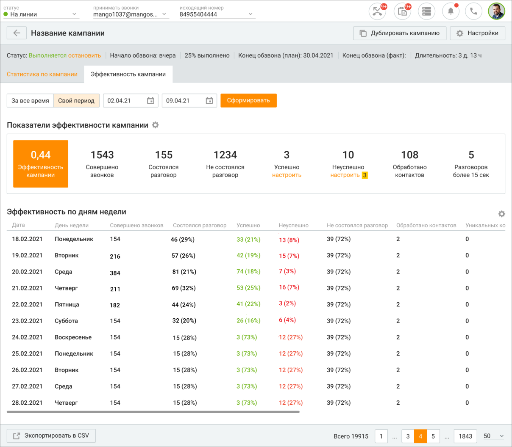

# 11.5.2. Эффективность кампании

> Трассировка: PDF §11.5.2 · сквозные стр. 372-374 · источники: ч.4 `kb/mango-product-docs/sources/mango-cc-manual/CC_manual_1.26.23-part-4.pdf` с.69-71.

Вкладка "Эффективность кампании" служит для оценки кампаний Исходящего обзвона. В зависимости от выбранных параметров пользователь может отслеживать различные показатели кампаний ИО и получать данные в форме структурированных отчетов. Для формирования отчета установите фильтр периода и нажмите кнопку Сформировать.

Вы можете самостоятельно выбрать, какие показатели эффективности будут отображаться на

панели. Для этого щелкните левой кнопкой мыши по пиктограмме и установите/снимите флаги напротив наименований показателей. В зависимости от выбранного варианта отображения, значение показателя отображается в числовом или процентном выражении. Доступны следующие показатели: 1. Эффективность кампании – количество попыток звонков в статусе "разговор состоялся" в текущей кампании ИО за период, поделенное на общее количество попыток звонков за период в текущей кампании. 2. Совершено звонков – общее количество совершенных попыток в текущей кампании за период. 3. Состоялся разговор – количество попыток за период, по которым удалось дозвониться. 4. Не состоялся разговор – количество попыток, по которым не удалось дозвониться. 5. Успешно – количество задач кампании, которые были созданы в заданный период и по которым была проставлена одна из указанных в настройках показателя тематик. Выбор возможен из набора тематик, определенных для кампании. 6. Неуспешно – количество задач кампании, которые были созданы в заданный период и по которым была проставлена одна из указанных в настройках показателя тематик. Выбор возможен из набора тематик, определенных для кампании. 7. Обработано контактов – количество контактов, по которым был успешный дозвон, либо закончилось количество попыток дозвона.

8. Разговоров более 15 сек – количество разговоров длительностью более 15 секунд. Клик по кнопке Экспортировать в CSV приводит к открытию стандартного окна экспорта данных. Экспорт производится с учетом выбранных в фильтрах значений.
