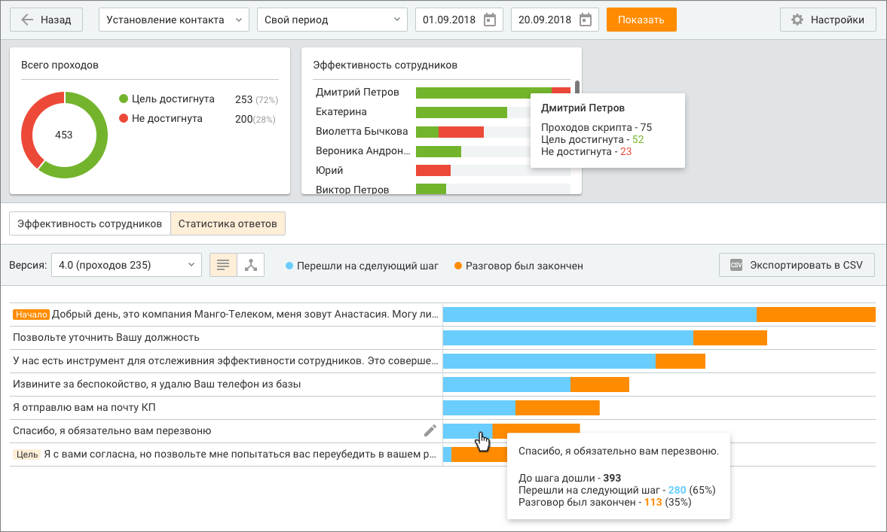
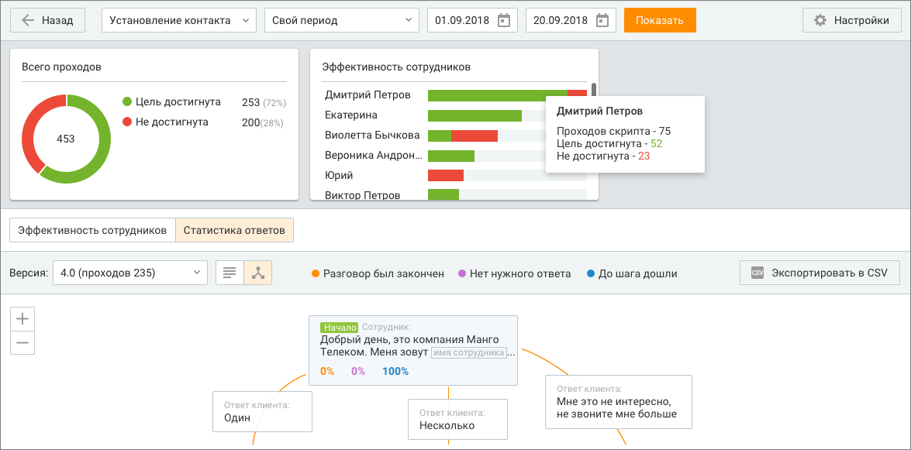

# 12.3.2. Статистика ответов

> Трассировка: PDF §12.3.2 · сквозные стр. 390-393 · источники: ч.4 `kb/mango-product-docs/sources/mango-cc-manual/CC_manual_1.26.23-part-4.pdf` с.87-90.

Выбор скрипта и период, за который будут получены статистические данные, указываются в шапке отчета. При выборе другого скрипта и/или изменении периода нажмите кнопку Показать для формирования отчета по новым условиям. В верхней части окна отображается общее количество проходов выбранного скрипта вне зависимости от его версии в течение указанного периода. Круговой график конверсии отображает процентное отношение количества проходов скрипта, в которых хотя бы один сотрудник достиг хотя бы одной цели выбранной версии скрипта, к общему количеству проходов скрипта выбранной версии. Отчет отображает статистические данные в зависимости от версии скрипта. Выбор версии осуществляется путем выбора нужного пункта из выпадающего списка в поле "Версии". Формирование отчета при изменении версии выполняется автоматически. Основная часть отчета отображает схему скрипта выбранной версии. Представление схемы возможно как в виде дерева, так и в виде списка.

Переключение осуществляется при помощи переключателей и соответственно.

При списковом представлении отчет представлен в табличном виде. На каждом ответе сотрудника отображается два значения, каждое из которых выделено соответствующим цветом: • Перешли на следующий шаг (голубой) — количество проходов текущей версии скрипта, дошедших до данного шага: • Разговор был закончен (оранжевый) — количество проходов текущей версии скрипт, в которых данный ответ сотрудника стал последним ответом, к которому перешел сотрудник во время разговора. При щелчке по графику отображается подробная информация по соответствующему шагу. Пример отчета в виде дерева:

При представлении отчета в виде дерева на каждом ответе сотрудника отображается три значения, каждое из которых выделено соответствующим цветом: • Разговор был закончен (оранжевый) — процентное соотношение количества проходов выбранной версии скрипта, в которых текущий ответ сотрудника стал последним ответом, к которому перешел сотрудник в течение разговора, к общему количеству проходов текущей версии скрипта; • Нет подходящего ответа (фиолетовый) — процентное соотношение количества проходов выбранной версии скрипта, в которых к текущему ответу сотрудника был оставлен комментарий, т. е. выбран "Ответ клиента", к общему количеству проходов текущей версии скрипта; • До шага дошли (синий) — процентное соотношение количества проходов выбранной версии скрипта, в которых сотрудник дошел до текущего ответа сотрудника, к общему количеству проходов текущей версии скрипта. Для редактирования блока с ответом сотрудника или клиента наведите курсор на нужный блок

и щелкните по пиктограмме . В результате выполняется переход к форме редактирования скрипта. Для просмотри дерева используются те же горячие клавиши, что и для создания скрипта: ОС Windows: • сочетание клавиш "Ctrl" и "+", а также сочетание зажатой клавиши Ctrl с вращением колеса мыши в сторону увеличения аналогичны нажатию кнопки "+"; • сочетание клавиш "Ctrl" и "+", а также сочетание зажатой клавиши Ctrl с вращением колеса мыши в сторону уменьшения аналогичны нажатию кнопки "-". ОС macOS: • сочетание клавиш cmd и "+" аналогично щелчку по кнопке "+"; • сочетание клавиш cmd и "-" аналогично щелчку по кнопке "-". В статистике ответов следующие показатели вычисляются с учетом нескольких проходов цикла и быстрых переходов: • До шага дошли (хотя бы один раз дошли в текущем проходе); • Перешли на следующий шаг (при каждом прохождении этого шага оператор переходил на следующий шаг); • Разговор был закончен; • Количество проходов выбранной версии скрипта, в которых текущий ответ сотрудника стал последним ответом, к которому перешел сотрудник в течение разговора; • Количество проходов выбранной версии скрипта, в которых к текущему ответу сотрудника был оставлен комментарий, т. е. выбран Ответ клиента; • Количество проходов выбранной версии скрипта, в которых сотрудник дошел до текущего ответа сотрудника; Таким образом, если в проходе скрипта сотрудник прошел один цикл, после чего перешел на другую ветвь скрипта, то в статистике ответы в цикле будут учитываться как пройденные.

