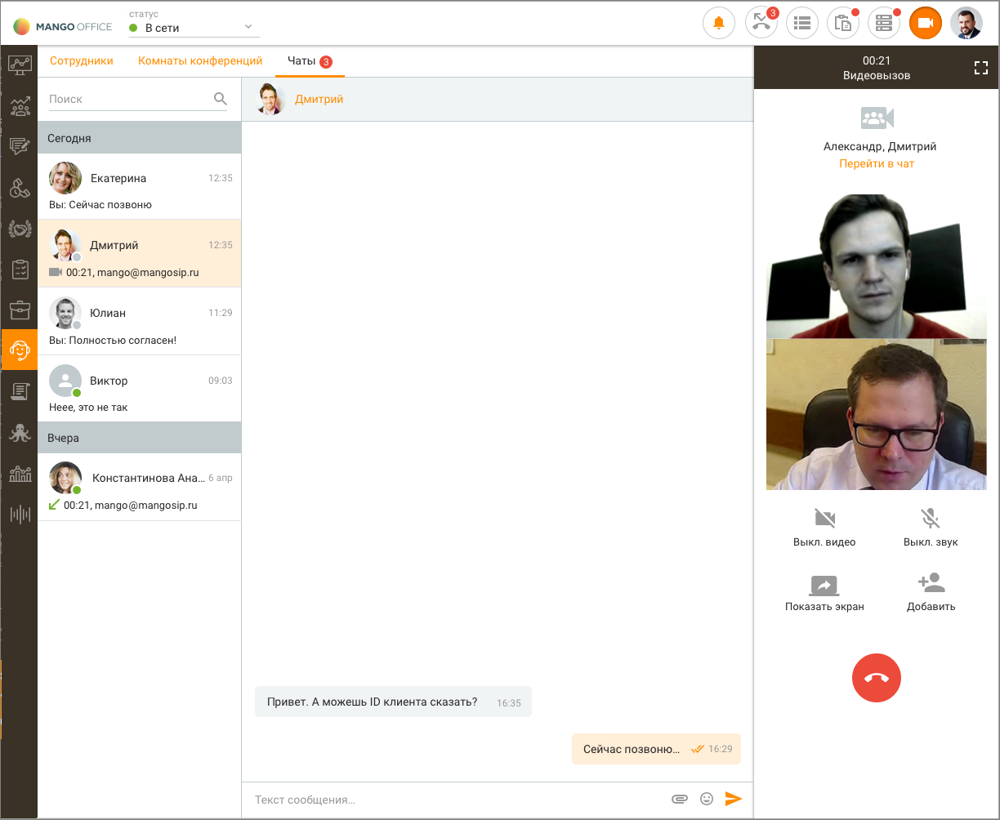
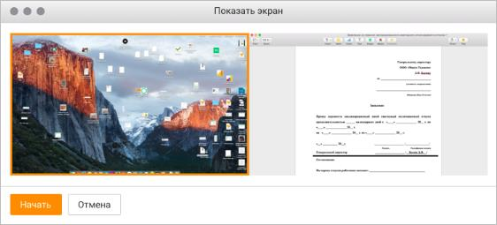
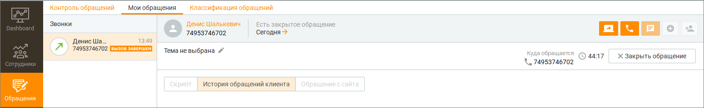

# 13.4. Видеоконференции

> Трассировка: PDF §13.4 · сквозные стр. 401-406 · источники: ч.4 `kb/mango-product-docs/sources/mango-cc-manual/CC_manual_1.26.23-part-4.pdf` с.98-101; ч.5 `kb/mango-product-docs/sources/mango-cc-manual/CC_manual_1.26.23-part-5.pdf` с.1-2.

Видеозвонки позволяют двум и более участникам общаться друг с другом при помощи голоса и видео. В ходе групповой конференции возможен групповой чат и передача файлов (чат и файлы сохранятся и после завершения конференции). Исходящий видео вызов инициируется в любом статусе одним из следующих способов: • из персонального текстового чата с сотрудником; • из группового текстового чата; • из списка сотрудников вкладки "Внутреннее общение";

• по ссылке, сгенерированной в окне "Мои обращения".

| В случае, когда текущий пользователь уже участвует хотя бы в одном видео вызове, |  |  |
| --- | --- | --- |
|  | видеоконференции или аудиовызове, то при попытке инициации видео вызова отображается |  |
| уведомление вида: "Нельзя одновременно участвовать в видео вызове и в другом вызове". |  |  |

При получении входящего видео вызова на экране отображается виджет вида:

Кнопка С видео доступна только при наличии хотя бы одной подключенной камеры. В противном случае кнопка заблокирована, доступна только голосовая связь с абонентом. Если версия Контакт-центра пользователя не поддерживает видеоконференций, в панели софтфона и в плавающем виджете отображается обычный аудио-вызов. После принятия вызова панель софтфона переходит в состояние "Разговор":

При сворачивании панели софтфона либо окна приложения на экране отображается виджет видео вызова. Двойной щелчок по виджету в состоянии разговора приводит к активации основного окна приложения и отображению текущего вызова в панели софтфона (если она была скрыта).

Панель софтфона содержит функции:

|  | Развернуть разговор в отдельном окне |
| --- | --- |
|  | Выключить видео |
|  | Выключить микрофон |
|  | Показать экран |
|  | Добавить в конференцию пользователя |
|  | Завершить разговор |

Для демонстрации своего экрана нажмите кнопку . При этом на экране отобразится окно выбора экрана демонстрации вида:

При наличии нескольких экранов выберите нужный экран для демонстрации собеседнику и нажмите кнопку Начать. В результате окно выбора экрана скрывается, при этом собеседнику демонстрируется выбранный экран вместо видео с камеры.

Для того, чтобы остановить демонстрацию экрана, следует еще раз нажать кнопку . При этом демонстрация экрана останавливается и возобновляется публикация видео с камеры (в зависимости от состояния кнопки Выкл. видео).

| Сотрудник может пригласить абонента к участию в видеоконференции, сгенерировав |
| --- |
| ссылку-приглашение в окне обращения. |

При этом немедленного начала видеоконференции не происходит. Видеоконференция начинается только после нажатия Клиентом или Гостем кнопки Присоединиться к видеоконференции во всплывающем окне уведомления. Там же можно скопировать ссылку

или ID видеоконференции в буфер обмена, кликнув по кнопке .

Клик по кнопке Отмена приводит к скрытию окна Присоединиться к видеоконференции. Пользователь Контакт-центра может участвовать в видео-конференциях с пользователями приложения M. TALKER. При отключении организатора аудиоконференция завершается автоматически для всех участников. Для продолжения общения требуется создание новой конференции.

<!-- изображение на стр. 406: байты не извлечены (PyMuPDF недоступен) -->
