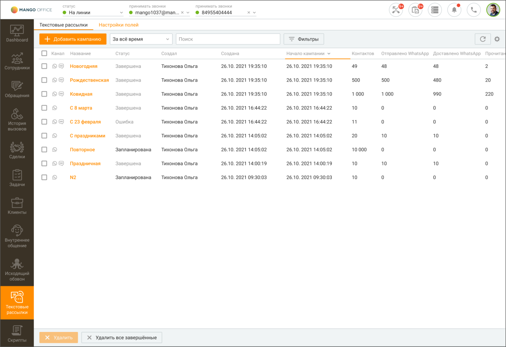

# 14.1. Текстовые рассылки

> Трассировка: PDF §14.1 · сквозные стр. 406-408 · источники: ч.5 `kb/mango-product-docs/sources/mango-cc-manual/CC_manual_1.26.23-part-5.pdf` с.2-4.

Вкладка "Текстовые рассылки" предназначена для создания и отслеживания статуса WhatsApp и СМС рассылок, а также просмотра и анализа статистики их доставки. На вкладке пользователь может: • добавлять, редактировать, дублировать, копировать или удалять кампанию по рассылке • просматривать или экспортировать общую статистику по кампании • просматривать детальную статистику по каждой кампании в карточке кампании • настраивать поля мастера создания кампаний в соответствии с полями шаблонов текстовых рассылок Вид вкладки со списком рассылок приведен на рисунке ниже.

Вкладка содержит блок фильтров и табличную часть. Блок фильтров позволяет производить фильтрацию списка кампаний по следующим параметрам: • дата проведения кампании – за последний месяц, за последнюю неделю, за все время, произвольный; • сотрудники – сотрудник, создавший кампанию; • статус кампании – выполняется, запланирована, остановлена (компания остановлена оператором во время ее выполнения), обрабатывается (кампания находится в процессе создания), завершена; Кампания переходит в статус "завершена" в следующих случаях: • все задачи кампании переведены для WhatsApp – в статус "доставлено" и/или "прочитано", для СМС – "отправлено". • отменена коммутатором, из-за следующих причин: a) некорректен шаблон рассылки, b) закончились деньги на счету пользователя Контакт-центра. Статус отправки WhatsApp сообщений:

| Статус | Описание статуса |
| --- | --- |
| Не отправлено • • • | Сообщение не отправлено по каналу WhatsApp Причины, по которым сообщение не отправлено: указанный получатель не зарегистрирован в WhatsApp неправильный формат номера абонента попытка отправки дубликата сообщения в течение 5 минут |

| • | сообщение не соответствует допустимому шаблону |
| --- | --- |
| В очереди | Сообщение находится в очереди на отправку |
| Отправлено | Сообщение отправлено |
| Доставлено | Сообщение доставлено |
| Прочитано | Сообщение прочитано |
| Не доставлено | Сообщение отправлено, но не получило статус "Доставлено" за период указанный в WhatsApp- сообщении (период "тайм-аут") |

Статус отправки СМС сообщений:

| Статус | Описание статуса |
| --- | --- |
| отправки |  |
| В очереди | Сообщение находится в очереди на отправку |
| Отправлено | Сообщение отправлено |
| Не отправлено | Отклонено, отменено, ошибка |

Также в блоке фильтров доступен поиск по названию кампании. Клик по кнопке F5 или

пиктограмме обновляет данные в отчетах. Клик по кнопке Очистить фильтр удаляет заданные параметры фильтрации. Табличная часть содержит сводную статистику по кампаниям. Для настройки отображения

столбцов таблицы нажмите Настройки и выберите необходимые варианты.
