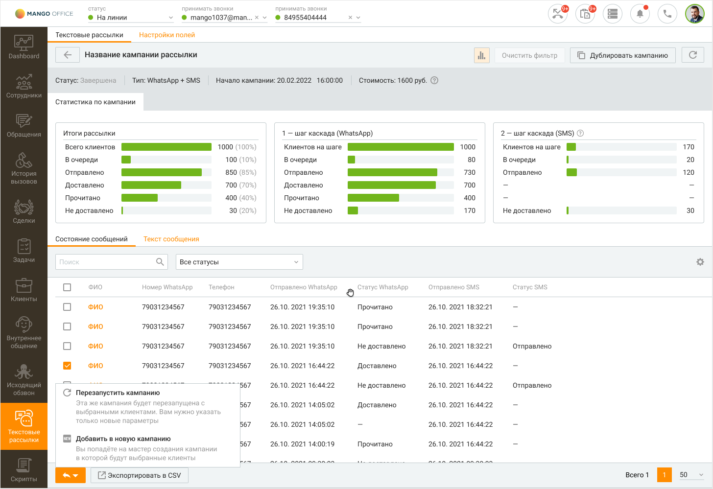
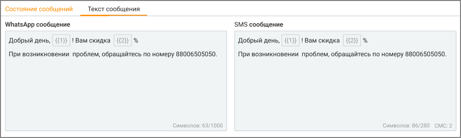

# 14.2. Карточка кампании

> Трассировка: PDF §14.2 · сквозные стр. 415-417 · источники: ч.5 `kb/mango-product-docs/sources/mango-cc-manual/CC_manual_1.26.23-part-5.pdf` с.11-13.

Карточка кампании открывается по клику на наименование кампании в списке кампаний текстовых рассылок. Карточка кампании состоит из двух блоков:

• инфографика (открывается кликом по пиктограмме ); • данные текущей кампании, разделенные на вкладки.

Клик по кнопке F5 или пиктограмме обновляет данные в отчетах. Клик по кнопке Очистить фильтр удаляет заданные параметры фильтрации.

В заголовке отображаются параметры рассылки: статус, тип, начало (дата, время), стоимость. Описание статусов приведено в разделе Текстовые рассылки.

Для возвращения к списку кампаний нажмите пиктограмму Инфографика Данные о текстовой рассылке выбранной кампании приведены в виде инфографики, включающей три диаграммы. Обновление информации осуществляется автоматически каждые 10 секунд либо при нажатии кнопки F5. Клик по кнопке Сбросить очищает фильтр графика. Данные текущей кампании, разделенные на вкладки Блок данных текущей кампании разделен на вкладки "Состояние сообщений" и "Текст сообщений".

Пользователь видит только те вкладки, к которым у него есть доступ. Вкладка "Состояние сообщений" содержит табличную часть со сводной статистикой. Для

настройки отображения столбцов таблицы нажмите Настройки. Допускается отображение следующих столбцов: • Статус WhatsApp – текущий статус WhatsApp сообщения данному абоненту • Номер WhatsApp – номер мобильного телефона, на который отправляется WhatsApp сообщение данному абоненту • Статус СМС – текущий статус СМС сообщения данному абоненту • Телефон – номер мобильного телефона, на который отправляется СМС сообщение данному абоненту • ФИО – ФИО абонента • Отправлено WhatsApp – дата и время отправки WhatsApp сообщения • Доставлено WhatsApp – дата и время доставки WhatsApp сообщения • Прочитано WhatsApp – дата и время прочтения WhatsApp сообщения абонентом • Не доставлено WhatsApp– отметка о не доставленном WhatsApp сообщении • Отправлено СМС – дата и время отправки СМС сообщения • Имя отправителя – имя отправителя сообщения Вкладка "Текст сообщения" содержит текст WhatsApp или СМС сообщения кампании.

Просмотр статистики по текстовой рассылке С помощью статистики можно понять, как сработала рассылка по WhatsApp и SMS: сколько сообщений дошло до адресатов, сколько было прочитано, а сколько – нет. Это помогает принимать решения о повторной отправке и готовить отчёты. Как использовать статистику по максимуму: 1) Работайте с данными: • Фильтрация – можно выбрать, например, только тех, кому не доставлено.

• Поиск – по имени или номеру. • Экспорт – можно скачать таблицу в формате CSV. • Обновление данных – статистику можно обновить вручную по кнопке. 2) Обратите внимание: • Удалить рассылку можно только после завершения. • Статистика не обновляется автоматически – нужно нажимать кнопку. • Статусы доставки отображаются отдельно для WhatsApp и SMS. • Имя клиента – просто для ориентира, перейти в карточку клиента нельзя. 3) Полезные советы: • Если много «не доставлено» – проверьте правильность номеров. • Перед повторной рассылкой лучше отфильтровать тех, кто не получил сообщение. 4) Когда смотреть статистику: • Сразу после завершения кампании – чтобы понять, как сработала. • При планировании повторной рассылки – чтобы не дублировать сообщения тем, кто уже прочитал. • Для подготовки отчётов и анализа эффективности.
