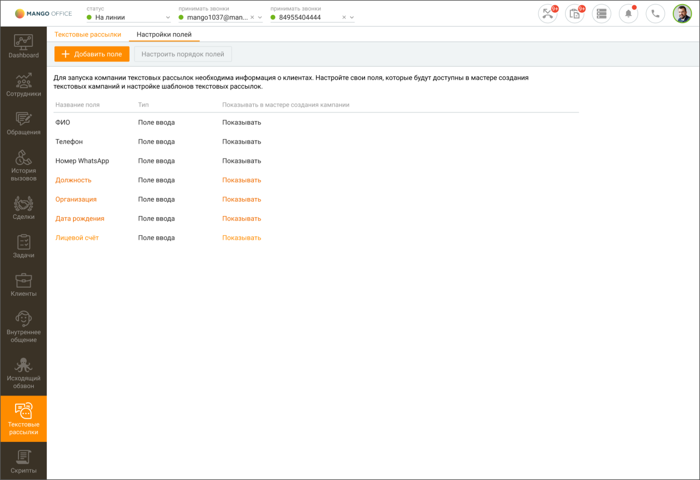

# 14.3. Настройки полей

> Трассировка: PDF §14.3 · сквозные стр. 418-419 · источники: ч.5 `kb/mango-product-docs/sources/mango-cc-manual/CC_manual_1.26.23-part-5.pdf` с.14-15.

На вкладке настраиваются пользовательские поля, информация которых используется в кампании текстовой рассылки. Имя пользовательского поля является переменной, которую можно добавить при настройке кампаний.

Чтобы добавить новое пользовательское поле, нажмите кнопку Добавить поле. В открывшемся окне введите наименование поля и сохраните внесенные изменения кнопкой Сохранить. Максимальное количество пользовательских полей – 30. Для изменения имени поля, кликните на поле и в открывшемся окне внесите необходимые изменения. Кнопка Настроить порядок полей предназначена для формирования очередности отображения пользовательских полей в списке. В открывшемся окне зафиксируйте курсор на наименовании поля и, удерживая левую кнопку мыши нажатой, переместите поле вверх или вниз. В списке полей настраиваются следующие параметры: • Показывать в мастере создания кампании – при значении "Показывать" соответствующее поле будет отображаться в списке доступных полей в мастере создания кампании текстовой рассылки.

